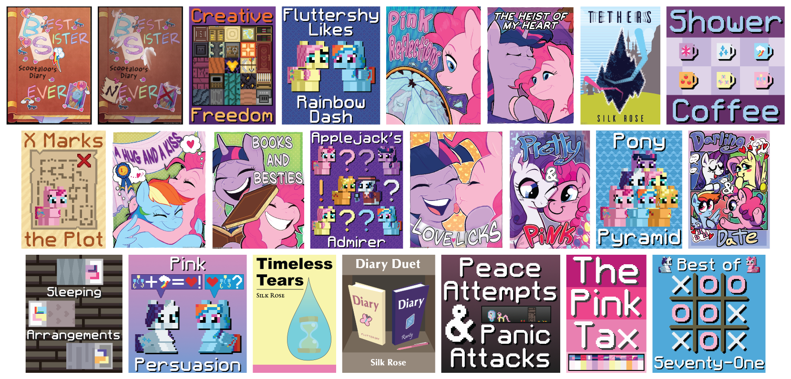

# Pony

     

A collection of stories, ideas, names, and more, all pony related.

## About:

### Who:
Silk Rose, I'm a massive fan of *My Little Pony: Friendship is Magic*, it's my favorite show. My favorite pony is Pinkie Pie, and almost everything I do creatively is pony related in some way.

My favorite games are [Factorio], and [Minecraft]. I've made a few [Factorio Mods], and since late 2019, I have been the lead maintainer of [Love & Tolerance], an MLP:FiM-inspired resource pack for Minecraft.

### What:
I love to write, mostly romance, but I want to write all genres. I also, sometimes, make my own covers.

### When:
I had written several stories from 2017 onward, but on Friday, March 31, 2023, at 5:00:55 AM, I committed the first commit to my [Pony] repository, and the rest is history, Git history.

### Where:
All of my writing can be found in my [Pony] repository on GitHub, published or not. All of my published writing can be found on FIMFiction, on my [FIMFiction profile][Silk Rose FIMFiction].

### Why:
- **Writing in the open:** Everything is open for the world to read, whether it gets posted elsewhere or not.
- **Plain text:** My work is stored in plain text Markdown files, no reliance on proprietary software to read or write.
- **Easier to share:** Every story and chapter is just a publicly available link on GitHub.
- **Better versioning:** I can see the history of everything I've written, and easily go back and find it if need be.
- **Free to use:** I license my writing under the Creative Commons Zero 1.0 Universal License, meaning my words are free to do anything with.

### With:
- **[Linux Mint]**, my Operating System of choice. I love Linux for the choice, freedom, and control it gives me over my computer and what I do on in.
- **[Git]**, used to keep track of changes over time, it makes it easy to find anything deleted or changed.
- **[Markdown]**, my file format of choice, makes it easy as Markdown is fairly ubiquitous and most chat applications have most of its syntax built in.
- **[fimd]**, used to convert Markdown into [FIMFiction BBCode]. I use this for every story I publish.
- **[Obsidian]**, a highly customizable and extensible Markdown text editor. I only use features that are present in Markdown, that way everything works on [GitHub].
- **[Syncthing]**, for syncing to and from my computer and phone, makes it super convenient for writing on the go and for backing up my work.
- **[LanguageTool]**, grammar tool of choice, I use the premium version to proofread longer stories.
- **[Obsidian LanguageTool]**, a plugin to use LanguageTool within Obsidian, highly configurable and easy to use.
- **[GIMP]**, an awesome open-source image editor, I make all my covers in it.
- **[MLP Vector Club]**, used to get accurate pony colors when I make any art.
- **[VSCodium]**, I write all my shell scripts in it.
- **[GitHub]**, where I host all of my git repositories, on my [GitHub profile][Silk Rose GitHub]

## Readings:
A few of my stories have had readings made for them, I would like to thank the following ponies for doing readings of my work:

- **[The Mystery Fluttershy Fan]** for making a [reading][Pretty and Pink reading] of [Pretty and Pink].
- **[StraightToThePointStudio]** for making a [reading][The Pink Tax reading one] of [The Pink Tax].
- **[Rainbow Infinity Readings]** for making a [reading][Best of Seventy-One reading] of [Best of Seventy-One].
- **[Rainbow Infinity Readings]** for making a [reading][Pony Pillows reading] of [Pony Pillows].
- **[Pony&Wolf Productions]** for making a [reading][The Pink Tax reading two] of [The Pink Tax].

## Translations:
A few of my stories have had translations made for them, I would like to thank the following ponies for doing translations of my work:

- **[volkov]** for translating [The Heist of My Heart] into [Ukrainian][The Heist of My Heart Ukrainian].
- **[Nova Twinkle]** for translating [Pony Pillows] into [Chinese][Pony Pillows Chinese].

## License:
My words, both fiction and code, are licensed under the Creative Commons Zero 1.0 Universal License. Images are owned by their respective creators and are not subject to this license. The full license can be read [here][license].

My Little Pony: Friendship is Magic © Hasbro, Inc.

## Special Thanks:
While I may be the main contributor to this repository, I have had help, and thus I would like to give a special thanks to the following ponies:

- **[Meadowsys]** for creating [fimd] and general coding help.
- **[6-D Pegasus]** for proofreading, pre-reading and collaborative writing.
- **[Forcalor]** for proofreading and pre-reading.
- **[Langtanium]** for creating the pony sprites and props used to make covers.
- **[irradiatedpiratebooty]** for illustrating a handful of covers.
- **Tiki Bat** ([FIMFiction][Tiki Bat FIMFiction], [Twitter][Tiki Bat Twitter]) for creating a few covers and arranging the banner.
- **Cookieteer** for proofreading and pre-reading.
- **[Steady Gaze]** for proofreading and making the cover for Timeless Tears.
- **[Gapty]** for proofreading X Marks the Plot.
- **[MoonSong Darkstone]** for writing The Saddest Rainbow based off Best Sister Never.
- **[Nebbie]** for providing feedback on the cover for Sleeping Arrangements.
- **EDEN** for helping write the first chapter of Saddle Bagged.

<!-- Links go below this point. -->
[Pony]: https://github.com/SilkRose/Pony "GitHub"

[fimd]: https://github.com/Meadowsys/fimd "GitHub"
[FIMFiction BBCode]: https://www.fimfiction.net/articles/bbcode "FIMFiction"

[GitHub]: https://github.com/ "GitHub"
[FIMFiction]: https://www.fimfiction.net/ "FIMFiction"

[Silk Rose GitHub]: https://github.com/SilkRose "GitHub"
[Silk Rose FIMFiction]: https://www.fimfiction.net/user/237915/Silk+Rose "FIMFiction"

[Love & Tolerance]: https://love-tolerance.com/ "Love & Tolerance"

[Factorio]: https://www.factorio.com/ "Factorio"
[Factorio Mods]: https://mods.factorio.com/user/SilkRose "Factorio Mods"
[Minecraft]: https://www.minecraft.net/ "Minecraft"

[Linux Mint]: https://linuxmint.com/ "Linux Mint"
[Git]: https://git-scm.com/ "Git"
[Markdown]: https://www.markdownguide.org/ "Markdown Guide"
[Obsidian]: https://obsidian.md/ "Obsidian"
[Syncthing]: https://syncthing.net/ "Syncthing"
[LanguageTool]: https://languagetool.org/ "LanguageTool"
[Obsidian LanguageTool]: https://github.com/Clemens-E/obsidian-languagetool-plugin "GitHub"
[GIMP]: https://www.gimp.org/ "GIMP"
[MLP Vector Club]: https://mlpvector.club/ "MLP Vector Club"
[VSCodium]: https://vscodium.com/ "VSCodium"

[Foam]: https://foambubble.github.io/foam/ "Foam"
[Dendron]: https://www.dendron.so/ "Dendron"

[license]: ./LICENSE.md

[Meadowsys]: https://github.com/Meadowsys "GitHub"
[6-D Pegasus]: https://www.fimfiction.net/user/293755/6-D+Pegasus "FIMFiction"
[Forcalor]: https://www.fimfiction.net/user/564657/Forcalor "FIMFiction"
[Langtanium]: https://github.com/Langtanium "GitHub"
[irradiatedpiratebooty]: https://irradiatedpiratebooty.tumblr.com/ "Tumblr"
[Tiki Bat FIMFiction]: https://www.fimfiction.net/user/218083/Tiki+Bat "FIMFiction"
[Tiki Bat Twitter]: https://twitter.com/TikiBat "Twitter"
[Steady Gaze]: https://www.fimfiction.net/user/481974/Steady+Gaze "FIMFiction"
[Gapty]: https://www.fimfiction.net/user/493938/gapty "FIMFiction"
[MoonSong Darkstone]: https://www.fimfiction.net/user/612265/MoonSong+Darkstone "FIMFiction"
[Nebbie]: https://www.fimfiction.net/user/35109/Nebbie "FIMFiction"

[The Mystery Fluttershy Fan]: https://www.fimfiction.net/user/15759/The+Mystery+Fluttershy+Fan "FIMFiction"
[StraightToThePointStudio]: https://www.youtube.com/@StraightToThePointStudio "YouTube"
[Rainbow Infinity Readings]: https://www.youtube.com/channel/UC_iFUISpI08ALO1DiwFbWHw "YouTube"
[Pony&Wolf Productions]: https://www.youtube.com/@PonyWolfProductions "Youtube"

[Pretty and Pink reading]: https://www.youtube.com/watch?v=haVP8dKX_Mg "YouTube"
[The Pink Tax reading one]: https://www.youtube.com/watch?v=6DTLq1e9NXk "YouTube"
[Best of Seventy-One reading]: https://www.youtube.com/watch?v=O7hpeDvzCaM "Youtube"
[Pony Pillows reading]: https://www.youtube.com/watch?v=O7dc4uZj3xY "YouTube"
[The Pink Tax reading two]: https://www.youtube.com/watch?v=Nouf1_Sbysc "YouTube"

[volkov]: https://www.fimfiction.net/user/595939/volkov "FIMFiction"
[Nova Twinkle]: https://www.fimfiction.net/user/298151/Nova+Twinkle "FIMFiction"

[The Heist of My Heart Ukrainian]: https://github.com/Vovkiv/The_Heist_of_My_Heart-ukr "GitHub"
[Pony Pillows Chinese]: https://fimtale.com/t/57065 "FimTale"

[Pretty and Pink]: https://www.fimfiction.net/story/432210/pretty-and-pink "FIMFiction"
[The Heist of My Heart]: https://www.fimfiction.net/story/538410/the-heist-of-my-heart "FIMFiction"
[The Pink Tax]: https://www.fimfiction.net/story/539422/the-pink-tax "FIMFiction"
[Best of Seventy-One]: https://www.fimfiction.net/story/540748/best-of-seventy-one "FIMFiction"
[Pony Pillows]: https://www.fimfiction.net/story/541813/pony-pillows "FIMFiction"
