# FixFiction: Fixed Fimfiction Embeds

[FixFiction](https://github.com/SilkRose/FixFiction) is a service I wrote in Rust. It fixes embeds for Fimfiction on Discord and other platforms. A while back when a new bot blocking measure was implemented, embeds suddenly stopped working, and ever since then, it annoyed me.

This blog post will explain how the embeds work and what options are available for them.

Embeds work for stories, users, and blogs. All you have to do is replace the `m` with an `x` in the address.

When you click the link, you get redirected to the right page on Fimfiction, but this only works for /story, /user, and /blog currently.

`https://www.fimfiction.net/` → `https://www.fixfiction.net/`

Here is an example for each:

Story: [Paragraphobia](https://www.fimfiction.net/story/561105/paragraphobia)  
`https://www.fixfiction.net/story/561105/paragraphobia`  
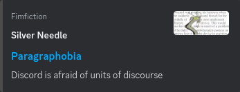

User: [Shirlendra](https://www.fimfiction.net/user/312832/Shirlendra)  
`https://www.fixfiction.net/user/312832/Shirlendra`  
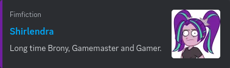

Blog: [Image Hosting on Fimfiction - An Authoritative Account](https://www.fimfiction.net/blog/1028988/image-hosting-on-fimfiction-an-authoritative-account)  
`https://www.fixfiction.net/blog/1028988/image-hosting-on-fimfiction-an-authoritative-account`  
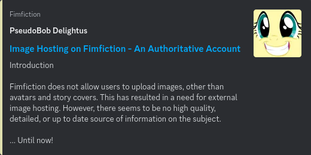

I think these embeds look better than how Fimfiction used to do them. I've done a number of things to try to improve them. Probably the most obvious is the color is taken from the image associated with the item. This is returned via the API, and after [Damaged](https://www.fimfiction.net/user/216165/Damaged) suggested it, I had to add it.

While the above are just pictures of the embeds, on the real ones, the tiny Fimfiction text is a link and will take you to the homepage, which on Fimfiction embeds, only used to be the case for stories. I also added the author link and name to blogs.

I also strip out all the BBCode tags from the text, which Fimfiction did not.

Now, let's get to the options you can use with FixFiction!

The first one lets you refresh the data in the cache of the service. By default, FixFiction will keep embeds cached for 24 hours before removing them, but this means that if you made a silly mistake like misspelling a word, every embed would have this present. We can fix this though with the `refresh=true` option.

To give this option, all you have to do is add `?refresh=true` at the end of the URL. One thing to keep in mind is that this has a 1-minute cooldown, so you have to wait up to a minute before re-caching something. This is so re-caching doesn't overload the Fimfiction API.

Here is an example: [sirenc0re](https://www.fimfiction.net/user/559908/sirenc0re)  
Before: `https://www.fixfiction.net/user/559908/sirenc0re`  

After: `https://www.fixfiction.net/user/559908/sirenc0re?refresh=true`  
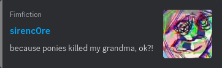

`becase` → `because` has been fixed! This mistake was manufactured with the help of [sirenc0re](https://www.fimfiction.net/user/559908/sirenc0re) .

The next option we will look at is stats, this adds additional details about the item. It can be enabled by adding `?stats=true` to the end of the URL.

Story: [Forgot Your Hat](https://www.fimfiction.net/story/528240/forgot-your-hat)  
`https://www.fixfiction.net/story/528240/forgot-your-hat?stats=true`  
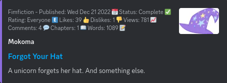

User: [heartlessons](https://www.fimfiction.net/user/534616/heartlessons)  
`https://www.fixfiction.net/user/534616/heartlessons?stats=true`  
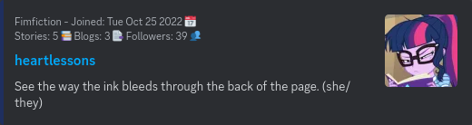

Blog: [Status Update - What's next?](https://www.fimfiction.net/blog/1055092/status-update-whats-next)  
`https://www.fixfiction.net/blog/1055092/status-update-whats-next?stats=true`  
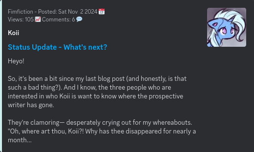

As you can see it adds info about when it was posted, the likes, dislikes, and more.

If a story doesn't have enough likes and dislikes for them to be public, or if the author disabled, they would show like this:

Story: [Maud's Mental Diary](https://www.fimfiction.net/story/561695/mauds-mental-diary)  
`https://www.fixfiction.net/story/561695/mauds-mental-diary?stats=true`  
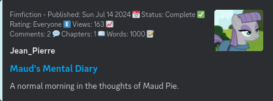

Now, when it comes to the stats, I'm using Unicode characters for the symbols, and these are rendered by whatever platform you are using. So, my screenshots are from Discord on Linux Mint using the Firefox web browser, they will likely look different on other platforms. There's not really anything I can do about this.

The next option we will cover is, well, cover. You can change the image displayed depending on the type of embed you are doing. By default, the embeds use the stories cover image if it has one.

For a story embed, you can choose `user` or `none`.

You can also use the parameter `image` instead of `cover`. I will be using `cover` for stories, and `image` for users and blogs going forward, but know they are interchangeable.

Story with user profile picture: [Futures](https://www.fimfiction.net/story/568143/futures)  
`https://www.fixfiction.net/story/568143/futures?cover=user`  
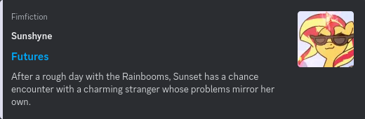

Story with no cover: [Petrichor](https://www.fimfiction.net/story/565847/petrichor)  
`https://www.fixfiction.net/story/565847/petrichor?cover=none`  
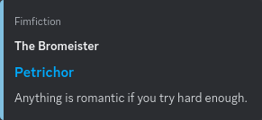

For a blog embed, you can select `story` if the blog has a tagged story, or `none`. By default, blog embeds use the user's profile picture, if they have one.

Blog with story cover: [WHAT](https://www.fimfiction.net/blog/1044279/what)  
`https://www.fixfiction.net/blog/1044279/what?image=story`  
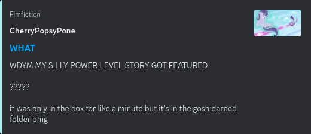

Blog with no cover: [Alicorn Down](https://www.fimfiction.net/blog/1061186/alicorn-down)  
`https://www.fixfiction.net/blog/1061186/alicorn-down?image=none`  
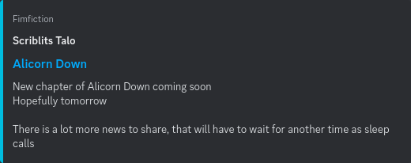

If you provide an option like `?image=story` on a blog with no tagged story, it will default back to user's profile picture.

You can also set a user embed to have no image with `?image=none`.

User no image: [Forcalor](https://www.fimfiction.net/user/564657/Forcalor)  
`https://www.fixfiction.net/user/564657/Forcalor?image=none`  
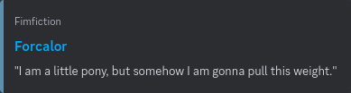

It is worth noting that FixFiction does not show the default profile picture for user's without an image.

The last option we will cover is color. The small strip of color on the left side of embeds can be changed. This option has the most customization.

The first color option is light. This color was used for all embeds on Fimfiction, when that was working. It's from the HTML with light theme set. Which for embeds was all of them, since the server requesting the embed didn't have a cookie.

To use this, just add `?color=light` to the end of the URL.

Going forward, all example with be stories, but this also works for users and blogs.

Story color light: [Sunset's Secret](https://www.fimfiction.net/story/571788/sunsets-secret)  
`https://www.fixfiction.net/story/571788/sunsets-secret?color=light`  
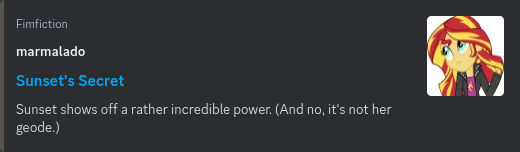

The dark color is next, and taken from the HTML with dark mode enabled.

Story color dark: [Sold on a fantasy](https://www.fimfiction.net/story/571763/sold-on-a-fantasy)  
`https://www.fixfiction.net/story/571763/sold-on-a-fantasy?color=dark`  
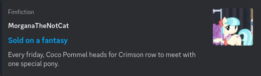

The next option is specifying a hex color code. Hex color codes typically start with a `#` but you cannot include it when using this option as the `#` specifies the start of a URL fragment, and they aren't sent to the server, so for example if you wanted to use the color of Pinkie Pie's coat you would use, `?color=f5b7d0`.

A good place to get pony specific color is the [MLP Vector Club](https://mlpvector.club/cg) website.

Here's an example with Pinkie's coat as the color.

Story color Pinkie: [Little Bits of Affection](https://www.fimfiction.net/story/533579/little-bits-of-affection)  
`https://www.fixfiction.net/story/533579/little-bits-of-affection?color=f5b7d0`  
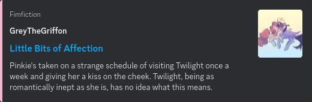

The next color option is `none`. This does not remove the colored bar, but just doesn't provide the value, so Discord will use its default for whichever theme you are in.

Story Discord dark mode: [How NOT to Confess to an Alicorn (or anypony, really)](https://www.fimfiction.net/story/554786/how-not-to-confess-to-an-alicorn-or-anypony-really)  
`https://www.fixfiction.net/story/554786/how-not-to-confess-to-an-alicorn-or-anypony-really?color=none`  
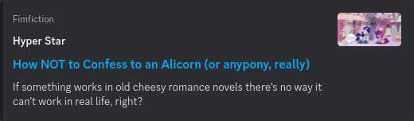

Story Discord light mode: [Rarishy Poems](https://www.fimfiction.net/story/562471/rarishy-poems)  
`https://www.fixfiction.net/story/562471/rarishy-poems?color=none`  
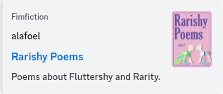

The last color options are to provide a CSS color name. A full list of them can be found [here](https://developer.mozilla.org/en-US/docs/Web/CSS/named-color).

Story CSS color name: [Flight 823](https://www.fimfiction.net/story/571375/flight-823)  
`https://www.fixfiction.net/story/571375/flight-823?color=rebeccapurple`  

You might have noticed the color I used doesn't seem like a standard color, but if you want to read about it, there is a story behind the color: [rebeccapurpple](https://medium.com/@valgaze/the-hidden-purple-memorial-in-your-web-browser-7d84813bb416).

That's all the options! (For now…)

One last thing, you can combine these options together, all you need to do is join them with a `&`, an example would be `?cover=story&color=red`.

Here's the last example combining all 4 options.

Story all options: [Pisces Noctium](https://www.fimfiction.net/story/559894/pisces-noctium)  
`https://www.fixfiction.net/story/559894/pisces-noctium?cover=none&color=pink&stats=true&refresh=true`  
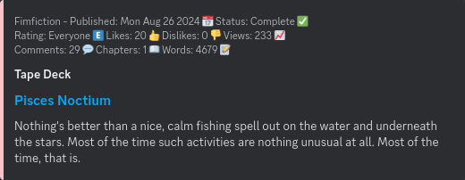

I plan to improve FixFiction in the future, but needed to move onto other projects for now. There are so many more features I have planned. If you have any suggestions for the project, please leave them in the comments below.

Some last minute information I didn't have the time to go into detail on:
- FixFiction embeds work for URL's that never had embeds before, like a user's stories page, or chapters of a story.
- It preserves the URL you provided, even if it isn't the canonical one, i.e., this link will take you to my profile: `https://www.fixfiction.net/user/237915/pinkie-pie-is-cute!`.
- Discord has its own caching strategy so refreshing the cache of FixFiction might not update it on Discord, to make Discord re-cache you need to change the URL, a common tactic is to add `?v=2` and change the number each time to re-cache.

One last thing, if you noticed, I used a different user for every example, and I chose users with less than 100 followers. So, if you feel so inclined, I would love it if you checked them out and see what they have to offer!

Hope this helps!  

