# Fixfiction v2.0 is released

After months of work, a new major version of [FixFiction](https://github.com/SilkRose/FixFiction) is online and available for use. Actually, everyone who's been using FixFiction for the last week or so has been using FixFiction v2.0, probably without noticing. This is good!

Something you may wish to notice, though, are all the changes, big and small, that are included in this release.

## New Endpoints

The biggest change is the introduction of new endpoints. Previously FixFiction only supported stories, blogs, and user pages. Additional endpoints are supported.

- ### Chapters
  This follows the natural syntax of a FimFiction chapter link.
  - `www.fixfiction.net/story/{storyid}/{chapternumber}/{storytitle}/{chaptertitle}`
  - `www.fixfiction.net/story/{storyid}/{chapternumber}/`
  Note that the `/` after the `{chapternumber}` is always required, otherwise the link will redirect to the story rather than the chapter. This behaviour is native to FimFiction and has been left unchanged. See more on this in the "Fixes" section.
  
  Examples:
  - Story "Changes" --> Chapter "One."
    `https://www.fixfiction.net/story/579410/1/changes/one`
    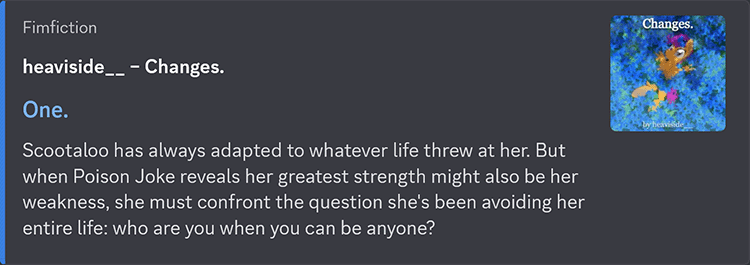
    
  - Story "Changes" --> Chapter "Two."
    `https://www.fixfiction.net/story/579410/2/`
    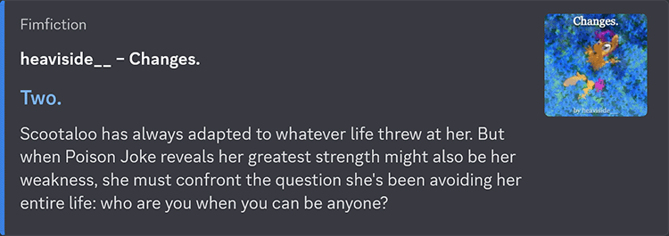
    
  - Story "Changes" --> Chapter "Three." 
    `https://www.fixfiction.net/story/579410/3`
    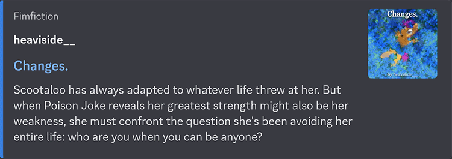
    (Leaving out the trailing slash will embed the story instead.)
    
- ### Bookshelves
  This follows the natural syntax of a FimFiction bookshelf link.
  - `www.fixfiction.net/bookshelf/{bookshelfid}/{bookshelfname}`
  - `www.fixfiction.net/bookshelf/{bookshelfid}`
  
  Examples:
  - Bookshelf "Story Recommendations"
    `https://www.fixfiction.net/bookshelf/2812367/story-recommendations`
    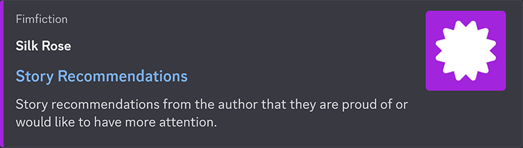
    
  - Bookshelf "My Shit"
    `https://www.fixfiction.net/bookshelf/717893`
    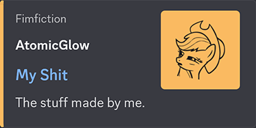
    
- ### Groups
  This follows the natural syntax of a FimFiction group link.
  - `www.fixfiction.net/group/{groupid}/{groupname}`
  - `www.fixfiction.net/group/{groupid}`
  
  Examples:
  - Group "A Thousand Words"
    `https://www.fixfiction.net/group/216361/a-thousand-words`
    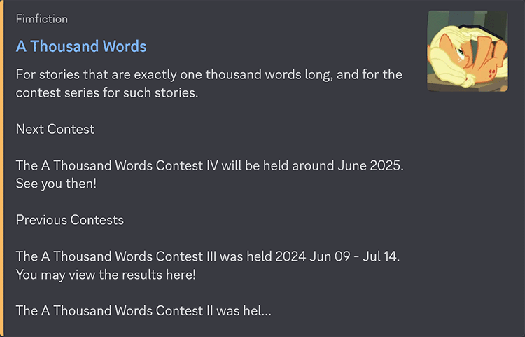
    
  - Group "Anterlot public Library"
    `https://www.fixfiction.net/group/215528`
    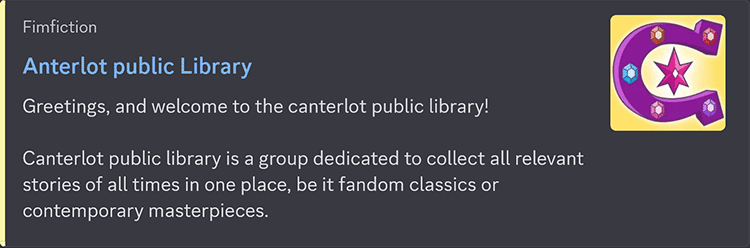
  
- ### Forum Threads
  This follows the natural syntax of a FimFiction forum thread link.
  - `www.fixfiction.net/group/{groupid}/{groupname}/thread/{threadid}/{threadtitle}`
  - `www.fixfiction.net/group/{groupid}/-/thread/{threadid}`
  Note that while the `{groupname}` is not required, the two slashes surrounding it are. You don't even need the hyphen. This behaviour is native to FimFiction.
  
  This endpoint also comes with a MASSIVE CAVEAT: Due to a limitation of the FimFiction API, only the 100 most recent threads in the group can be fully embedded. For the rest, FixFiction will still redirect to them, but the embedded content will be for the thread's parent group.
  
  Examples:
  - Group "A Thousand Words" --> Forum Thread "A Thousand Words Contest IV (2025 May 25 - Jul 06)"
    `https://www.fixfiction.net/group/216361/a-thousand-words/thread/561086/a-thousand-words-contest-iv-2025-may-25-jul-06`
    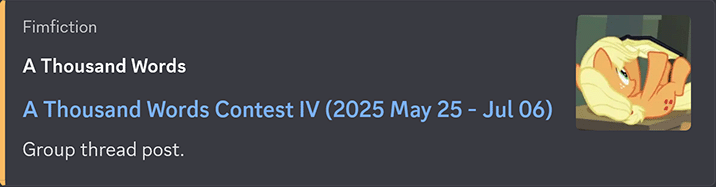
    
  - Group "A Thousand Words" --> Forum Thread "and CLOSED!"
    `https://www.fixfiction.net/group/216361/-/thread/562941`
    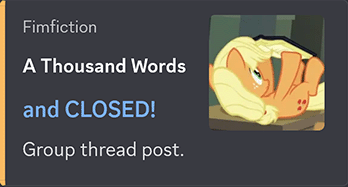

## New Query Options

'Query Options' are the little commands you add after a regular FixFiction link to change how it's displayed or what kind of information is included. Additional query options are supported.

- Blogs, Chapters, and Stories have a new option `tag`, accepting a boolean. When true, it includes tags in the embed.
  
  Blog: "New chapter of “Road To Glory” is out!"
  `https://www.fixfiction.net/blog/1127623?tag=true`
  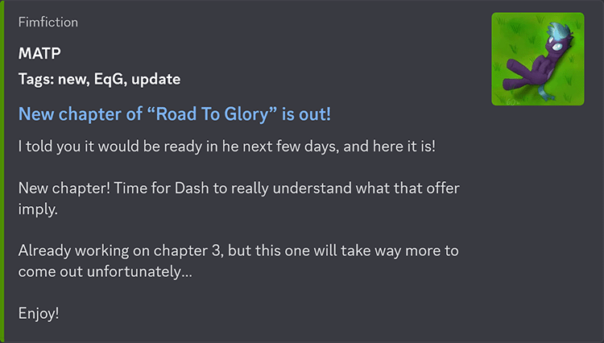
  
- Blogs, Chapters, Stories, Groups, and Forum Threads have a new option `comment`, accepting a number. When present, the passed value is used as a `{commentid}` and the following text is appended to the target URL: `#comment/{commentid}`. This allows you to make FixFiction links that highlight a specific comment. The appearance of the embed is unaffected.

There are also new values for existing query options.

- A new `color` value is `random`, which selects a random mane 6 colour to use as the embed's highlight colour. This value also has the alias `ran`.
  
  User: "pneu"
  `https://www.fixfiction.net/user/616548/pneu?color=random`
  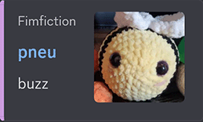
  
- A new `color` value is `modulo`, which applies a modulo function on the target's ID to select a mane 6 colour. Practically speaking it is similar to `random`, but the colour selected for a specific item will not change over time. This value also has the alias `mod`.
  
  User "Math Spook"
  `https://www.fixfiction.net/user/612387/Math+Spook?color=modulo`
  
  
- A new `color` value is `founder`, applicable to Groups and Forum Threads. This will take the colour of the user who founded the relevant group and use it for the embed.
  
  Group: "Harmony Reviews"
  `https://www.fixfiction.net/group/217953/harmony-reviews?color=founder`
  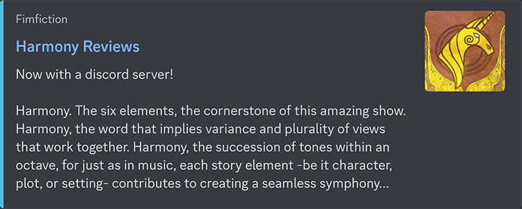
  
- Any option which accepts a boolean value will consider the following as `true`: "1", "yes", "y", "t".
- Any option which accepts a boolean value will consider the following as `false`: "0", "no", "n", "f".

And some aliases.

- The option `color` now has an alias: `colour`.
- The option `refresh` now has an alias: `renew`.
- The option `stats` now has an alias: `info`.

And a few other changes.

- Any unknown query options are appended to the target URL.
- All query options and values are now case insensitive. In other words, capitalization does not matter.
## Improvements

Various other parts of FixFiction have been improved.

- Stat numbers like view count, word count, etc. are now formatted as they are on FimFiction.
  
  Story: "Stormy Affair"
  `https://www.fixfiction.net/story/553709/stormy-affair?info=true`
  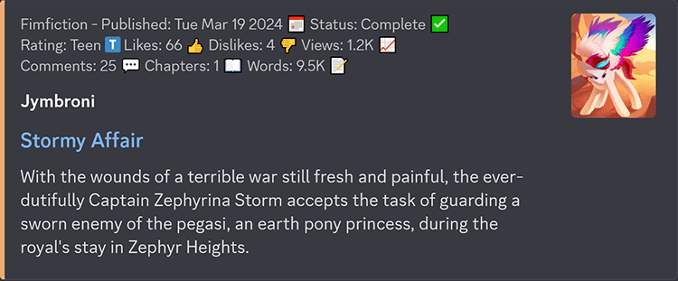
  
- Links and icons are now removed from embedded content to improve visual appearance.
- The "full" size variant for covers and profile pictures are now used, up from the "medium" size variant.

## Error Handling

Error handling has been improved.

- If a FixFiction link points to a valid destination but has syntax errors, the embed succeeds with an appended error message.
- If a FixFiction link causes a fatal error, it will embed an error message and a link to support pages.

## Fixes

Existing problems have been fixed.

- Some FimFiction links that may appear valid will actually lead to 404 pages. Typically these follow the pattern of a resource endpoint where the ID is supplied without a trailing `/`. For example:
  
  User: "AtomicGlow"
  `https://www.fimfiction.net/user/90142`
  (This link leads to a 404 page.)
  
  For Users, Bookshelves, Groups, and Forum Threads, FixFiction will add a `/` to the end of these types of links, allowing the embed to succeed.
  
  User: "AtomicGlow"
  `https://www.fixfiction.net/user/90142`
  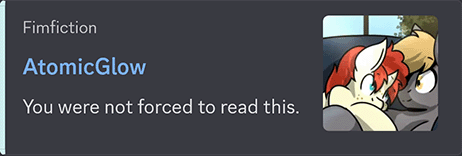
  
  This could not be fixed for the Chapter endpoint, as it would be ambiguous whether the link is meant to point to the first chapter of a story, or a story titled "1", for example.

## Future

Most readers may know that knighty and Xaquseg are preparing a major update for FimFiction. One expected feature that's relevant to FixFiction is an increased variety of bookshelf icons. We've been given advanced access to these icons, so FixFiction is ready for the update!