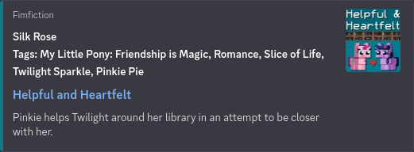
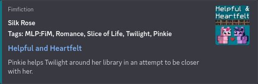
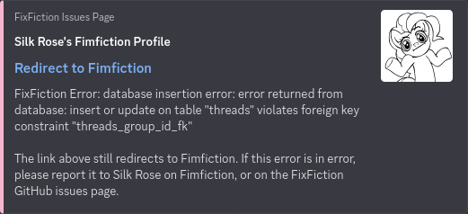

# FixFiction 2.1: Small Update, Small Fixes

I wasn't expected to have to release another update so soon, but a few smaller issues needed to be fixed. Let's get into it!

Let's start by going over the changes and fixes that don't have images associated with them.

The following changes have been made for group and thread embeds:
- Fix ending slash by adding it if missing.
- Fix parsing so URLs accept empty strings for group and thread names.
- Fix database insertion order so the group is inserted before the thread. (oops)

A big feature in this update is FixFiction now has proper error logging! Before The errors were shown to the user in the embed, but now they are also logged to the console and to a log file.

An example of a warning error:
`2025-10-11T14:49:05.218556231 - warn: Unsupported info value: ture -- Link: https://www.fimfiction.net/user/1/knighty`

An example of a fatal error:
`2025-10-14T19:43:47.966700138 - error: Fimfiction API Error: 4040 – Resource not found -- Link: https://www.fimfiction.net/story/552650`

There was a minor spelling mistake in the fatal error embed message, one of the name drops for Fimfiction was missing the second `i`.

Now, lets get into some of the more visual changes in this update!

Story tags now appear in the same order as on Fimfiction, and They've been shorted similar to how they are on the site.

Before: [Helpful and Heartfelt](https://www.fimfiction.net/story/581870/helpful-and-heartfelt)  
`https://www.fixfiction.net/story/581870/helpful-and-heartfelt?tags=1`

After: [Helpful and Heartfelt](https://www.fimfiction.net/story/581870/helpful-and-heartfelt)  
`https://www.fixfiction.net/story/581870/helpful-and-heartfelt?tags=1`

The shortened tag names help a lot, especially for stories with long tag names or lots of tags. Some embeds had no tags before because of the length. Unfortunately I don't have a before and after for each separate change, I only have it for both the sorting and tag name shortening.

Also, tags weren't being requested for chapter embeds, this is now fixed!

Database errors now give way more context for what happened:  

Added support for 1 char hex codes: `f` -> `ffffff` 
Story: [Missed Opportunities](https://www.fimfiction.net/story/540071/missed-opportunities)  

Added support for 2 char hex codes: `67` -> `676767`  
Story: [Under a Frozen Moon](https://www.fimfiction.net/story/581626/under-a-frozen-moon)  

Added support for 3 char hex codes: `16c` -> `1166cc`  
Story: [Of Dragons and Maternity](https://www.fimfiction.net/story/484327/of-dragons-and-maternity)  

Version 2.1 added 300 lines of code in 23 commits. That might seem small, but the logging module I wrote was in my [Pony](https://github.com/SilkRose/Pony) repository, which holds all my library code. The log module is 300 lines by itself.

Again, like last time, some of the embeds have users who deserve more attention, so go give them some love!

Thanks for reading!  

