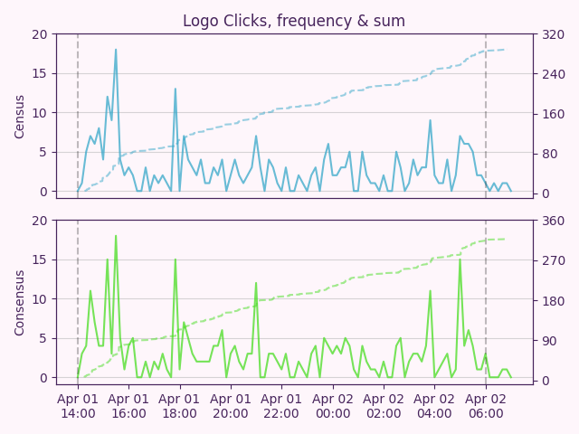
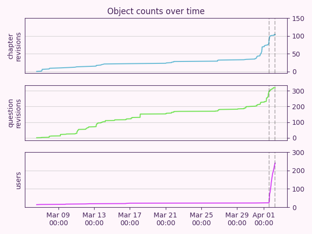
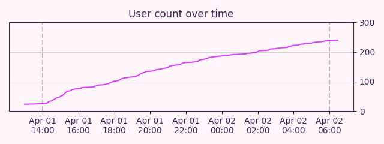
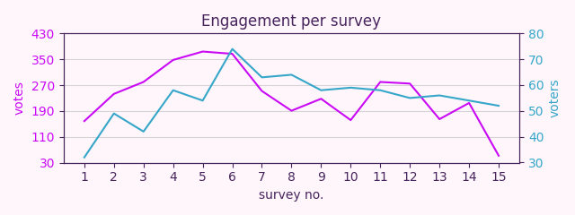

# Census Consensus

Tagged story: [Census Consensus](https://www.fimfiction.net/story/589323/census-consensus)

***

## Introduction

With the release of this blog post, our [custom survey site](https://census.silkrose.dev/) has been updated to allow anyone to vote on all the surveys! It lets you view the current results for each chapter, and a random results page can show you any combination of answers. If you missed the event, feel free to go vote and make your voice heard!

In addition to allowing you to vote for missed surveys, you can also vote more than once to re-cast your ballot. We've also made the behind-the-scenes pages visible to the public. You can see exactly how chapters and questions were written and see every revision of them.

This story was a lot of fun, but it was also a lot of stress. The idea was chosen in early December, when I was naive and thought it'd only take a month to a month and a half to code everything. In mid-December I made a group on Discord with myself and nine other people interested in the project. [Meadowsys](https://www.fimfiction.net/user/487213/meadowsys) started on the code at the end of December, and I joined her in coding in the middle of January. We ended up coding right up to and including April 1st. We even had to re-deploy twice to fix bugs while the event was happening. But we'll talk about that later.

For anypony who wants to browse the code, it is now public. It's all open source, and you can find it [here](https://github.com/SilkRose/Census-Consensus).

Thank you to [Math Spook](https://www.fimfiction.net/user/612387/Math+Spook) and [Hipponous](https://www.fimfiction.net/user/875988/Hipponous) for proofreading this blog.

## Collaborators

Before I continue, I'd like to thank everypony below who helped with this project throughout its development:

- [ashley1227](https://www.fimfiction.net/user/499793/ashley1227)
- [FanOfMostEverything](https://www.fimfiction.net/user/1400/FanOfMostEverything)
- [hawthornbunny](https://www.fimfiction.net/user/77473/hawthornbunny)
- [heaviside__](https://www.fimfiction.net/user/860080/heaviside__)
- [Hipponous](https://www.fimfiction.net/user/875988/Hipponous)
- [Lunaria](https://www.fimfiction.net/user/68640/Lunaria)
- [Math Spook](https://www.fimfiction.net/user/612387/Math+Spook)
- [meadowsys](https://www.fimfiction.net/user/487213/meadowsys)
- [PseudoBob Delightus](https://www.fimfiction.net/user/12771/PseudoBob+Delightus)
- [Rego](https://www.fimfiction.net/user/180061/Rego)
- [RunicTreetops](https://www.fimfiction.net/user/489485/RunicTreetops)
- [Scriblits Talo](https://www.fimfiction.net/user/495925/Scriblits+Talo)
- [Shakespearicles](https://www.fimfiction.net/user/83757/Shakespearicles)
- [Shay492](https://www.fimfiction.net/user/840747/Shay492)
- [Silver Needle](https://www.fimfiction.net/user/463467/Silver+Needle)

I guess I should explain how the event worked before going into more detail.

Once the story was live, a custom survey site allowed users to vote on a survey that would affect the outcome of an in-universe census that the Mane 6 were holding. Everything from the questions, options, and results were all written before the event went live, so the code could publish the results for whatever options won.

If that didn't explain it well enough, you can read [Math Spook's](https://www.fimfiction.net/user/612387/Math+Spook) blog post: [Behind the scenes of “Census Consensus”](https://www.fimfiction.net/blog/1138770/behind-the-scenes-of-census-consensus); it does a great job of explaining the event. You should read it even if you understood my explanation; it's a good read, and he's a great writer.

Let's start at the beginning. Late last year [PseudoBob Delightus](https://www.fimfiction.net/user/12771/PseudoBob+Delightus) told me he wasn't planning to do an April Fools event this year. I'd helped him do two of these in the past, so I felt like I could step up and do something instead. I mean how hard could it be? The last two years, while hectic, weren't *that* bad…

## Previous Events

### The Exploding Story

Now, while in the middle of explaining this story, let's go back even farther to the first April Fools event I helped with: [This Story Did Not Explode](https://www.fimfiction.net/story/553695/this-story-did-not-explode), or as we called it internally, The Exploding Story. I was the one who came up with the idea. We both immediately liked the idea and went forward with it. [PseudoBob Delightus](https://www.fimfiction.net/user/12771/PseudoBob+Delightus) wrote it while I coded it with help from [meadowsys](https://www.fimfiction.net/user/487213/meadowsys) for the timing code. I also wrote two chapters. Had to insert romance into it somehow, right?

This story exploded onto the scene, immediately getting attention. The event was awesome and ran without a hitch. Well, at least my code went off without a hitch. You can read more about this event in Bob's blog on it: [The Real Explosion Was The Friends We Made Along The Way](https://www.fimfiction.net/blog/1036675/the-real-explosion-was-the-friends-we-made-along-the-way). I also wrote a blog post about the code.  You can read it here: [The Exploding Story Code Overview](https://www.fimfiction.net/blog/1036674/the-exploding-story-code-overview).

A fun fact about this story: while it was live, an archival friend of mine messaged me to ask if it was really going to explode, because he wanted to know if he had to stay up all night to archive the story so it wouldn't be lost.

I bring up The Exploding Story to say: this is where it all began. I won't speak for Bob, but for me this is where I realized a story could be more than just a story, it could be an event. We immediately knew that whatever we did next year, we wanted it to be interactive. This was something we'd always wanted, but didn't have the time for this first event.

### The Democracy Story

Next year's event was exactly that: interactive. [Democracy Manifest](https://www.fimfiction.net/story/575601/democracy-manifest), known as The Democracy Story, was interactive; it used the like button as a way to vote on proposals in the story. I wrote the code while Bob did the writing, but this time with some outside help. I also wrote two chapters.

One interesting thing about the code that only I utilized: it allowed branching paths. I wrote the chapter where you vote on if Pinkie or Fluttershy are cuter. Then whoever is voted less cute, goes back to the voting ponies to ask them if she should ask out the other pony. If you'd like to read the alternative chapters, you can do so [here](https://github.com/SilkRose/Pony/blob/mane/stories/democracy-manifest/democracy-manifest-meta.md) in my [Pony](https://github.com/SilkRose/Pony) repository.

A fun fact about this story: no matter which way you vote on my two chapters, I made it so they always ended up together.

I recently re-read this story, and I really liked this line I wrote in it:
> Fluttershy smiles, appearing more relaxed after getting that off her chest. "She's just so amazing, I really want to ask her out, but I don't know if I could do it without the support of a bunch of ponies I don't know who agree that she is cuter than me."

You might have noticed that neither Bob nor I wrote a blog about this story. Bob was burnt out from writing and a little disappointed with it, so he didn't want to write a blog. I didn't want to write one unless Bob was going to, and the code was messier and would be harder to explain.

This story had what can only be described as an obvious flaw in its design: you can only like a story once. Because removing a like counted as a no vote, interacting with the mechanics of the story was very clunky. There was a five-minute window between chapters in which you could remove a like to get your vote back, but I don't know how many people realized this.

Some readers interpreted that disliking the story counted as a no vote. We tried our best to explain that only the like button was used. I think this misconception is why the story has so many dislikes.

[PseudoBob Delightus](https://www.fimfiction.net/user/12771/PseudoBob+Delightus) wrote this about the story while discussing this blog:
> This Story Did Not Explode was more fun, but I still enjoyed writing Democracy Manifest. Even the usual 'scrambling to get things finished at the last minute' stage has its charm, though in this case it was particularly exhausting.
>
> The big problem with Democracy Manifest, though, was user experience. The mode of interaction made little sense and provided no feedback, so users had trouble understanding how to vote, what their votes did, and whether voting did anything at all. This made the live story event frustrating to engage with, so many people didn't. It was a critical mistake and a disappointing failure and an important lesson.
>
> I am still very grateful for everyone who contributed to it, especially Silk Rose, without whom it would not have happened at all.

If I had to rank these two stories in terms of fun and enjoyment, I'd put The Exploding Story above The Democracy Story. While they were both fun, The Democracy Story didn't have that explosive energy of the first one.

I'm not sorry for any of the explosion puns.

## Early Development

Now, let's get back to this year's event: [Census Consensus](https://www.fimfiction.net/story/589323/census-consensus).

For the last 2 years, I had someone to call the shots for me. Bob was an amazing coordinator for these April Fools events. This was the first event where I had to lead the ship myself.

I wanted this whole project to be as collaborative as I could get from the very start. I didn't want to arbitrarily decide anything unless it was absolutely necessary. This is why the Discord group was made before any code had even been written.

The first thing I coded for the project was the database SQL, over a thousand lines of create, delete, update, and insert SQL statements. Once I got the table creation done, [PseudoBob Delightus](https://www.fimfiction.net/user/12771/PseudoBob+Delightus) helped me with fixing the table designs. He says he didn't help with this event, but he did help with this in the very beginning.

The original plan for the code was for myself to code the back end server stuff, while [meadowsys](https://www.fimfiction.net/user/487213/meadowsys) coded the front end using a specific library called [Leptos](https://www.leptos.dev/). Unfortunately, we never got to the point of converting my back end HTML template code to the new system, as we ran out of time. And the code I had written on the back end using an HTML template library called [Maud](https://maud.lambda.xyz/) was functioning well. Yes, that library's name is a MLP reference.

A fun fact about this story: [hawthornbunny](https://www.fimfiction.net/user/77473/hawthornbunny) thought of a question idea early on about a pony working in the factory the census was being printed in getting stuck and asking a question on the survey as a way to call for help. We never found a way to use this, but we all liked the idea.

Authentication was trickier than expected. We figured that potential voters would already have Fimfiction accounts, and we thought that authenticating through Fimfiction would simplify our development and provide a better user experience. They wouldn't have to trust us to handle a password correctly, but they would still be able to see and change their votes. On our side, requiring accounts prevented abuses like vote-stuffing and let us associate feedback to users.

Fimfiction limits API access to a user's account using [permission scopes](https://www.fimfiction.net/developers/api/v2/docs/scopes). We didn't want to do anything besides authenticate, so our first attempt asked for no scopes at all. That triggered a Fimfiction bug: It returned an error whether or not authentication succeeded. So instead, we asked for the `read_user` scope. The only thing this does is allow us to see an account's email address (and we threw away the token necessary to do that). This led to a second "bug." Fimfiction's page for granting access said that our site would be able to see "things like an email address." That's vague and sounds a little suspicious. Math Spook suggested using the `read_chapter_read` scope. It's supposed to be for seeing what chapters a user has read, so it sounds peculiar but harmless. It doesn't work at all, though, because of another Fimfiction bug. `read_user` was the best we could do. At least one person on the Fimfiction Discord server was bothered enough by the idea of giving "some rando" vague access that they didn't participate in voting.

By the time the database code was done, meadow had authentication working, and I could start working on the pages for writers to create and edit questions and chapters.

## Site Screenshots

### Early Site Pages

Here is an early screenshot of the `/chapters` page:  

The `add` button orders the chapter. Only ordered chapters get posted when the event is live. The up and down arrows for vote duration adjust the time for voting on that chapter's survey.

Here is an early screenshot of the `/chapters/{id}/revisions` page:  

This shows every revision of the chapter, so no data is lost.

Here is an early screenshot of the `/questions/new` page:  

This page was later moved to be at the bottom of the question list page. Response percentage is how many ponies in-universe responded. If this is set to 50%, then the answers to the survey are scaled so the total count is half of 50,240,000.

Here is an early screenshot of the `/questions/{id}/revisions` page:  

Here is an early screenshot of the `/chapters/{id}/questions` page:  

This page lets you add a question to a chapter and move around the order within that chapter. It also lets you claim a question, signaling that you plan to write that question.

It took a while, but I eventually got all the pages working. Initially I made the questions and chapters pages use HTML tables, but eventually this changed, as you will see in a bit.

### Color Schemes

The next thing I worked on was the color schemes. As you might have seen on the site, the color themes are Celestia for light and Luna for dark. I used the [MLP-VectorClub](https://mlpvector.club/) website and the [Realtime Colors](https://www.realtimecolors.com/) website to create the themes. You can view the original versions here: [Celestia](https://www.realtimecolors.com/?colors=5e2f79-fef6fb-fcd8b6-fdf5b4-f2d9e8&fonts=Inter-Inter), [Luna](https://www.realtimecolors.com/?colors=a7bef1-171a35-3adfc3-00c5cc-aba4f4&fonts=Inter-Inter).

After the site was functional and looked decent, it was time to start writing. The first question of the story was created on March 3rd 2026 at 5:39AM UTC. Yes, the entire story was written very late into development. Some things never change.

I used the Luna theme initially, as I love dark-mode everything, but something about the Celestia theme made me switch, and I've been using it ever since. A few people mentioned in their feedback that they really liked the themes being Celestia and Luna. Thank you!

### Event Complete Pages

Here is a screenshot of the `/user` page for an admin:  

It had an extra spot to update a user's role and a spot to ban a user. We wanted to be prepared for anything. Luckily, we never had to ban anypony!

Here is the `/chapters` page:  

This shows all the relevant information while still looking good on desktop and mobile.

Here is the mobile `/chapters` page:  

Here is the bottom of the `/chapters` page:  

This has the new chapter form.

Here is the `/chapters/{id}/revisions` page:  

It shows every revision in an HTML details element, including the date and time it was saved and who made the revision.

Here is the `/questions` page:  

This shows all the relevant information while still looking good on desktop and mobile.

Here is the mobile `/questions` page:  

Here is the bottom of the `/questions` page:  

It has the form for creating new questions.

Here is the rest of the form on the `/questions` page:  

Here is the `/questions/{id}/revisions` page:  

Includes the same info as the chapter revisions page, but for questions.

Here is the `/feedback` page, which was for writers and admins only:

As you can see, I used my private feedback to write my message for sending to potential collaborators. It also includes the logo clicks stats, more on this later.

Here is a screenshot of the only admin-only page, `/dashboard`:  

This has forms for adjusting the story ID, the total population of Equestria, vote duration for all chapters, the event reset, and the start date and time.

Another fun fact about this story: The population of Equestria used for the event was taken from the start of a new save in [Hearts of Iron IV](https://store.steampowered.com/app/394360/Hearts_of_Iron_IV/) with the [Equestria at War](https://steamcommunity.com/sharedfiles/filedetails/?id=1826643372) mod.

All these screenshots were taken before the code was updated to make some of these pages public. A lot of site functionality will be removed by now to make most things read-only.

## Late Development

Once writing had started, I worked on polishing the site and fixing bugs until it came time to code the event loop, the thing that controlled the event and updated the story with the correct chapter.

A fun fact about the website: The user [LastToTheParty](https://www.fimfiction.net/user/584567/LastToTheParty) is the last person to sign up as I write this. Their name checks out.

Now at this point in development we were getting really close to April 1st. The stress was getting to me, and I had only written about nine questions for the event. I had to stop writing and go back to coding to get it all done in time.

Thankfully all the amazing people listed above helped out! [RunicTreetops](https://www.fimfiction.net/user/489485/RunicTreetops) wrote the three questions on The Friendship Chapter that I couldn't finish. [Math Spook](https://www.fimfiction.net/user/612387/Math+Spook) wrote the first and last chapters, while helping fix bugs in my code. [hawthornbunny](https://www.fimfiction.net/user/77473/hawthornbunny) helped connect chapters, add extra details, and find and fix formatting errors. [meadowsys](https://www.fimfiction.net/user/487213/meadowsys) coded the parser that converted our mess of a format into something readable that was posted on Fimfiction.

Literally the day of the event, 8 hours before launch or so, I added a page to preview chapters based on the current votes in the database. I also added a page to preview chapters with random votes. This was insanely useful for catching and fixing formatting errors. Absolutely crazy this wasn't implemented before the day of, considering how much it helped.

## Asset Showcase

Before we get to the live development during the event, let's go over the assets created for this project.

### Website Icons

[Math Spook](https://www.fimfiction.net/user/612387/Math+Spook) created the website icon based on an idea I had. They were some of the first things he made in [Inkscape](https://inkscape.org/). We dynamically serve the light or dark based on which theme you select or, by default, the browser's preferred theme.

Celestia theme icon:  

Luna theme icon:  

### Story Covers

After Spook did such a good job making the icons, I decided to see what I could do in Inkscape to make a cover.

Celestia theme cover:  

Luna theme cover:  

The story on Fimfiction uses the Celestia-themed cover, but I made a Luna version too.

Fun fact about the cover: I intentionally chose to showcase this question. I thought it would be funny to show a question that was never asked on any of the surveys. And Pinkie is, in fact, best pony.

## Live Event Development

After the event went live and seemed to be working, I breathed a sigh of relief. It didn't last long, though. After 2 surveys had completed, we noticed, and so did a reader in the comments, that the numbers weren't adding up.

We diagnosed the problem 15 minutes before the third survey went live. In my code for calculating the votes, I was putting them into buckets based on option IDs. I thought this function also sorted the votes beforehand, but I was wrong. This caused the bucket tallies to get overwritten every time the order of the votes and the order of the option IDs didn't match (which was almost all the time).

I added a sort into the database SQL statement and deployed the fix with only 6 minutes to spare. It worked and fixed the issue. We also used the website preview to get the correct chapter text for the already published chapters so that we could copy it over.

The second issue we ran into during the live event was on the 10th survey. The story's short description always showed one of the questions from the current survey. One particularly long question was so long that Fimfiction didn't allow it to be used as a short description. I was aware that this was a possible problem, but my string length limiting code had a bug. I was limiting the length, but I think it was one character too long. For 20 minutes my code was unable to update the story on Fimfiction, so I had to sit and manually operate the title countdown. After that question had passed, I fixed the code and deployed the fix.

A third issue we only discovered after the event: I forgot to save the API response to the database. I had wanted to showcase some graphs with metrics over time, but this data is lost to us.

## Chapters
Hello ponies! [hawthornbunny](https://www.fimfiction.net/user/77473/hawthornbunny) here. Silk Rose is busy coding (seriously, she's done way too much on this project and needs a break), so I'm taking over to talk about the chapters that we wrote for the event.

There was no overarching plan for the story - in fact, the whole "Celestia gets the Mane Six to do a survey" framing wasn't even added until like the final day. There was a lot of confusion in the writing team about how the story was structured temporally - I thought we were writing the before and after threads separately, others thought the survey was somehow being taken and answered in real time, and it was all rather incoherent and a mess. So, while Silk Rose and Meadowsys were busy hammering at the code, us writers were busy hammering the story into shape, and, luckily, it all came together before the deadline.

Let's take a look at each chapter!

### [Inquiring Ponies Want to Know](https://www.fimfiction.net/story/589323/1/census-consensus/inquiring-ponies-want-to-know)
**Written by:** Math Spook

Math Spook basically carried us through the final day, supplying this first chapter that justifies the existence of the census and makes the whole thing work via vaguely-explained time magic. A handy excuse for our clumsy writing coordination. Spook talks about the chapter in his [behind-the-scenes blog](https://www.fimfiction.net/blog/1138770/behind-the-scenes-of-census-consensus), so you can read about it there, but, for my part, I thought the escalating cake binge was hilarious. FanOfMostEverything provided the chapter name.

### [The Friendship Chapter](https://www.fimfiction.net/story/589323/2/census-consensus/the-friendship-chapter)
**Written by:** Silk Rose, RunicTreetops, hawthornbunny

This was one of the first chapters written - a nice straightforward one about friendship to start us off. I thought it was a little plain, so I added a joke about Applejack mistaking "census" for "censors".

It's in this chapter that readers first get to see how their survey choices affect the writing. The system was designed so that no matter what readers chose, there would always be a response pre-written. Silk Rose's engine was designed to handle complex situations like "what if less than 30% chose option C", but I don't think any of us actually used anything more complex than "which option got the most votes". The responses all get compiled into one chapter that hopefully reads like a continuous narrative to the audience, which is why each chapter is just the characters reading through the answers one-by-one.

At the end of each chapter, there's an outro, which is supposed to connect each chapter to the next, and we had to write them all pretty much on the last day because we didn't know what the chapter order was going to be. I had some fun with these, as they were a chance to include a bit of actual continuity, like Rainbow Dash working on her own questions in the background.

Also I don't know if anyone noticed this:

> "Singing!" Pinkie nodded. "We do it all the time! I've always wanted to know how other ponies sing too, you know, when they're off - off somewhere else."

She was about to say "offscreen", but stopped just short of breaking the fourth wall.

### [Spontaneous Singing](https://www.fimfiction.net/story/589323/3/census-consensus/spontaneous-singing)
**Written by:** Silk Rose, hawthornbunny

**Proofread by:** Hipponous

Silk Rose's second chapter, but with significant additions by me. Silk's responses ended up coming out a bit short, so I took the opportunity to add an intro that shows how the time spell actually works. This also conveniently allowed me to double the amount of Derpy in the story, for no reason other than to make FanOfMostEverything happy.

There's a reference to *Inside Out*:

> "I knew it! How could it not be Joy? She's the best emotion!"
> 
> Applejack tilted her head, puzzled. "She?"

The outro for this chapter was written by Math Spook, as it leads into his economics chapter.

### [On apples, and the consumption thereof](https://www.fimfiction.net/story/589323/4/census-consensus/on-apples-and-the-consumption-thereof)
**Written by:** Math Spook

A chapter about Applejack and apples. I love how Applejack starts off with the pretense of being sensible but just goes completely off the rails when the subject is apples, and you can just see Twilight beginning to regret the entire endeavor. Again, see Spook's blog for more details, but I liked this line:

> Look at how many ponies want to buy apples! Why, 6,209,664 want to buy over six quintillion apples each! That’s more apples than have ever existed! Can you just imagine the sales?

### [The misery and sacrifice of fashionable mares](https://www.fimfiction.net/story/589323/5/census-consensus/the-misery-and-sacrifice-of-fashionable-mares)
**Written by:** Math Spook

And then Applejack has the gall to call Rarity's questions silly. Rarity's questions are more or less fine - it's just that she comes to the absolute stupidest conclusions from the data, like finding out which fashion opinions are the most popular so that they can deliberately ignore them next season. Also, Rarity is a walking chemical incident. I think this is where Spook started to hit his stride with the writing, as this one flows a lot more naturally even though it's composed from pre-written blocks.

I wrote the outro for this chapter, which has the characters all take a break for a bit. There were a few reasons for this: firstly, we'd already written later chapters that take place on different days, so I needed to establish that the time spell does actually allow for this. And secondly, I needed to separate Pinkie and Twilight, because Silk Rose's romance chapter has Twilight filling in her census answers as the outcomes are revealed, so she can't know about it beforehoof.

### [Romantic Research](https://www.fimfiction.net/story/589323/6/census-consensus/romantic-research)
**Written by:** Silk Rose, hawthornbunny

**Proofread by:** Hipponous, Math Spook

Silk Rose's romance chapter, AKA an excuse for Silk to get her OTP Twi-Pie into the story, a goal with which I am only too happy to assist. Pinkie's hastily-written questions, it turns out, are just her using the census to ask Twilight out, because if you've got access to government analytics and a time spell, why not make use of them?

After some smoochy time, Rainbow Dash's story arc comes to a point as she finally gets to ask the questions she's been working on. I took the liberty of having Rainbow also subvert the census system by submitting her questions without Twilight's oversight, because that was a convenient way to join it to the next chapter...

### [Sports in General](https://www.fimfiction.net/story/589323/7/census-consensus/sports-in-general)
**Written by:** RunicTreetops, hawthornbunny

...which opens with Twilight putting her hoof down and telling them not to submit any more census questions without her approval. She also slices an envelope open with a letter opener spell, a nod to the horrifying capabilities of unicorns.

Runic's prewritten responses did not include the actual questions being asked - a problem because without this context, the ponies would just seem to be reacting to nothing and it would be impossible to tell what's happening. I went in and added them myself, which is why the formatting of this chapter is different from the ones up until now.

Anyway, Dash's questions are about sports, and they're all stupid, but in fairness, she's probably the *most likely* to write stupid questions, including the amazing **Why aren't you an athlete? (Yes/No)**.

At the end, Mayor Mare comes in, and - being a government official - she already knows about the census and has her own designs for it.

### [Political Polling](https://www.fimfiction.net/story/589323/8/census-consensus/political-polling)
**Written by:** Shay492

Shay gave us a break from the Mane Six asking the absolute dumbest questions possible by having the canny Mayor Mare usurp the census for her own political ends. After all, if anypony knows how to wield an instrument of government, it's ol' Scrollflank. After a bit of taxpayer-funded, magic-accelerated polling, the Mayor leaves with her ill-gotten data, just in time for the true villain of the story to arrive...

... *Gen Z*.

Spook originally thought we'd reject the Skibidi Mark Crusaders for being too stupid, but we all loved it, and I particularly love the ominous way he introduced them. How many other stories will give you electoral analytics and skibidi in the same chapter? Don't answer that.

### [Skibidi Mark Crusaders](https://www.fimfiction.net/story/589323/9/census-consensus/skibidi-mark-crusaders)
**Written by:** Math Spook

I'll be honest, I still have no idea what the CMC were saying, and it's funnier that way. It took me a few rereads to notice that Apple Bloom says nothing but "bruh" for almost the whole chapter. And introducing Luna of all ponies as the only one able to communicate on the CMC's level was pure genius. If you want to know what Luna was actually saying, check Spook's blog. soþlice.

I bet this line hit more readers than expected:

> Rainbow Dash said, “Face it, Twilight. From their perspective, we’re old folks now.”

I decided that the mind-breaking insanity of the Skibidi Mark Crusaders and Luna was the perfect excuse to have everypony take another break, which was good because I needed Twilight alone in her castle in order to lead into my chapter.

### [Elemental Efforts](https://www.fimfiction.net/story/589323/10/census-consensus/elemental-efforts)
**Written by:** hawthornbunny

This was the first chapter I wrote, and you can tell because the survey responses are kinda rubbish - there's only 4 questions, and they all come one right after the other before the chapter ends , without much in the way of humor. I got better at it later on, I think. But I do like the lead-in to this chapter, which had the Tree of Harmony commandeer Trixie's body so that it could talk to Twilight. This allowed me to include a little mythology gag, where Twilight tells the Tree to make its own avatar next time (not realizing that the Tree will end up just copying her form).

There's no real throughline from the census to the next chapter, because when I wrote my chapters I was under the impression that we were writing the before-census and after-census parts separately. So, it just cuts straight to Rarity in the spa with Zephyr Breeze. Zephyr is here because a friend of mine adores the stallion, and thus I really wanted to include him. And Zeph definitely wouldn't shy away from a spa visit, so we get him and Rarity shooting the breeze. Oops, bad phrasing.

Zeph tries to hit on Rarity because of course he does, but he also knows a lot about manes, which provides a perfect opportunity for them to collab on the next chapter and learn about the state of Equestrian haircare.

### [Quit Polling My Mane](https://www.fimfiction.net/story/589323/11/census-consensus/quit-polling-my-mane)
**Written by:** hawthornbunny

It's a pun, see. I really did write completely different responses for all the mane colors, but for whatever reason, everyone picked "None", so you got goths.

Of course, the *real* reason for this chapter is so that Zephyr can ask his completely stupid, self-serving question, and everyone voted for his ass because of course they did. Apparently I was the only one who didn't see that coming, and annoyingly that was the worst response I wrote. You shoulda voted for hooves and you'd have learned something about Applejack.

After that nonsense, FanOfMostEverything enters the battlefield! He wrote the outro, which is about Fluttershy shyly using the census to ask 60 million ponies about their pets.

### [Help Patrol the Pet Population](https://www.fimfiction.net/story/589323/12/census-consensus/help-patrol-the-pet-population)
**Written by:** FanOfMostEverything

I put this chapter after the Rarity/Zephyr one because the characters were already all off doing separate things and it made sense (you can argue that this is why Fluttershy isn't at the spa with Rarity and her brother). In this chapter, Twilight and Fluttershy enjoy some gentle friendly bonding as they go over the census results about pets, and Twilight tries to prevent Fluttershy from going into a ponicidal rage. Even Fluttershy, it turns out, isn't immune to the pitfalls of poor survey design.

By a stroke of good fortune, Twilight and Fluttershy also happened to be the only characters present during Lyra's intro, so it made perfect sense for her chapter to come next. But how to join these two very tonally different scenes together? I needed to come up with something that could smoothly bridge the gap between this sweet scene of platonic love and Lyra's agitated raving. A segue so subtle, so silken, that readers wouldn't even perceive the transition.

Anyway, Lyra comes in ranting about humans, and she wants to use the census to find ponies she can trust. It's time for The H-Files.

### [The H-Files (insert spooky whistling theme music here)](https://www.fimfiction.net/story/589323/13/census-consensus/the-h-files-insert-spooky-whistling-theme-music-here)
**Written by:** Math Spook

Despite being a child of the 1990s, I never actually watched The X-Files. I was more into spaceships and lasers. Anyway, Starlight Glimmer makes a welcome return in this chapter, bringing some much-needed skepticism to counter Lyra's insane conspiratorial logic. This was my favorite bit:

> “Yes, many ponies who experience human abductions say they have a dreamlike quality,” said Lyra. “Nopony understands why.”
> 
> “Really?” asked Starlight Glimmer dryly. “Nopony has figured out what a dreamlike experience that happens while you sleep could possibly be?”

The story starts going completely off the rails at this point, assuming it was ever on them to begin with, as Maud unearths an ancient evil that turns Fluttershy into a giant mechanical monster, and Twilight decides this is a perfect topic for the next section of the census.

### [Terror of Mecha-Fluttershy](https://www.fimfiction.net/story/589323/14/census-consensus/terror-of-mecha-fluttershy)
**Written by:** Math Spook

I have seen a little bit of *Neon Genesis Evangelion*, enough to understand the whole joke with the traumatized child mecha pilot. This entire chapter is so much self-aware parody that it probably gained sentience, and I love it. My favorite part is the bit where Rainbow Dash gets traumatized slightly too late to be of any use.

We were near the end of the story at this point, and I'd decided to put my final chapter last, as it takes place in the far future. Since Spook's Mecha-Fluttershy chapter acts as a kind of soft ending to the nonsense in Ponyville, it felt like the right place to add this thousands-year time skip, which I'll discuss in the next section...

### [Generational Gap](https://www.fimfiction.net/story/589323/15/census-consensus/generational-gap)
**Written by:** hawthornbunny

I knew I wanted to get G5 into this story somehow, and I hit on the idea of Sunny and friends finding the census long after it had taken place and trying to make sense of it. This, in turn, led to the idea of the census being damaged and unreadable, and then I realized I could turn the joke around on the readers, by making them answer questions they couldn't actually read. There was one "correct" answer for each question, and all the other answers would obviously be stupid if you could actually read the question - which you couldn't.

I wrote the lead-in to the chapter with deliberate mystery, not identifying the timeframe or any of the speakers until Pipp is mentioned by name. The whole "discovering the ruins of Ponyville" thing is inspired by [milesprower06](https://www.fimfiction.net/user/6403/milesprower06)'s [Forgotten](https://www.fimfiction.net/story/503677/forgotten) series, which I recommend.

Sadly, most people chose the correct answer ("chocolate") for the first question, which therefore got the most boring response, but the other three were suitably silly and revealed Sunny's crush on Princess Twilight which she totally doesn't have. Also, [Applejack is a silly pony](https://www.youtube.com/watch?v=84PZbL_-jjU).

The end of the chapter brings us - perhaps jarringly - back to the present, and the finale of the story. This was provided by Math Spook, who had the idea to end the census with a single, ominous request: assign a letter grade to the census. Dun dun dun.

### [Grading on a Curve](https://www.fimfiction.net/story/589323/16/census-consensus/grading-on-a-curve)
**Written by:** Math Spook

Princess Twilight may be a master of magic and a defeater of demons, but this chapter targets her single greatest weakness: *being graded*. I didn't actually know the term "grading on a curve" until I looked it up - apparently it refers to a system of relative grading where individuals are compared to others in the population. Hey, the "Math" in Spook's name isn't for show, you know.

Anyway, Twilight has been stuck in a loop of repeatedly fainting before she can hear the grade, which turns out to be almost a majority of As. Awwww, you guys. This was the last survey chapter, so there were no more questions to answer. All that's left is to go back to where we began with Celestia...

### [Census Consensus](https://www.fimfiction.net/story/589323/17/census-consensus/census-consensus)
**Written by:** Math Spook

And we end as we began - with a slice of cake, and Celestia praising a job (mostly) well done. See, there was a story arc there. Totally mapped and planned out like the Disney Star Wars trilogy. Pay no attention to that mare behind the curtain.

## Early Notes

Before we get into the stats about the event, I wanted to go over some early notes meadowsys took from the Discord group.

### initial idea:
> Twilight goes to Celestia asking if they can do a census. She agrees and Twilight and her friends write all the questions. (me and everyone who collab on the story)
>
> The survey gets sent out through the mail. Because it's not the best not everypony gets every page/section. (explanation for why some chapters have more or less participants.)
> 
> Each chapter is 1 section written by 1 person, where the characters react to the answers from the survey.

More info from a later message:
> every chapter will be a new set of questions' they answer them live on an external site each chapter will have 1 hour for answering then the results get used to make the chapter Also, I should note: this story is going on my account, not Bob's.

Bob's response:
> 🫐

Pretty cool to see that the initial idea remained basically unchanged throughout its development. Even the mail bit stayed with the use of time magic. We did have mixed author questions, which I see as a plus.

### Story notes:
- every hour, a new chapter is published, and a new set of questions is available on the site for answering, with the new chapter every hour responding to the results of the previous survey.
- questions in start are census like, but get more and more random as the story goes on.
- rig questions if it's funny.
- last chapter is a recap of all the stats, maybe something like Princess Celestia reading the results as she finds out what ridiculous questions they put in.

We didn't implement any way to rig questions, other than just not including more than one option, which Math Spook took advantage of. The last chapter did have Celestia in it, and she does go over the results, but not the kinds I was thinking about when I wrote that note.

### Implementation Specific Notes
- question types supported
- multiple choice
- multiple select
- number select
- number range
- scale (1-5, 1-10, etc.)
- date picker
- date range
- fimfic auth as registration (everyone who votes has an account based on fimfic account)
- style it like an actual census form
- could have "forever questions" (questions people answer, but the results are not shown until the end)
- comment box, for comments that get shown at the end?
	- probably needs to be moderated

We ended up only implementing multiple choice, multi-select, and scale questions. Anything else would have been too much, we were already down to the wire as it is. The other option didn't garner much interest from the writers anyway. 

The "forever questions" never went anywhere, and the comment box turned into the public and private feedback that appeared after taking a survey.

### Question Ideas
- Are you friends with Pinkie Pie?
- Is Rainbow Dash the most awesomest pony ever?
- Do you think Fluttershy is cute?
- Is Cheese Sandwich or Pinkie Pie the better party pony?
- (rigged question) fish
	- note: not actually a question
- (rigged question) Who is best pony? Pinkie Pie
	- like that one thing Rose made, where no matter what you typed, it'll always type out "Pinkie Pie"

The first question ended up as the first question of the event. The next three never happened. The next isn't a question. And the last one was the question on the cover.

### Unanswered Questions About the Project
- How many questions should be in each section?
- What should happen if nopony answers the survey in the hour long period?
- how should question rigging be implemented?

We mostly tried for five to seven questions per survey, but this wasn't a hard rule. We used a priority system to handle cases where nopony voted on a question. Each question had an order of options for priority, like: `A > C > B`. So, if A and B are tied, it would pick A as the winner. And if nopony voted, it would default to A winning. We never implemented rigging questions, but we sure did talk about it a lot at the start.

## Event Statistics

Now, let's go over some data about the event. We'll start with some numbers before getting into the graphs.

As of writing this section of the blog, there are 282 users registered on the site, and 202 of those users voted on a survey. There were a total of 3,591 votes cast across 67 questions comprising 15 surveys.

The site had 80 questions created, so 13 unfinished or unused questions, with a total of 322 revisions for all questions. The site had 18 chapters with 17 being used, with a total of 105 chapter revisions.

Fun fact about the event: [knighty](https://www.fimfiction.net/user/1/knighty), the creator of [Fimfiction](https://www.fimfiction.net/), signed up for the site and answered a few surveys.

There were only 3 ponies who voted on every single survey of the event. [FanOfMostEverything](https://www.fimfiction.net/user/1400/FanOfMostEverything) with 67 votes, [Born-From-Black-Lightnin](https://www.fimfiction.net/user/238497/Born-From-Black-Lightnin) with 66 votes, and myself ([Silk Rose](https://www.fimfiction.net/user/237915/Silk+Rose)) with 65 votes.

[Shay492](https://www.fimfiction.net/user/840747/Shay492) barely missed the top three with 64 votes.

Writers were able to vote early from a then-hidden page on the site. I wanted to make sure the ponies who wrote for the event wouldn't miss out on voting because of their schedule that day.

You might have noticed earlier in the screenshots the logo stats listed on the feedback page. I added code to track how many times a user clicked either of the logo radio buttons in the top left. This was for a secret contest that only the writers knew about.

Meadow would have won, but she knew about it, so with all the writers/admins removed, there were 389 census clicks and 422 consensus clicks, for a total of 811 clicks.

The pony with the most clicks was [pneu](https://www.fimfiction.net/user/616548/pneu). They had 65 census clicks and 64 consensus clicks, for a total of 129 clicks. I've already messaged them and told them that they won a free story commission from me.

The code for collecting logo clicks has been removed now. A few people mentioned in their feedback about the logo buttons not doing anything; well, now you know.

The first commit of the repository was done on December 14th at 10:01 PM. There are 561 total commits in the repository, with 514 of them being from before the event took place. 3 commits were done while the event was live.

At the time of the event there were around 6,500 lines of Rust code. Now, with most of the site being made public and read-only, the code has 4,700 lines of Rust. There is also about 700 lines of CSS, about 50 lines of JavaScript, and around 240 lines of both SQL files and Markdown files.

Now, let's get into the graphs about the event. Massive thank you to [PseudoBob Delightus](https://www.fimfiction.net/user/12771/PseudoBob+Delightus) for creating the following graphs!

Here is the logo clicks during the event:  

Here is the count of chapter/question revisions and users over time:  

As you can see, we were writing and working on the story right till the end, even as the event was running.

Here's a closer look at the user count during the event:  

Looks like we got a steady stream of new users during the whole event.

Here are the counters for votes and voters per survey:  

I love statistics and data visualization. Now, let's move onto all the feedback ponies left on the survey site.

## Event Feedback

Many users left interesting feedback on the site; I'd like to showcase some of my favorites.

### [AtomicGlow](https://www.fimfiction.net/user/90142/)
> Dear Princess Twilight Sparkle. I will not pay taxes, no matter how many guards you send, and especially not if they identify themselves as 'Census Officers' and lack the basic ability to avoid net traps.

Who doesn't love tax evasion?

### [Lunaria](https://www.fimfiction.net/user/68640/)
> It was a cool event, I wish I had had the time to write more for it.

Thanks for writing! I wish we could have found a spot for your question.

### [FanOfMostEverything](https://www.fimfiction.net/user/1400/)
> I stand ready to advance democracy! Which faction are we shooting?
>
> *frantic whispering*
>
> Oh, the other kind of democracy. Yeah, that works too.

Thank you for helping with democracy and the project as a whole!

### [hawthornbunny](https://www.fimfiction.net/user/77473/)
> Shoooooo be do
>
> Shoo shoo be do

Call upon the Sea Ponies when you're in distress!

### [Night Shine Lives](https://www.fimfiction.net/user/183881/)
> Good lord

Indeed.

### [Forcalor](https://www.fimfiction.net/user/564657/)
> on average, a horse have 40 teeth
> it is a titbit of trivia I usually share
> only with my
> closest friends
>
> Have you ever wondered about Pinkie Pie agenda? 
> and what happened to all dentists in Equestria?
> there is a correlation between exponential rise of parties
> and the fact that our Princess looks like a giant tooth
> with colorful
> magical
> toothpaste

I think about Pinkie Pie's agenda a lot. No comment.

### [TCC56](https://www.fimfiction.net/user/350373/)
> Question #1 is obviously a trick question. If you claim not to be friends with Pinkie Pie, you are wrong. You may not be aware of it, but she is friends with you. You do not have a choice. It is too late.

Yes, I am friends with Pinkie. You are friends with Pinkie. We all are friends with Pinkie.

### [quazarcreachure](https://www.fimfiction.net/user/876102/)
> Im not sure what this was but I do like answering questions.

Same.

### [Ignimbrite](https://www.fimfiction.net/user/607336/)
> Have the public officials of Ponyville considered my proposal that mailboxes be mounted on springs so that they can bend and bounce back on impact?  This is the 1,532nd time I've had to replace my mailbox after Derpy delivering mail, Rainbow practicing stunts, or random monster attacks.  I am not counting the potato incident, as insurance declared that one an "act of Celestia."

Dear resident of Ponyville,

You can mount your own mailbox on a spring, no one is stopping you. We just don't want to make it a mandate for the whole town.

Thank you,
The Town of Ponyville, or something

### [Ragan](https://www.fimfiction.net/user/866876/)
> 😎😎😎

Word.

### [Void_Wolf](https://www.fimfiction.net/user/529464/)
> I'd like my stories to not rely on singing as a crutch. Have you noticed how the best parts of the show are the ones that don't rely on songs?

I like writing songs inside of stories, it's a fun challenge. I don't exactly agree with you about the show. There were lots of good moments in the show both with and without songs.

### [Sudrian Engineer](https://www.fimfiction.net/user/250579/)
> This was a LOT of fun, and I LOVE how interactive it was!!!
>
> I do hope more events like this happen again!

Thank you so much! We love to get feedback and hear that ponies are enjoying the event. We definitely want to do more, we'll see if anything happens before next year…

### [monabat79](https://www.fimfiction.net/user/876227/)
> This was really neat! I appreciate Pinkie and Twilight being gay, it's cute; and always lovely to see queer rep in such a big event!! The questions were cool!! The G5 section is neat!! I feel like some funnier answers weren't showcased enough (back hooves were available for the dominant hooves question but not mentioned at all in the follow-up chapter which is sad, I was wondering about the statistics). Otherwise, really cool concept!! Makes me kind of wonder how far you can take the concept for an interactive fic.

I'm glad you liked it. I love shoving romance into stories, especially when it's Twilight and Pinkie together! Thank you for all the kind words! Those unseen results are visible on the survey site, just click on the random results link for a chapter and refresh until you see the option you want winning.

We'll just have to see how far you can take an interactive fic at some point…

### [Tape Deck](https://www.fimfiction.net/user/703128/)
> I definitely appreciate the commitment you guys have to doing this sort of thing each year and the time and effort you all spend to make it.
>
> Have been having fun answering the different survery questions throughout the day.
>
> Very entertaining!

Thank you. It's really fun to make these for you all to enjoy.

### [BismuthBorealis](https://www.fimfiction.net/user/629371/)
> The fact the dark/light modes are called 'luna' and 'celestia' respectively is amazing, and celestia mode even using the pink/green/blue of her mane is a lovely touch too, it's almost a pity that luna's colour scheme only really has blues and purples to work with, and that stars would likely be bad ux even if they'd be cool as heck. (I say *almost* a pity because it's still the one I'm using)
>
> It's also interesting that the story chapters don't usually note the percent abstaining from each question, there's only really been brief mentions of it. Then again, I suspect so far (as of the sports questions, as I write this) that only a few questions (like half the apple ones) really had all that many abstentions.

Thank you for the theme comments. I tried really hard to make themes from their colors that looked the best I could.

This comment was from when the vote counting function had that sorting bug. Abstentions don't get represented in the results. But the writers do get to decide the abstention percentage for each question in universe, as explained above.

### [DoContra](https://www.fimfiction.net/user/226378/)
> 5 out of 7, would FOMO again. (Would be nice if all censuses were made public at the end)

I have good news for you! The surveys are available to vote on again! Sorry it's taken so long to get to this point.

### [Phai](https://www.fimfiction.net/user/24493/)
> There must be a more virulent strain of whatever causes this singing phenomenon inculcating among my group of friends. Over the last 5 years symptoms have increased immensely. No group of 2 or more of us can gather without breaking out into short or long songs at least twice an hour. Currently Black Parade by MCR and Ballin by Mustard top the charts. I nominate myself for invasive testing to help find a cure

[I've found the cure!](https://www.youtube.com/watch?v=dQw4w9WgXcQ)

### [Hobbestc](https://www.fimfiction.net/user/8814/)
> I think this survey may have been a bit biased towards apples. I mean, what about cherries? Cherry pies are the best! Don't let anypony fool you, more cherry pie for the common pony!

I don't know what you're talking about…

### [DopplerEffect](https://www.fimfiction.net/user/31943/)
> potato

Potahto.

### [That_Guy_You_Know](https://www.fimfiction.net/user/281173/)
> bruh

Soþlice.

### [Scotishbro](https://www.fimfiction.net/user/474516/)
> This was like, the third greatest survey I have ever completed. Maybe second if you ignore the 'what kind of vegetable are you' thing on buzzfeed.

Understandable, but what vegetable did you get? I got pepper.

### [Dubs Rewatcher](https://www.fimfiction.net/user/741/)
> i'm easting a bagel

Okay, but what is 'easting', and why did you put the type of bagel into the private feedback so only writers and admins can know? Don't the people deserve to know it's a—

### [BifauxnenStroganoff](https://www.fimfiction.net/user/18580/)
> I loved the Twippy :)

Me too :)

### [hope chr](https://www.fimfiction.net/user/876381/)
> "If I make you breakfast in bed, a simple 'thank you' is all i need. Not all this 'how did you get into my house' business."
> ~ Monika DDLC
>
> i used to have 2 dogs, a cat, some fish, a parrot, and a horse, but they've all died like my parents

### [blumaroo](https://www.fimfiction.net/user/826830/)
> .

Full stop.

### [Mechanical Marvel](https://www.fimfiction.net/user/161294/)
> Wasn't going to answer the last question but damn does he take care of those hooves.

Indeed.

### [I Vicious I](https://www.fimfiction.net/user/641199/)
> Luna best pony

That's a weird way to spell Pinkie.

### [Lurks-no-More](https://www.fimfiction.net/user/11819/)
> Why was there not a question about the direction of a horn's spiral? This is unicorn erasure!

One last question everypony! Answer in the comments.

1. Which direction does your horn spiral if you are a unicorn or alicorn?
   - A: Clockwise
   - B: Counter-Clockwise
   - C: Both Ways

### [MiOnDoJi](https://www.fimfiction.net/user/875019/)
> burger, nuggets

[Nuggets, burger.](https://www.youtube.com/watch?v=QKw2Xi5Xx2Q)

### [TippyTapAKittyCatalyst](https://www.fimfiction.net/user/875113/)
> pnoy

Piknie Pei.

### [KinkyToffee](https://www.fimfiction.net/user/18012/)
> F

No you.

### [Silver Hallo](https://www.fimfiction.net/user/462624/)
> This is absolutely fantastic, but what does the census consensus toggle even do???

Thank you, and sorry about the confusion with the logo buttons.

### [Alpax](https://www.fimfiction.net/user/461469/)
> I blame cutie mark crusaders

Gosh darn whippersnappers.

### [PaprikaBluesAndCo](https://www.fimfiction.net/user/13891/)
> Why are all these questions arriving at my door. I didn't sign up for anything!! Help!!

Answer them and they will go away! For now…

### [TitaniumTao](https://www.fimfiction.net/user/247556/)
> This was very odd? Interesting but odd?

Thank you.

### [alioth](https://www.fimfiction.net/user/332678/)
> more! more! more!

We'll try to do more, but we need time. Thank you.

### [Im bad at writing](https://www.fimfiction.net/user/782096/)
> Dang this helped me realize that my mane, is really, really long. Maybe I should get it cut, but the Mane & Tail does a good enough job untangling it and making it all smooth. So I guess I shouldn't cut it but honestly, I think I should dye it. I am not really happy with my mane color, and think that I could do with a lovely pink instead of this ugly brown, but all of that aside I do think that this is a cool census and that you should be the ones to host this next year, cause I am tired of low quality sucky websites. Like did you hear that Derpibooru sold out and is now a subsidiary to some big corporation, I cant believe they would do such a thing! Now they are desperately grabbing onto ponies data. The nerve to think they can just go from a fun website to a greedy corporation. Like I swear if some company buys out Sugarcube Corner, then I will lose it. I have been eating their milkshakes for years, and I love the combination milkshakes where you can add multiple flavors to the milkshake, it's the best! Although I haven't seen Pinkie around much, she made the best milkshakes, but one can hope that someone just as good at making milkshakes comes around. Are any of you good at making milkshakes, cause I go to Sugarcube Corner every Wednesday. If you are than come on by and make some milkshakes. By Luna do I love milkshakes, but I am getting off topic I love the UI being stylized after check-boxes, it is small touches like that that make a website super fun. Speaking of fun! Did you hear that there is a math contest in the Ponyville Schoolhouse? I am gonna go and destroy those foals at math, they will never know what hit 'em! I love math there is so much cool things in math like wow, I cant remember any of those cool things off the top of my head so I won't tell you, but anyways, wait, uh, what were we talking about? Oh umm, uhh, RIGHT! I like the colors, blinding white really fits the whole census vibe. I could go to Luna mode, but I can not be bothered. I would rather just listen to some music, speaking of which what kinda music do you like? I am partial to, rock, metal, jazz, electronic, classical, dance, pop, dubstep, hip hop, atmospheric, avant garde, honestly whatever I can get my hooves on. I love music! There is this pony down from Portland, Boaregon, called Vylet Lunamoon, who makes some really good music. Their music spans all kind of genres but my favorite are the rock songs, they sound awesome. Honestly I have been rambling for too long but I am not stopping until you hear my review for your website. Ready? Okay here it goes.
>
> It is pretty good.

No comment².

### [The Hermit](https://www.fimfiction.net/user/306102/)
> Having the option for light mode is incredible. I love blinding myself.

Don't we all?

### [MLPLvrXD](https://www.fimfiction.net/user/559497/)
> Cheezu

I don't know.

### [AvoidingFever17](https://www.fimfiction.net/user/561663/)
> Man this is a CRAZY event im sorry i joined late but im here and i brought mares!

Thanks for coming, glad you enjoyed the event!

### [ItsAboutTime](https://www.fimfiction.net/user/580204/)
> Census Consensus turned my tongue purple. I want my money back.

No refunds!

### [Lopunny](https://www.fimfiction.net/user/452635/)
> No Luna option. Bad census.

The Luna option was in the top right corner of your screen the whole time!

### [ciziy_keks](https://www.fimfiction.net/user/876082/)
> :(

Sorry you missed it! You can vote again on the site!

### [R5h](https://www.fimfiction.net/user/63822/)
> Wait, did I miss the window? Aww

The window is open again. You can vote again on all surveys on the site now.

### [ashley1227](https://www.fimfiction.net/user/499793/)
> This is super duper awesome and cool

Thank you, and you too!

Fun fact about user feedback: Someone decided to fill the feedback text box with nothing but A's. How many you may ask? Well, it was 60,450 A's. The plot twist was, they came back and removed the A's. Where did they go? And why did they get removed?

## Event Retrospective

And now, for the last section of the blog.

This entire event, story, and site was a work of pure collaboration, determination, and fun. It was hard work, but it was well worth it after seeing it through to the end, and hearing all the kind words in the feedback on the site and the comments under the story.

Thank you to everypony who helped on the story, the code, and the artwork. This wouldn't have happened without all of you.

Thank you to everypony who read and voted on the survey. This wouldn't have happened without all of you as well. You're all why we did this: to have fun and make others smile.

Thank you, everypony!  

