# Census Consensus

Tagged story: [Census Consensus](https://www.fimfiction.net/story/589323/census-consensus)

***

## Introduction

With the release of this blog post, our [custom survey site](https://census.silkrose.dev/) has been updated to allow anyone to vote on all the surveys! It lets you view the current results for each chapter, and a random results page to see any combination of answers. If you missed the event, please go vote and make your voice heard!

In addition to allowing you to vote for missed surveys, you can also vote more than once to re-cast your ballot. We've also made the behind the scenes pages visible to the public. You can see exactly how chapters and questions were written and see every revision of them.

This story was a lot of fun, but it was also a lot of stress. The idea was chosen in early December, when I was naive and thought it'd only take a month to a month and a half to code everything. In mid December I made a group on Discord with myself and nine other people interested in the project. [Meadowsys](https://www.fimfiction.net/user/487213/meadowsys) started on the code at the end of December, and I joined her in coding in the middle of January. We ended up coding right up to and including April 1st. We even had to re-deploy twice to fix bugs while the event was happening. But, we'll talk about that later.

## Collaborators

Before I continue, I'd like to thank everypony below who helped with this project throughout it's development:

- [ashley1227](https://www.fimfiction.net/user/499793/ashley1227)
- [FanOfMostEverything](https://www.fimfiction.net/user/1400/FanOfMostEverything)
- [hawthornbunny](https://www.fimfiction.net/user/77473/hawthornbunny)
- [heaviside__](https://www.fimfiction.net/user/860080/heaviside__)
- [Hipponous](https://www.fimfiction.net/user/875988/Hipponous)
- [Lunaria](https://www.fimfiction.net/user/68640/Lunaria)
- [Math Spook](https://www.fimfiction.net/user/612387/Math+Spook)
- [meadowsys](https://www.fimfiction.net/user/487213/meadowsys)
- [PseudoBob Delightus](https://www.fimfiction.net/user/12771/PseudoBob+Delightus)
- [Rego](https://www.fimfiction.net/user/180061/Rego)
- [RunicTreetops](https://www.fimfiction.net/user/489485/RunicTreetops)
- [Scriblits Talo](https://www.fimfiction.net/user/495925/Scriblits+Talo)
- [Shakespearicles](https://www.fimfiction.net/user/83757/Shakespearicles)
- [Shay492](https://www.fimfiction.net/user/840747/Shay492)
- [Silver Needle](https://www.fimfiction.net/user/463467/Silver+Needle)

I guess I should explain how the event worked before going into more detail.

Once the story was live, a custom survey site allowed users to vote on a survey that would affect the outcome of a in-universe census that the mane 6 were holding. Everything from the questions, options, and results were all written before the event went live, so the code could publish the results for whatever options won.

If that didn't explain it well enough, you can read [Math Spook's](https://www.fimfiction.net/user/612387/Math+Spook) blog post: [Behind the scenes of “Census Consensus”](https://www.fimfiction.net/blog/1138770/behind-the-scenes-of-census-consensus), it does a great job of explaining the event. You should read it even if you understood my explanation, it's a good read and he's a great writer.

Let's start at the beginning, late last year [PseudoBob Delightus](https://www.fimfiction.net/user/12771/PseudoBob+Delightus) told me he wasn't planning to do an April Fools event this year. I'd helped him do two of these in the past, so I felt like I could step up and do something instead. I mean how hard could it be? The last two years, while hectic, weren't *that* bad…

## Previous Events

### The Exploding Story

Now, while in the middle of explaining this story, let's go back even farther to the first April Fools event I helped with: [This Story Did Not Explode](https://www.fimfiction.net/story/553695/this-story-did-not-explode), or as we called it internally: The Exploding Story. I was the one who came up with the idea. We both immediately liked the idea and went forward with it. [PseudoBob Delightus](https://www.fimfiction.net/user/12771/PseudoBob+Delightus) wrote it while I coded it with help from [meadowsys](https://www.fimfiction.net/user/487213/meadowsys) for the timing code. I also wrote two chapters. Had to insert romance into it some how, right?

This story exploded onto the scene, immediately getting attention. The event was awesome, and ran without a hitch. Well, at least my code went off without a hitch, you can read more about this event in Bob's blog on it: [The Real Explosion Was The Friends We Made Along The Way](https://www.fimfiction.net/blog/1036675/the-real-explosion-was-the-friends-we-made-along-the-way). I also wrote a blog post about the code, you can read it here: [The Exploding Story Code Overview](https://www.fimfiction.net/blog/1036674/the-exploding-story-code-overview).

A fun fact about this story: while it was live, an archival friend of mine messaged me to ask if was really going to explode, because he wanted to know if he had to stay up all night to archive the story so it wouldn't be lost.

I bring up The Exploding Story to say: this is where it all began. I won't speak for Bob, but for me this is where I realized a story could be more than just a story, it could be an event. We immediately knew that whatever we did next year, we wanted it to be interactive. This was something we'd always wanted, but didn't have the time for this first event.

### The Democracy Story

Next year's event, was exactly that, interactive. [Democracy Manifest](https://www.fimfiction.net/story/575601/democracy-manifest), known as The Democracy Story, was interactive; it used the like button as a way to vote on proposals in the story. I wrote the code while Bob did the writing, but this time with some outside help. I also wrote two chapters.

Something interesting about the code that only I utilized was: it allowed branching paths. I wrote the chapter where you vote on if Pinkie or Fluttershy are cuter. Then whoever is voted less cute, goes back to the voting ponies to ask them if she should ask out the other pony. If you'd like to read the alternative chapters, you can do so [here](https://github.com/SilkRose/Pony/blob/mane/stories/democracy-manifest/democracy-manifest-meta.md) in my [Pony](https://github.com/SilkRose/Pony) repository.

A fun fact about this story: no matter which way you vote on my two chapters, I made it so they always ended up together.

I recently re-read this story, and I really liked this line I wrote in it:
> Fluttershy smiles, appearing more relaxed after getting that off her chest. "She's just so amazing, I really want to ask her out, but I don't know if I could do it without the support of a bunch of ponies I don't know who agree that she is cuter than me."

You might have noticed that neither Bob or I wrote a blog about this story. Bob was burnt out from writing, and was a little disappointed with it, so he didn't want to write a blog. I didn't want to write one unless Bob was going to, and the code was messier and would be harder to explain.

This story had what can only be described as an obvious flaw in its design: you can only like a story once. With the fact removing a like counted as a no vote, this made interacting with the mechanics of the story very clunky. There was a five minute window between chapters you could remove a like to get your vote back, but I don't know how many people realized this.

Some readers interpreted that disliking the story counted as a no vote. We tried our best to explain that only the like button was used. I think this misconception is why the story has so many dislikes.

If I had to rank these two stories in terns of fun and enjoyment, I'd put The Exploding Story above The Democracy Story. While they were both fun, The Democracy Story didn't have that explosive energy of the first one.

I'm not sorry for any of the explosion puns.

## Early Development

Now, let's get back to this year's event: [Census Consensus](https://www.fimfiction.net/story/589323/census-consensus).

For the last 2 years, I had someone to call the shots for me. Bob was an amazing coordinator for these April Fools events. This was the first event I had to lead the ship myself.

I wanted this whole project to be as collaborative as I could get from the very start. I didn't want to arbitrarily decide anything unless it was absolutely necessary. This is why the Discord group was made before any code had even been written.

The first thing I coded for the project was the database SQL, over a thousand lines of create, delete, update, and insert SQL statements. Once I got the table creation done, [PseudoBob Delightus](https://www.fimfiction.net/user/12771/PseudoBob+Delightus) helped me with fixing the table designs. He says he didn't help with this event, but he did help with this in the very beginning.

The original plan for the code was for myself to code the back end server stuff, while [meadowsys](https://www.fimfiction.net/user/487213/meadowsys) coded the front end using a specific library called [Leptos](https://www.leptos.dev/). Unfortunately, we never got to the point of converting my back end HTML template code to the new system, as we ran out of time. And the code I had written on the back end using an HTML template library called [Maud](https://maud.lambda.xyz/) was functioning well. Yes, that library's name is a MLP reference.

A fun fact about this story: [hawthornbunny](https://www.fimfiction.net/user/77473/hawthornbunny) thought of a question idea early on about a pony working in the factory the census was being printed in getting stuck, and asking a question on the survey as a way to call for help. We never found a way to use this, but we all liked the idea.

By the time the database code was done, meadow had authentication working and I could start working on the pages for writers to create and edit questions and chapters.

## Site Screenshots

### Early Site Pages

Here is an early screenshot of the `/chapters` page:
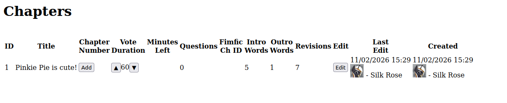

The add button orders the chapter. Only ordered chapters get posted when the event in live. The up and down arrows for vote duration adjusts the time for voting on that chapter's survey.

Here is an early screenshot of the `/chapters/{id}/revisions` page:
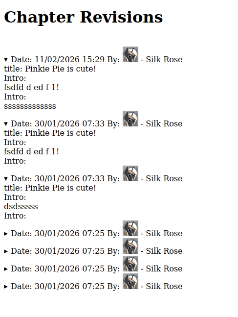

This shows every revision of the chapter, so no data is lost.

Here is an early screenshot of the `/questions/new` page:
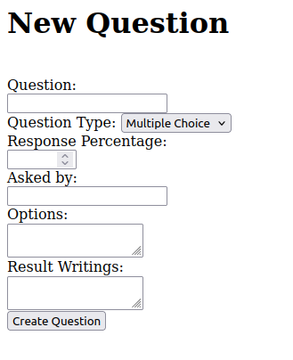

This page was later moved to be at the bottom of the question list page. Response percentage is how many ponies in-universe responded. If this is set to 50% then the answers to the survey are scaled so the total count is half of 50,240,000.

Here is an early screenshot of the `/questions/{id}/revisions` page:
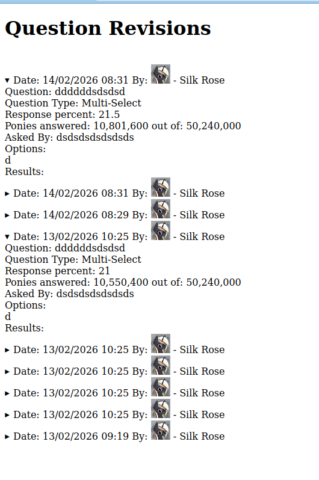

Here is an early screenshot of the `/chapters/{id}/questions` page:
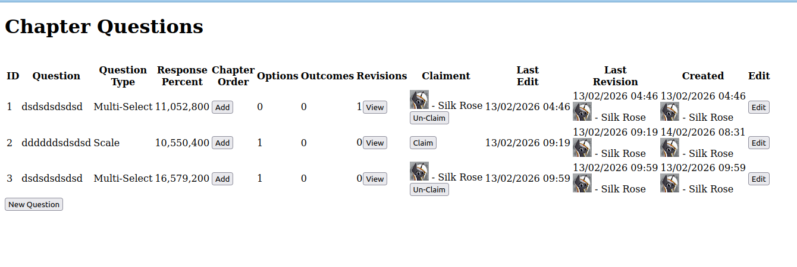

This page let's you add a question to a chapter, and move around the order within that chapter. It also lets you claim a chapter, signalling that you plan to write that question.

It took a while, but I eventually got all the pages working. Initially I made the questions and chapters pages use HTML tables, but eventually this changed as you will see in a bit.

### Color Schemes

The next thing I worked on was the color schemes. As you might have seen on the site, the color themes are Celestia for light, and Luna for dark. I used the [MLP-VectorClub](https://mlpvector.club/) website and the [Realtime Colors](https://www.realtimecolors.com/) website to create the themes. You can view the original versions here: [Celestia](https://www.realtimecolors.com/?colors=5e2f79-fef6fb-fcd8b6-fdf5b4-f2d9e8&fonts=Inter-Inter), [Luna](https://www.realtimecolors.com/?colors=a7bef1-171a35-3adfc3-00c5cc-aba4f4&fonts=Inter-Inter).

After the site was functional and looked decent, it was time to start writing. The first question of the story was created on March 3rd 2026 at 5:39AM UTC. Yes, the entire story was written very late into development. Some things never change.

I used the Luna theme initially, as I love dark mode everything, but something about the Celestia theme made me switch, and I've been using it ever since. A few people mentioned in their feedback that they really liked the themes being Celestia and Luna. Thank you!

### Event Complete Pages

Here is a screenshot of the `/user` page for an admin:
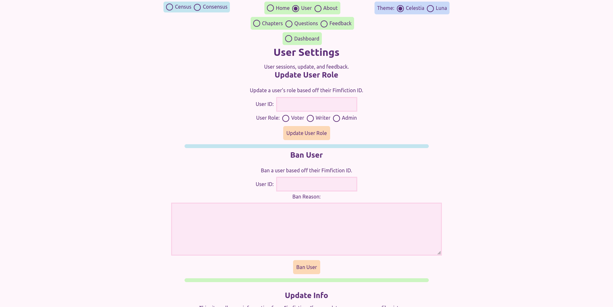

It had an extra spot to update a user's role, and a spot to ban a user. We wanted to be prepared for anything. Luckily, we never had to ban anypony!

Here is the `/chapters` page:
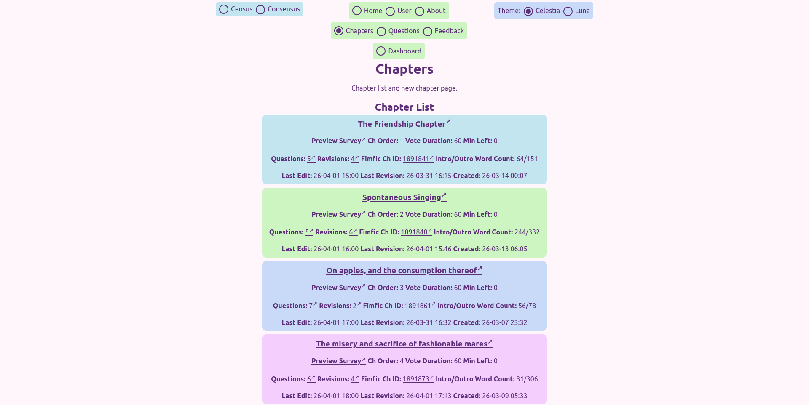

this shows all the relevant information while still looking good on desktop and mobile.

Here is the mobile `/chapters` page:
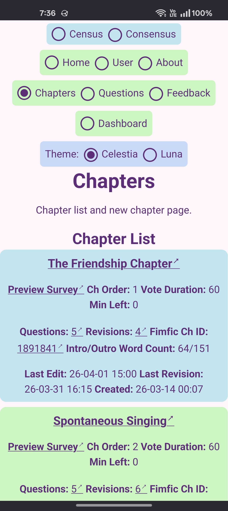

Here is the bottom of the `/chapters` page:
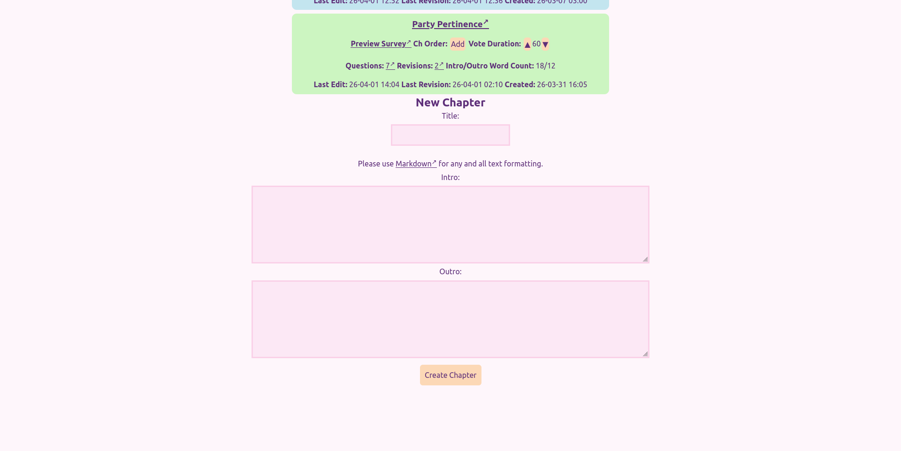

This has the new chapter form.

Here is the `/chapters/{id}/revisions` page:
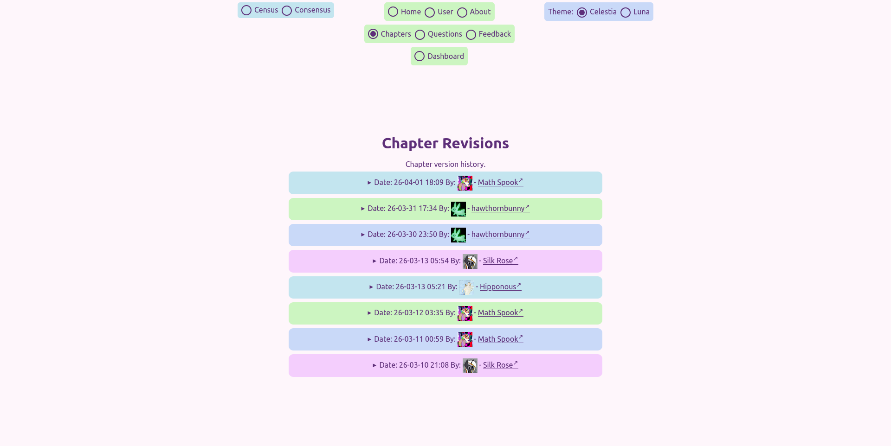

It shows every revision in a HTML details element, including the date/time it was saved, and who made the revision.

Here is the `/questions` page:
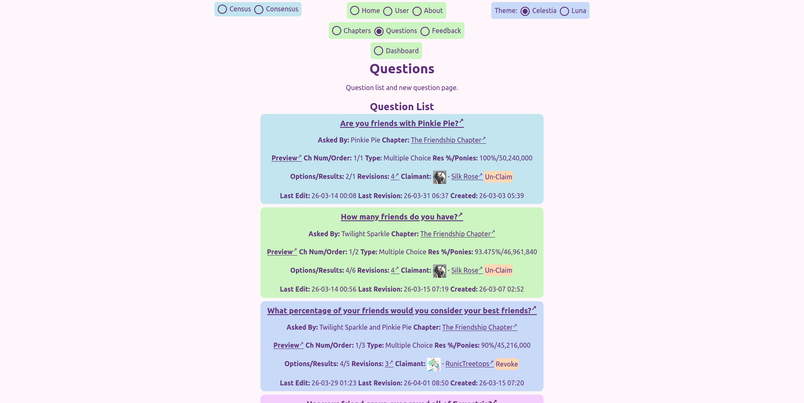

this shows all the relevant information while still looking good on desktop and mobile.

Here is the mobile `/questions` page:
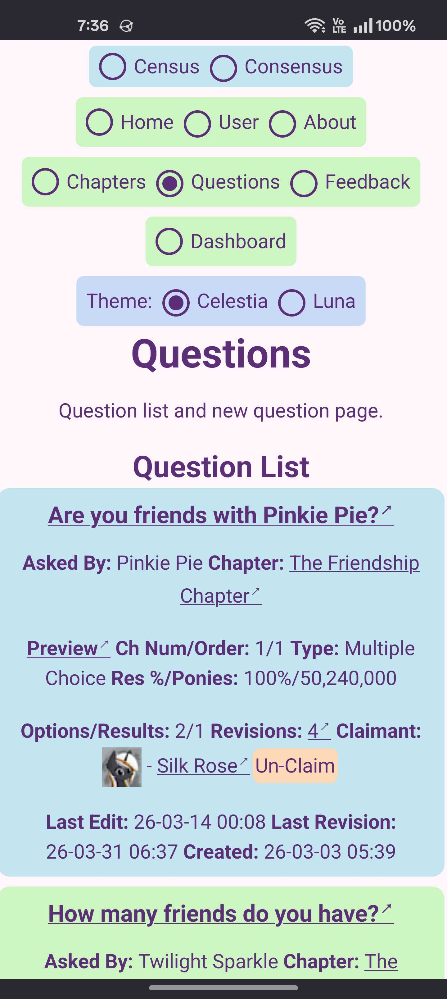

Here is the bottom of the `/questions` page:
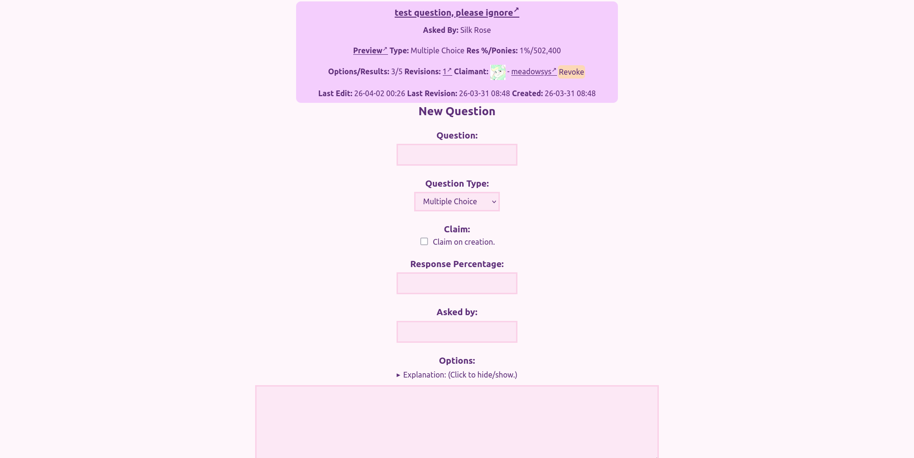

It has the form for creating new questions.

Here is the rest of the form on the `/questions` page:
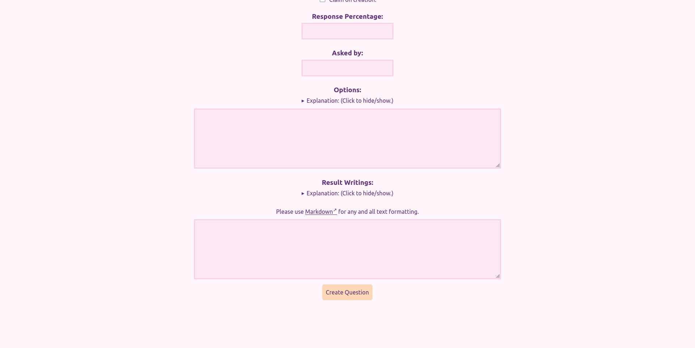

Here is the `/questions/{id}/revisions` page:
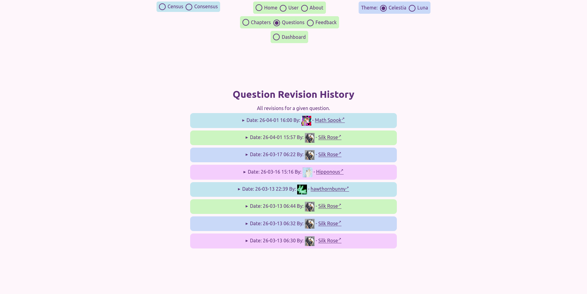

Includes the same info as the chapter revisions page, but for questions.

Here is the `/feedback` page, it is for writers/admins only:
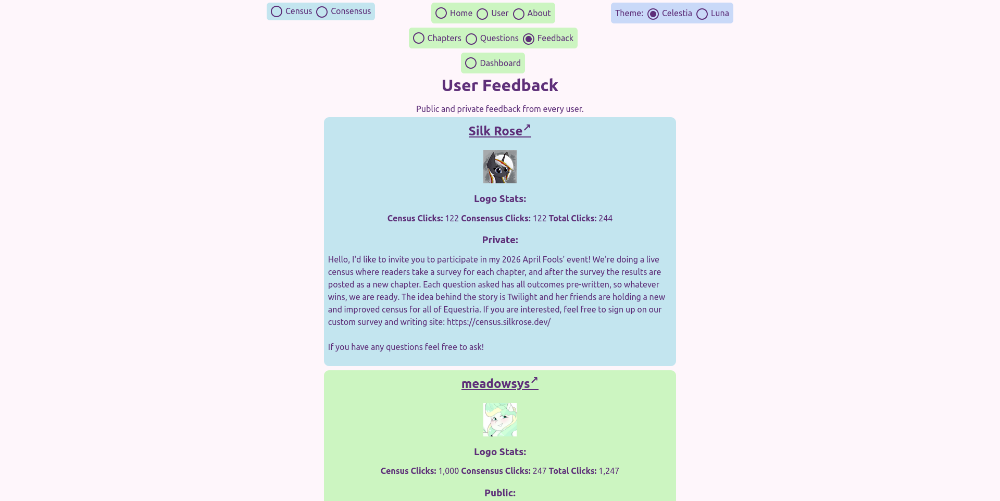

As you can see, I used my private feedback to write my message for sending to potential collaborators. It also includes the logo clicks stats, more on this later.

Here is a screenshot of the only admin-only page, `/dashboard`:
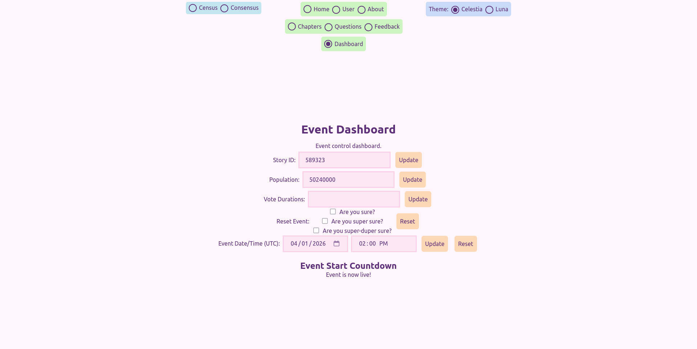

This has forms for adjusting the story ID, total population of Equestria, vote duration for all chapters, the event reset, and the start date and time.

Another fun fact about this story: The population of Equestria used for the event was taken from the start of a new save in [Hearts of Iron IV](https://store.steampowered.com/app/394360/Hearts_of_Iron_IV/) with the [Equestria at War](https://steamcommunity.com/sharedfiles/filedetails/?id=1826643372) mod.

All these screenshots were taken before the code was updating to make some of these pages public. A lot of site functionality will be removed by now to make most things read only.

## Late Development

Once writing had started, I worked on polishing the site and fixing bugs until it came time to code the event loop, the thing that controlled the event and updated the story with the correct chapter.

A fun fact about the website: The user [LastToTheParty](https://www.fimfiction.net/user/584567/LastToTheParty) is the last person to sign up as I write this. Their name checks out.

Now at this point in development we were getting really close to April 1st. The stress was getting to me and I had only written like nine questions for the event. I had to stop writing and go back to coding to get it all done in time.

Thankfully all the amazing people listed above helped out! [RunicTreetops](https://www.fimfiction.net/user/489485/RunicTreetops) wrote the three questions on The Friendship Chapter that I couldn't finish. [Math Spook](https://www.fimfiction.net/user/612387/Math+Spook) wrote the first and last chapters, while helping fix bugs in my code. [hawthornbunny](https://www.fimfiction.net/user/77473/hawthornbunny) helped connect chapters, add extra details, and find and fix formatting errors. [meadowsys](https://www.fimfiction.net/user/487213/meadowsys) coded the parser that converted our mess of a format into something readable that was posted on Fimfiction.

