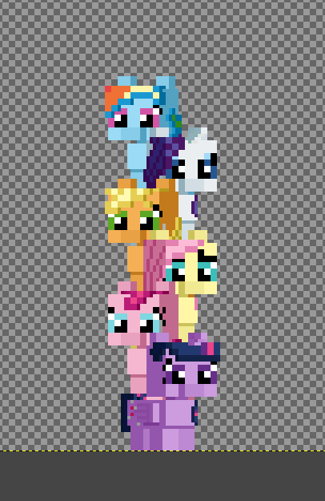

# Pony Pillar / Pony Pile-up

## Synopsis:
Stack ponies as high as you can.

## Ideas:
- Stack ponies as high as you can.
- 3 pony races: unicorn, pegasus, earth pony.
- Each race has unique qualities.
- Each run is created from a seed.
- Each pony is randomly generated from this seed.
- Pony race, mane, tail, colors, name, etc are all random.
- Each pony seen is added to a collection.
- Pony collection can be viewed from the menu.
- Achievements for collecting ponies.
- Achievements for reaching set counts of ponies stacked.
- Pegasus have a wider platform to hold ponies from spreading their wings.
- Earth ponies can hold ponies on their head.
- Unicorns can catch a pony in their magic if they are close enough?
- As the pillar of ponies gets higher the winds get stronger.
- Stores the ponies in a SQLite database.
- Either you get free reign to drop ponies where you want or they are constantly moving back and forth and you have to click to release them.
- Earth ponies fall faster?
- Pegasus ponies glide with their wings.
- Unicorns fall normally.
- Should this game have any kind of abilities or unlocks?
- Height chart that lets you view how tall all your runs made it.
- Achievement for stacking X number of unicorn, pegasus, or earth ponies on top one another.
- Achievement for stacking a pony on top of the one that came after it.
- Achievement for total distance on all runs reaching milestones.
- Achievement for booping the ponies.
- Potential rogue-like elements:
   - Score for how well you place ponies.
   - Reaching milestones lets you spent points.
   - Can buy passive or active abilities.
   - Score multiplier for quick stacking or combos.
- Preview for the next 1 to 3 ponies to stack.
- 

## Concept image(s):

