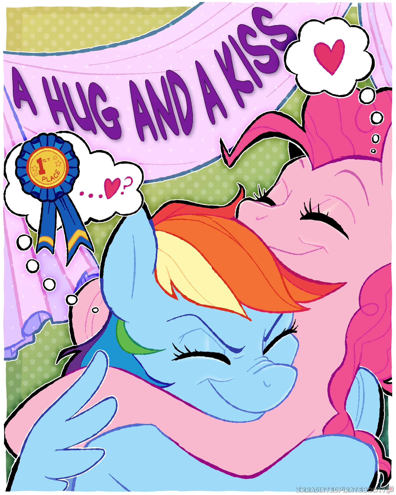

# A Hug and a Kiss

Mane Characters: 

Location: 

### Synopsis
Rainbow Dash and Pinkie get into a competition to see who can hold a hug the longest. They hug each other for days, Pinkie wins, but makes it look like Rainbow won to make her happy. Rainbow realizes she likes Pinkie and asks for a kiss as the prize for winning. They kiss then Rainbow asks Pinkie out.

### Description
Rainbow and Pinkie get into a contest over who can hold a hug the longest. Who will win? What might they discover as they make there way around town?

Cover done by irradiatedtittymilk on Discord.

### Short Description
Rainbow and Pinkie get into a contest over who can hold a hug the longest. Who will win? What might they discover along the way?

### Ideas
 - During the hug contest, they sleep in Pinkie's bed. Dash loses the contest in her sleep, but Pinkie wakes up and makes it seem like she lost instead.
 - The hugging contest has stakes, winner gets whatever they want.
 - Rainbow asks for a kiss from Pinkie. Rainbow kisses her passionately, holding her. She breaks the kiss off and asks Pinkie out.
 - Pinkie feels bad about lying about the hug contest, admitting that she just wanted to make her happy like she felt the whole time hugging her.

### Flow

### Story
[A Hug and a Kiss](./a-hug-and-a-kiss.md)
 - They have a hugging contest.
 - They go to Twilight's.
 - Twilight talks to Pinkie in a way Dash can't hear.
 - Dash and Pinkie both take naps at Twilight's.
 - Twilight suggests Dash thinking about a relationship with Pinkie.
 - Rarity says they look cute together.
 - Rarity feeds them, embarrassing Dash.
 - They agree to go to Fluttershy's next, but stop at Applejack's for a rest.
 - Dash thinks more on what Twilight and Rarity said.
 - Dash asks Applejack if she should date Pinkie.
 - They go to Fluttershy's.
 - Dash asks Fluttershy for advice on asking Pinkie out.
 - They communicate though a chalkboard so Pinkie cannot hear.
 - Fluttershy doesn't know, suggesting a kiss?
 - Fluttershy offers to let them sleep in her bed, so they don't have to walk all the way back into town.
 - Dash thinks about how much she's liked being with Pinkie all day.
 - They fall asleep.
 - Pinkie wakes up to discover she has won.
 - Pinkie makes it look like Dash won.
 - Dash is excited about winning then she calms down.
 - Dash hugs Pinkie.
 - Pinkie is confused.
 - Dash asks for a kiss, remembering what Fluttershy said.
 - Pinkie is shocked.
 - They kiss.
 - After the kiss, Pinkie feels bad an confesses that she actually won.
 - Dash doesn't care, and asks Pinkie out.
 - Pinkie says yes.
 - Dash asks what Pinkie was going to ask for, since she won.
 - Pinkie simply says a kiss.

### Cover

