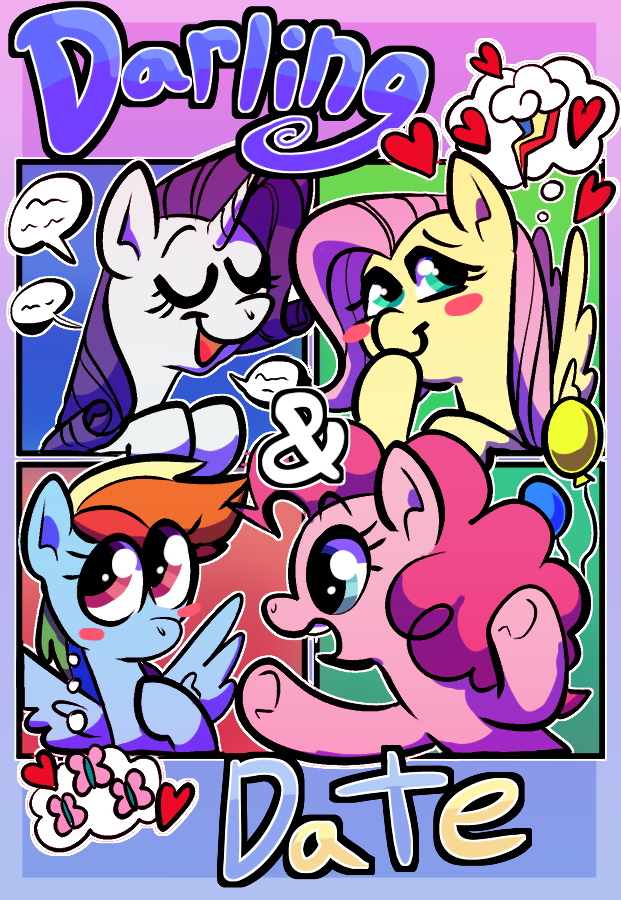

# Darling & Date

Mane Characters: [Rarity](../../ponies/rarity/rarity.md), [Pinkie Pie](../../ponies/pinkie-pie/pinkie-pie.md)

Location: [Ponyville](../../places/ponyville.md)

### Synopsis

Sequel to [Pretty and Pink](../pretty-and-pink/pretty-and-pink-meta.md). Pinkie plans a date for them.

### Description

Rarity and Pinkie throw a party announcing and celebrating their relationship. Rainbow asks if they've gone on a date, Pinkie thinks it's a great idea, asking Rarity out on the dance floor.

With the help of her friends, can Pinkie plan an amazing date for Rarity? Will she still be able to do it while helping Rainbow deal with her feelings for Fluttershy?

Sequel to [Pretty and Pink](https://www.fimfiction.net/story/432210/pretty-and-pink).

Cover done by irradiatedtittymilk on Discord.

Thanks to [Steady Gaze](https://www.fimfiction.net/user/481974/Steady+Gaze) for proofreading chapter one.

### Short Description

Pinkie and Rarity throw a party to announce their relationship. Pinkie asks Rarity on a date, getting the rest of their friends to help plan it, all while Rarity and Pinkie try to help Fluttershy and Rainbow deal with their feelings for each other.

### Ideas

- Have sub-plot of Rainbow and Fluttershy liking each other, they ask each other out in an epilogue.
- Each friend helps with one thing:
	- Rainbow Dash - Provides entertainment, an aerial show, with clouds shaped to spell 'Rarity <3 Pinkie', and clears the skies for their date.
	- Fluttershy - Helps make Rarity a dress for Pinkie to give her.
	- Applejack - Provides the place and sets up the picnic with desert for the end of the date.
	- Twilight Sparkle - Provides royal carriage for transportation on the date, and helps time the date for sunset.
- Rarity and Pinkie also pick something for the date:
	- Rarity - Rarity just wants to spend time with Pinkie, so Pinkie asks Rarity if she wants to have a sleepover at the end of the date.
	- Pinkie - Pinkie sings Rarity a song. She picks the game they play. She makes the desert they eat.

#### Dress Design:
White flowing dress, with a purple stitch going all the way around the skirt about one quarter of an inch from the bottom. The front has sleeves that cover one fourth her front legs. The neck has a blue stitch going around with a V neck in the front.

### Chapters

[Chapter 1: Announce & Ask](01-announce-and-ask.md):
 - Rarity and Pinkie Pie announce to their friends that they are dating.
 - Pinkie asks Rarity to go on their first date.
 - Fluttershy confides in Rarity she has a crush on Rainbow Dash.
 - Rarity agrees to help Fluttershy overcome her fear.
 - Pinkie asks their friends to help with the date.
 - Rainbow confides in Pinkie that she has a crush on Fluttershy.
 - Pinkie and Rainbow each at some point say why they fell in love with their desired pony.

[Chapter 2: Practice and Plan](02-practice-and-plan.md):
 - Fluttershy practices with Rarity a number of times to be able to ask out Rainbow Dash.
 - Pinkie goes to each friend asking how they could help, slowly piecing together a date plan.
 - Each pony contributes something, including Rarity and Pinkie. (See [ideas](#Ideas))
 - Rainbow asked Fluttershy to breakfast at Rainbow's place the day after Rarity and Pinkie have their date.
 - Rarity and Fluttershy each at some point say why they fell in love with their desired pony.

[Chapter 3: Dressmaking and Determination](03-dressmaking-and-determination.md):
 - The dress looks good and is finished in 3 parts.
 - Rainbow learns to make pancakes in 2 parts.
 - The timer goes off while Pinkie is leaving her room, on the 2nd pass.
 - Rainbow tries to pull it out but it falls on the ground when Pinkie runs into her on accident.
 - Pinkie is sad about to cake, but has a heart to heart with Rainbow that makes her have a change of heart about the date. (spending time with Rarity instead of making everything perfect.)
 - Pinkie tells Rainbow how to make homemade pancakes while she makes a new cake.
 - They put it in the oven and rainbow and Pinkie go help Fluttershy finish the dress.
 - They bring Rainbow's pancakes and give them to Fluttershy.
 - Pinkie and Dash discuss the dress while Fluttershy eats pancakes.
 - Rainbow suggests making the dress match somewhat with Pinkie's dress.
 - Rainbow suggests a v neck and blushes when asked why.
 - After its done, they go down stairs where the cake is almost done.
 - They pull it out and have a group hug over their success.

[Chapter 4: Darling and Date](04-darling-and-date.md):
 - Rarity and Pinkie go on the date.
   - Pinkie gives the dress to Rarity.
   - They ride in the chariot to dinner at a fancy restaurant.
   - They eat dinner.
   - They go watch Rainbow's flight show for entertainment.
   - They ride out to Sweet Apple Acres.
   - They take off the dresses and the chariot leaves.
   - They play tag together.
   - They relax on a picnic blanket.
   - They eat desert.
   - Pinkie sings a song to Rarity.
   - They watch the sunset together.
   - They walk into town together.
   - Pinkie asks Rarity is she wants to have a slumber party at her place.
   - She says yes.
   - They have a slumber party and fall asleep in Pinkies bed, cuddled together.

[Epilogue: Breakfast and Bonding](05-breakfast-and-bonding.md):
 - Mirrors [Pretty and Pink](../pretty-and-pink/pretty-and-pink-meta.md) in a way, short and sweet.
 - Spiritual remake of my first story, [Fluttershy Likes Rainbow Dash](../fluttershy-likes-rainbow-dash/fluttershy-likes-rainbow-dash-meta.md).
 - Fluttershy goes to Rainbow's place to have breakfast.
 - Rainbow Dash makes pancakes for Fluttershy.
 - Fluttershy asks Rainbow out after they eat.
 - Rainbow is taken aback but says yes excitedly.
 - They hug while smiling.

### Cover
