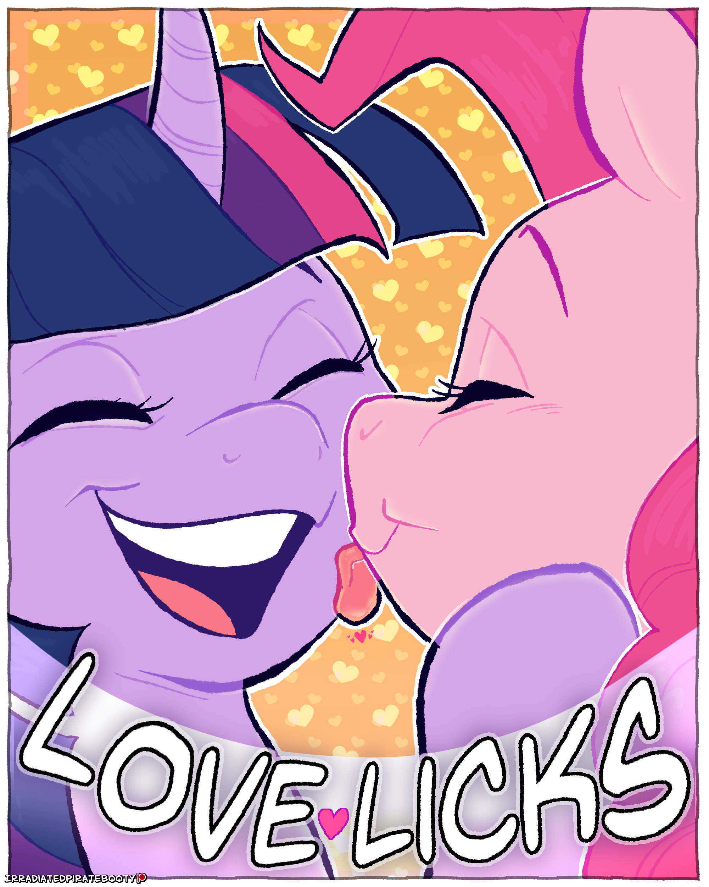

# Love Licks

Mane Characters: 

Location: 

### Synopsis
Twilight Sparkle and Pinkie Pie make a secret language out of licks, by the end they are smitten with each other and decide to go out.

### Description
What do you do when your best friend licks your face out of nowhere? You lick back, obviously.

Cover done by irradiatedtittymilk on Discord.

### Short Description
What do you do when your best friend licks your face out of nowhere? You lick back, obviously.

### Ideas
- They take turns assigning words to licks.
- Emphasizing like italics is tilting the action slightly.
- They use charades to convey the words, there is no spoken dialogue in the story.
- They use context clues for harder to guess words.
- Near the end, Pinkie assigns 'love' to a kiss on the lips, surprising Twilight.
- Pinkie says, "I love you," in their new language.
- Twilight doesn't get the true meaning, so Pinkie repeats it, tilting her head when she kisses Twi.
- Once Twilight understands, Pinkie says, "Twilight Sparkle, will you go out with me?" in licks.
- Twilight says yes and they kiss.

### Words
 - Pony Names: Write initials on cheeks.
 - Hello: A vertical lick upward one inch to the left or right of the nose.
 - Goodbye: A vertical lick downward one inch to the left or right of the nose.
 - Yes: A vertical lick upward on the chin.
 - No: A horizontal lick side to side on the chin.
 - I: A horizontal lick under the right eye.
 - You: A Horizontal lick under the left eye.
 - Out: A long line from the edge of the mouth on the right side to the side of the head.
 - Me: Two pokes to the left cheek.
 - With: Draw a V under the left eye.
 - Go: A long line from the edge of the mouth on the left side to the side of the head.
 - Will: Draw a V under the right eye.
 - Love: A kiss on the lips.
 - Please: A Lick on the left side of the neck.
 - Thank: A lick on the right side of the neck.
 - And: Draw an '&' on the cheek.
 - Hug: A hug.
 - A: A vertical lick above the nose.
 - Kiss: A kiss on the cheek.
 - My: Two pokes to the right cheek.
 - Lick: A vertical lick upward on the lips.

### Story
[Love Licks](./love-licks.md)

### Cover
