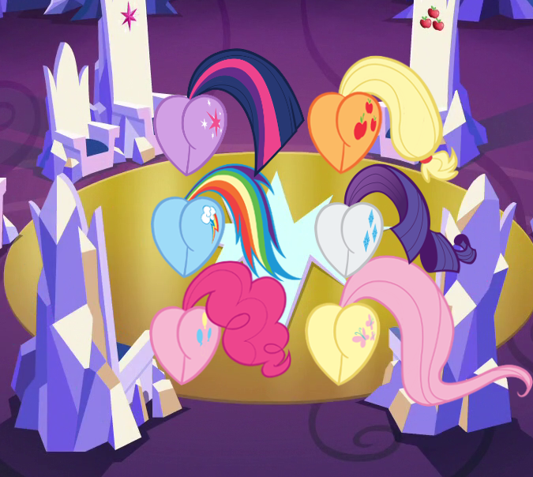

# Pony Posterior Prose Party

Mane Characters: 

Location: [Ponyville](../../places/ponyville.md)

### Synopsis

Chairs talk to each other but can't move. They have a holiday where they remember and talk about the butts that have sat on them.

### Description

The annual Pony Posterior Postulate Party is upon us and everychair is excited. Time to talk about butts.

### Short Description

Time to talk about butts.

### Ideas

 - Twilight Sparkle - soft, rather tense/slightly tight -- butt
 - Rarity - soft, well-kempt, slightly tight/some tension -- posterior
 - Pinkie Pie - very soft and plump, lose/tension free -- tooshie
 - Fluttershy - very soft, some tension, somewhat loose -- rump
 - Applejack - hard butt still soft, firm, muscular, tight -- behind
 - Rainbow Dash - soft with harder undertone, loose-ish, muscular -- hindquarters
 - Spike - hard and scaly -- ass

Todo: make the story from spike’s throne’s perspective.

 - Sat on by:
   - PPT - 2 - Human Twilight in pony form
   - AT - 2 - Sunset Shimmer
   - FT - 3 - Starlight, Spike, Meadowbrook
   - RDT - 3 - Big Mac, Flash Magnus, Spike standing
   - RT - 3 - Discord, Human Rainbow in pony form
   - TST - 5 - Celestia, Trixie, Starlight, Pinkie Pie, Sludge, RD and Twi at same time
   - All sans ST - Changelings

### Flow

1. Start
2. Twilight’s chair - 
3. Rarity’s chair - 
4. Rainbow Dash’s chair - 
5. Spike’s chair - 
6. Fluttershy’s chair - 
7. Pinkie Pie’s chair - 
8. Applejack’s chair - 
9. Chosen pony comes in
10. end

### Chapters

[Chapter 01](./01.md)

### Cover

