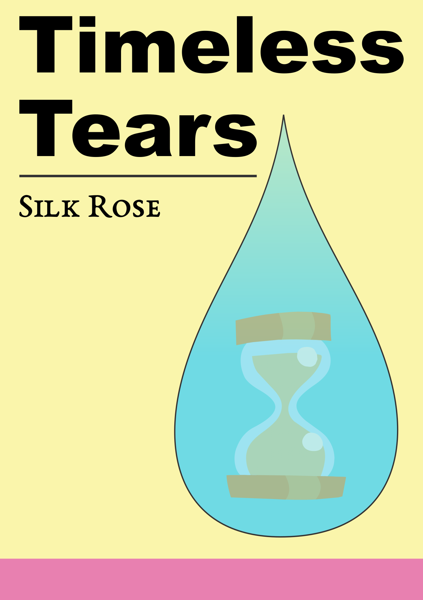

# Timeless Tears

Mane Characters: 

Secondary Characters: 

Locations: 

Genres:

## Synopsis
Fluttershy takes care of a comatose Pinkie for years, the rest of the mane six seemed to have given up on them, but not Fluttershy. She keeps taking care of them and one day, they wake up, the story cuts to black.

## Description
In the beginning, there was hope. In the middle there was doubt. In the end, there was conflict. But, throughout it all, there were tears.

Thanks to [Steady Gaze](https://www.fimfiction.net/user/481974/Steady+Gaze) for proofreading and for making the cover.

Entry into [A Thousand Words Contest II](https://www.fimfiction.net/group/216361/a-thousand-words/thread/517645/a-thousand-words-contest-ii-2023-may-29-jul-30).

## Short Description
In the beginning, there was hope. In the middle there was doubt. In the end, there was conflict. But, throughout it all, there were tears.

## Ideas:
- Fluttershy consuls in Pinkie that she was just about to confess her love before this happened.
- Fluttershy holds pinkie, cuddles, kisses her cheek while she is comatose as her coping mechanism.
- Fluttershy fights off the temptation to kiss Pinkie on the lips, until one day, the day she wakes up.
- Pinkie opens her eyes as Fluttershy is kissing her.
- Fluttershy has her eyes closed. 
- Pinkie wraps her hooves around Fluttershy and kisses back passionately.
- Fluttershy starts to cry, thinking it isn't real, Pinkie starts to cry too.
- Fluttershy opens her eyes and the story cuts to black.

## Story
[Timeless Tears](./timeless-tears.md)

## Cover
