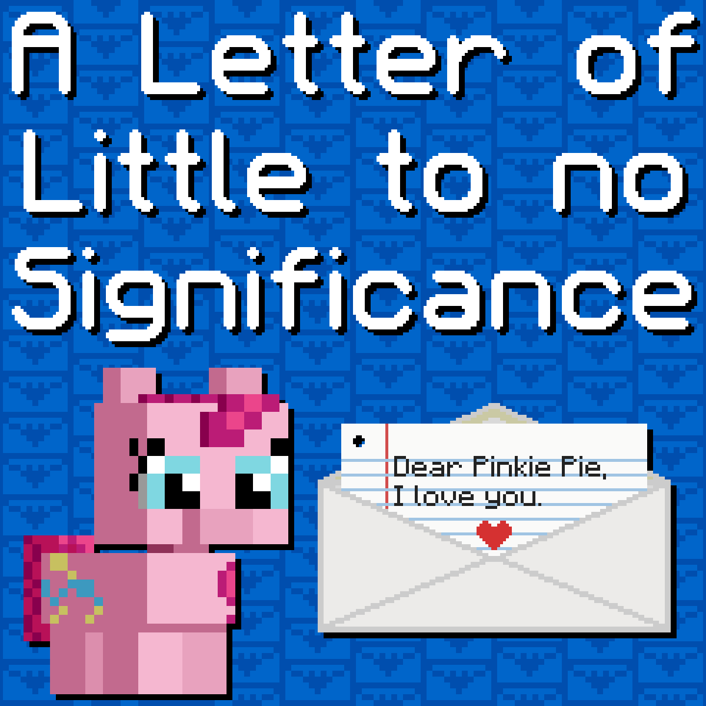

# A Letter of Little to no Significance

## Synopsis:
A letter written to Pinkie Pie.

## Description:
Pinkie gets a letter from a friend she doesn't know yet.

Entry into [A Thousand Words Contest IV](https://www.fimfiction.net/group/216361/a-thousand-words/thread/561086/a-thousand-words-contest-iv-2025-may-25-jul-06).

Thanks to [dashie04](https://www.fimfiction.net/user/334129/dashie04) for making concept cover photos.

Thanks to [PseudoBob Delightus](https://www.fimfiction.net/user/12771/PseudoBob+Delightus) for proofreading.

Thanks to [Math Spook](https://www.fimfiction.net/user/612387/Math+Spook) for proofreading.

Thanks to [Hoofprintz](https://www.fimfiction.net/user/503681/Hoofprintz) for pre-reading.

Thanks to [ARandomLonelyGirl](https://www.fimfiction.net/user/419652/ARandomLonelyGirl) for pre-reading.

## Short Description:
Pinkie gets a letter from a friend she doesn't know yet.

## Ideas:

## Story:
[A Letter of Little to no Significance](./a-letter-of-little-to-no-significance.md)

## Cover:

