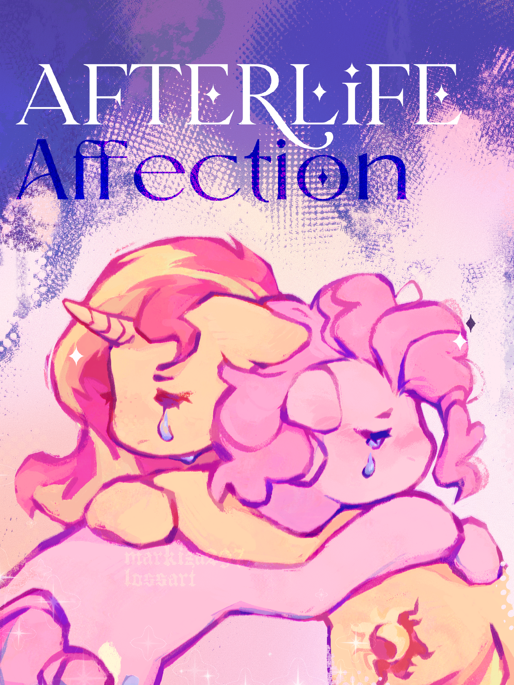

# Afterlife Affection

## Synopsis:
Sunset goes to Equestria to see Pinkie after the one she's dating in her world dies.

## Description:
Sunset knew it was wrong; she just had to see her love one more time.

Written for [Lunaria](https://www.fimfiction.net/user/68640/Lunaria) for [Jinglemas](https://www.fimfiction.net/group/213263/jinglemas) 2025.

Cover done by [Lossart](https://www.tumblr.com/blog/markiza297).

Thanks to [Math Spook](https://www.fimfiction.net/user/612387/Math+Spook) for proofreading.

Thanks to [PseudoBob Delightus](https://www.fimfiction.net/user/12771/PseudoBob+Delightus) for proofreading.

Thanks to [Shay492](https://www.fimfiction.net/user/840747/Shay492) for pre-reading.

Thanks to [Ashy](https://www.fimfiction.net/user/499793/ashley1227) for pre-reading.

Thanks to [Hoofprintz](https://www.fimfiction.net/user/503681/Hoofprintz) for pre-reading.

Thanks to [Jymbroni](https://www.fimfiction.net/user/474762/Jymbroni) for pre-reading.

Thanks to [6-D Pegasus](https://www.fimfiction.net/user/293755/6-D+Pegasus) for providing feedback.

Thanks to [Rego](https://www.fimfiction.net/user/180061/Rego) for providing feedback.

Thanks to [Corah Il Cappo](https://www.fimfiction.net/user/40371/Corah+Il+Cappo) for providing feedback.

## Short Description:
Sunset knew it was wrong; she just had to see her love one more time.

## Ideas:
- Pinkie had a Pinkie Sense the day of her death, it was a big doozy and she wanted to switch places with the second Pinkie to see what it was. The doozy was EqG Pinkie's death, but because they had swapped she died instead. And ever since then, EqG Pinkie has been pretending to be the pony one.
- EqG Pinkie gained the Pinkie Sense after going to Equestria. (Or she hears it from Twilight via Sunset's Journal during a friendship crisis.)
- EqG Pinkie decides to stay in Equestria as the bearer of the element of laughter.
- Somewhat open ending where either pony could be speaking the last line.
- 

## Story:
[Afterlife Affection](./afterlife-affection.md)

## Cover:
