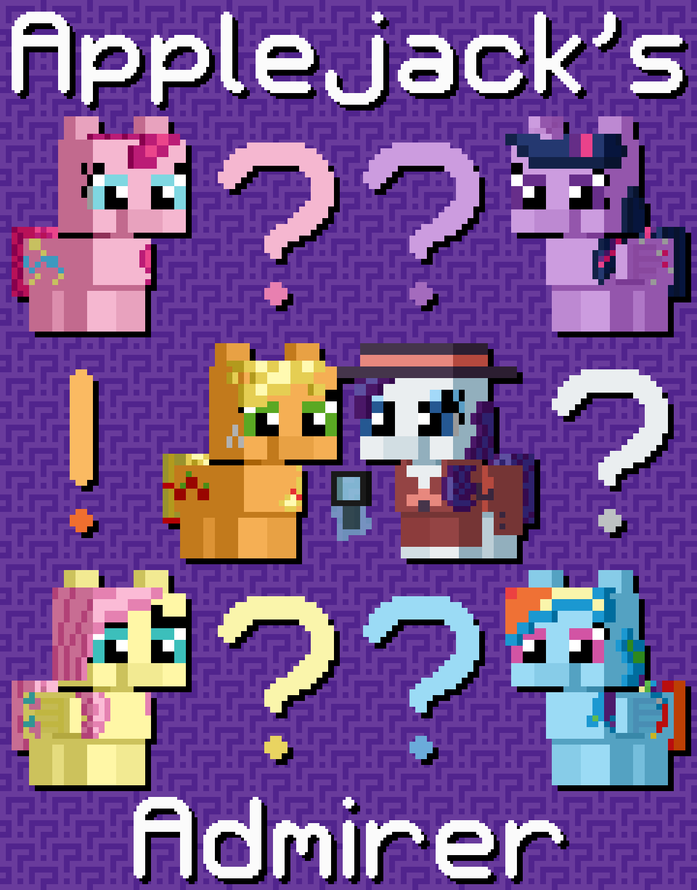

# Applejack's Admirer

## Synopsis:
Applejack is receiving anonymous love letters and goes to Rarity to help figure out who it is. Rarity keeps prodding Applejack about her thoughts on if it were X, but Applejack gets frustrated with all the questions, after all, she is not a detective. None of it seems relevant to the case.

## Description:
Applejack has a secret admirer, and Rarity is determined to make her figure out who it is.

## Short Description:
Applejack has a secret admirer, and Rarity is determined to make her figure out who it is.

## Ideas:
- She has 5 love letters and each is imitating a mane 6 members, but each has a slight hint at Rarity. And they go and interview each of them.
- Their friends are in on it, like Rarity helped them each write a love letter to AJ and know that it's Rarity.
- At the start, they read all five letters, then go one pony at a time and interview them. But before each interview, Rare asks AJ how she would feel if it were said pony.
- She only gets four letters at the start, missing one that is like from Rarity.
- But, after they go through all 4 ponies, Rarity asks, what if it were her? Applejack is confused and gets angry she hasn't figured it out yet.
- Applejack goes home and finds the last love letter, the one like Rarity.
- Applejack figures it out and goes back to Rarity.

## Cover Idea:
Title text at top and bottom, Applejack and Rarity in the center with the 4 other mane 6 on their diagonals, with various colored question marks around Rarity and Applejack.

## Story:
[Applejack's Admirer](./applejacks-admirer.md)

## Cover:
