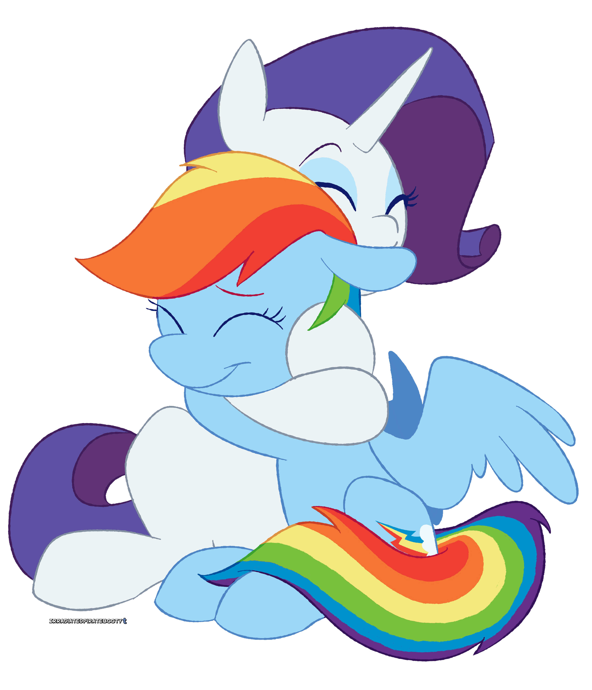

# Blue and Blushing

I knock on Rarity's door again, this time harder.

Come on, Rarity, I need to get these feelings off my chest.

Rarity answers the door almost immediately after. She looks worse for ware, her mane has stray hairs and a hairbrush hanging from it. Her makeup was half-running down her face, probably from crying. Her coat looks like it could use a good brushing.

She probably doesn't think it, but even now, in this state, she is the most beautiful mare I've seen.

She was about to say something, but I stop her with a hoof.

Rarity looks at me confused, expecting further explanation, which I don't give her. I put my hoof around her and lead her into her home, closing the door behind us.

I take her over to one of her pedestals, and point for her to get up. She does so, but still looking confused.

I pick up some tissues from a box on the floor and use them to clean Rarity's face of makeup. As I finish, she sniffles with the barest hint of a smile on her face.

Taking the hairbrush from her mane in my mouth, I start to brush her mane. I go gently as I make sure to get each stray hair.

As I brush, I can see the smile on her face grow, still mixed with confusion. I get down to the lower part of her mane and swipe a quick nuzzle on her chest in between one of the sweeps.

She's so soft.

I finish brushing her mane and look at her with a smile. She looks back with a smile and the barest hint of a blush.

I move behind her and start brushing her tail. I look up in between swipes and see she is still looking forward.

She looks so pretty from every angle. I try not to stare at her too much, and focus on my pampering.

After finishing her tail, I slyly rub up against her side as I get up onto the pedestal with her. I nuzzle her cheek for the briefest of moments before walking around her front to her other side.

I start to work her coat as I notice the blush that has formed on my face. I look up at Rarity between swipes of the brush.

Her ears are folded back. I hope that's a good sign.

Is that a blush on her face?

I continue brushing, moving to her cutie mark. I take extra care, going slowly over them.

My efforts are rewarded when I hear an adorable muffled giggle come from Rarity. I steal a quick nuzzle on her cutie mark before continuing down to brush her legs.

Whatever has caused you to feel like this, know that I am here for you. You deserve to feel as beautiful as I know you are.

I finish brushing that leg and move onto the next. I wonder what she is thinking about. I know she's all I've been able to think about for a while now…

I hope she feels the same way about me. Otherwise, I'm going to feel like an idiot.

I guess feeling like an idiot isn't so bad if it makes Rarity feel better. She clearly needed help.

I move onto her third leg as I look into her eyes for a moment.

Her eyes are so beautiful, they remind me of a clear open sky full of potential. I love staring into them. I love her.

I continue to pamper her as I think about our friendship.

She might be the only pony I'd admit this to, but I sometimes do like girly things. I would never tell anypony else, but telling her might be worth it to hear that adorable squeal.

I never thought I'd have fallen for one of my friends, but she feels different. She wants to bring out the beauty in ponies, and maybe I want to see mine.

I definitely don't mind seeing her beauty, I hope she sees it when I'm done.

I move to her last leg, still lost in thought.

I know I love her, but the real question is: does she love me?

I know we've both been acting weird around each other, but what if she's just acting that way because I am?

Usually Rarity would call out weird behavior, but she hasn't this time. Makes me think that she might feel the same way about me.

I hope she does.

Once I'm done with her leg, I place a hoof on her cutie mark and use it to motion for her to sit. She does so, and I move in front of her.

I start to brush her chest as an idea comes to my mind. After brushing the main part of her chest, I flip the brush around and nuzzle her chest, while pretending to brush a specific spot on her coat over and over.

As I do, I listen to her heartbeat. Its rhythmic beating at an accelerated rate, endearing and soothing.

I get lost in the moment and forget to keep brushing. I just stand there, holding my head to her chest.

Rarity takes notice, and wraps her hooves around me, holding me gently before nuzzling the top of my head.

As I take in the moment I swear I could feel Rarity kiss the top of my head. I decide to return the favor, and kiss her leg in front of me.

Rarity let's go a moment later, and I try to hide my blush by immediately starting to brush the fur on her stomach.

I brush more gently than even on her cutie mark. I can already hear stifled giggles.

Rarity, I hope you know how cute you are, because if you don't, I will have to inform you.

I finish brushing her stomach before daring another nuzzle, on said stomach.

I step back so I'm in front of her again. Looking at Rarity, I can see she's sporting a big smile and an adorable blush.

Rarity, you're beautiful.

I force myself back to work. Don't want to stare at her too long, not yet at least.

I pick up a cleaning cloth and start working on her hooves. I start with the hooves on her hind legs.

She has to know by now that I have feelings for her? Right? I guess I could do something when I'm done to make it very clear.

I move to the other hoof on her hind legs.

I wonder what she will say when I'm done. Knowing Rarity, she will sing a song. I wouldn't complain though, she has such a beautiful singing voice. I might even join in.

I finish the hoof I'm working on and move to her front left hoof.

I want to hold her in my hooves, to tell her what she means to me, how much I love her. I want to kiss her, a lot. I want to pretend the entire world is just me and her, if only for a little while.

I just hope she wants the same things as me.

I move onto her last hoof, the front right.

This is it, Rainbow Dash. This is the moment of truth, time to find out if she feels the same as me or not.

I know she's been all adorable and blushing this whole time, but that's not confirmation, right?

Let's do this.

After I finish cleaning her last hoof, I gently kiss her leg right above her hoof. I hold the kiss for a few seconds, making sure she knows I did it.

I take a step back and admire her beauty, before I point at Rarity, then close my eyes, signaling for her to repeat after me. She does so, closing her eyes before I roll over a mirror and place it in front of her.

I quietly fly onto the pedestal and sit next to her. I wrap my hoof around her neck, and my wing around her back, and pull us close.

I close my eyes and plant a gentle kiss right onto the blush on Rarity's cheek.

I open my eyes after a bit and notice Rarity has opened hers. She is just staring at us in the mirror, I join her and look as well, leaning my head against her.

I tighten my wing around her as we stare together in the mirror. We sit together as both of us smile wide, genuine smiles at our reflection. Neither of us caring about the massive blushes on our faces.

As the lights dim around us and the melodies start, I can feel the song coming on.

I point at her.

"Oh, Rarity, why are you so blue?  
Don't you know? I'm here to pamper you!"

I hold her close as we sit together, and brush the fur on her chest. Then, I pull her close, and lift her chin with a hoof.

"Need to see your smile,  
Make it last just a little while."

As I look into her eyes, I feel drawn, pulled dangerously close to her precious lips.

Rarity takes over singing for the next verse.

She points at me.

"Oh, Rainbow, it's true, you are my crush.  
You showed me love, you made me blush."  

She leans in, holding us even closer. She puts her hooves under my chin and lifts gently.

"You put me in a state of bliss.  
It's you, who I want to kiss."

She stares deeply into my eyes before bringing our lips together, and we kiss.

We sing the last verse together. We point at each other, then hug.

"Oh, (Rarity | Rainbow), here to give you my love, unending.  
Always be here for you, best friends, never pretending."

We hold each other's hoof to our chest while blushing.

"Need to hold your hoof, every way.  
Need to make you blush, every day."

We finish the song with a tight, loving embrace.

After the song, we sit on the pedestal, holding hooves while staring blissfully into each other's eyes.

I can only think of two things at this moment, both repeating in my mind over and over: I love her, and I want to kiss her, again.

And, that's just what we do. We both lean in and press our lips together. We hold the kiss for what feels like forever and not long enough at the same time.

We wrap our hooves around each other and Rarity lids her eyes before closing them. I close mine in response and release all the passion I can into the kiss.

I open my eyes after noticing myself crying tears of joy. Rarity still has hers closed, but I can see she's also crying.

She opens her eyes and we break the kiss.

I quickly steal a small kiss on her cheek before staring at her again.

I am about to tell Rarity, I love you, but she stops me with a hoof.

Now it's my turn to look confused.

She just smiles and kisses my cheek before hugging me tightly.

I smile in her embrace and hug back.

I love you, Rarity, and I'm happy that you love me, too.

