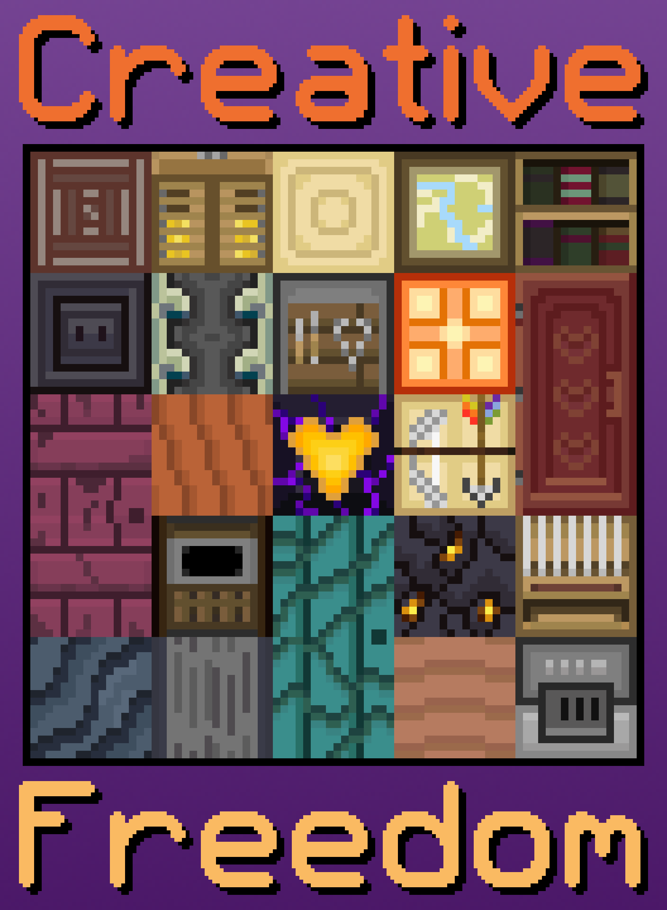

# Creative Freedom

## Synopsis:
Rarity is sad about how not popular a few or her newer dresses are. Luckily for her Applejack is there to listen.

## Description:
Rarity goes to Twilight in a time of need. With a good friend and a shoulder to cry on, can Rarity work out her creative conundrums?

The cover has nothing to do with the story, it is a personal showcase of my favorite textures I've made for [Love & Tolerance](https://love-tolerance.com/), a MLP:FIM-inspired resource pack for Minecraft.

This story is very personal to me and was written in collaboration with [6-D Pegasus](https://www.fimfiction.net/user/293755/6-D+Pegasus).

Thanks to [PseudoBob Delightus](https://www.fimfiction.net/user/12771/PseudoBob+Delightus) for pre-reading.

Thanks to [Forcalor](https://www.fimfiction.net/user/564657/Forcalor) for pre-reading.

## Short Description:
Sometimes you just need to vent, and a good friend.

## Story:
[Creative Freedom](./creative-freedom.md)

## Cover:
