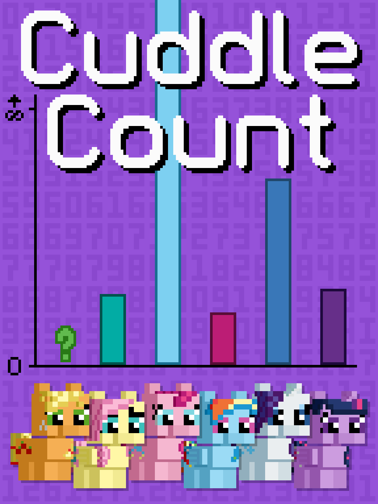

# Cuddle Count

## Synopsis:
Ponies treat cuddle count like body count and during a speed dating exercise, various ponies reveal their cuddle count and talk about different ponies they've cuddled.

## Description:
During a speed-dating event, the mane six reveal the number of ponies they've cuddled… and maybe a bit more.

Thanks to [PseudoBob Delightus](https://www.fimfiction.net/user/12771/PseudoBob+Delightus) for proofreading.

Thanks to [Scriblits Talo](https://www.fimfiction.net/user/495925/Scriblits+Talo/stories) for pre-reading.

Entry into [A Thousand Words Contest III](https://www.fimfiction.net/group/216361/a-thousand-words/thread/540659/a-thousand-words-contest-iii-2024-jun-09-jul-14).

## Short Description:
During a speed-dating event, the mane six reveal the number of ponies they've cuddled… and maybe a bit more.

## Ideas:
- Each pony has a pony they want to be with, and some are bad at hiding it.
- Twilight has many questions about the cuddle count and how it's calculated.
- Fluttershy asks if animals count.
- Pinkie doesn't say a number, but says a lot, or it's implied to be literally everypony.
- Applejack's count is very small.
- Rarity asks about the pony she wants to be with a lot. (the one before her.)
- Rainbow wants to date Applejack but tries to play it cool.
- At the end, somepony points out that it's only the mane 6 at the speed dating event.
- Applejack points out the obvious parings at the end.
- Applejack is surprised everypony is taking this so seriously.
- 

## Story:
[Cuddle Count](./cuddle-count.md)

## Cover:

