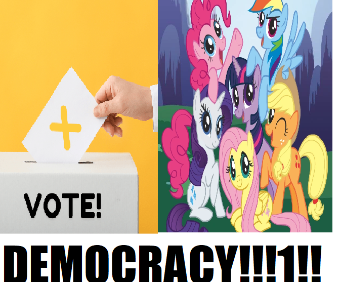

# Democracy Manifest

## Synopsis:
Story about Ponyville embracing democracy and the reader votes by liking the story. A new chapter every hour or so with results of the previous vote.

## Explanation:
This story was a collaboration with [PseudoBob Delightus](https://www.fimfiction.net/user/12771/PseudoBob+Delightus).

I wrote all the code and four chapters. Proofreading of my chapters done by [Ashy](https://www.fimfiction.net/user/499793/ashley1227).

This version only contains the parts I wrote, to read the whole story, please go [here](https://www.fimfiction.net/story/575601/democracy-manifest).

The history for these chapters can be found in PseudoBob's [fanfic](https://github.com/PseudoBob-Delightus/fanfic) repo.

## Description:
Democracy, democracy, and more democracy!

---

Thanks to [Silk Rose](https://www.fimfiction.net/user/237915/) for developing the code and writing two chapters; thanks also to collaborators, including [RunicTreetops](https://www.fimfiction.net/user/489485/), [Scriblits Talo](https://www.fimfiction.net/user/495925/), [TheDriderPony](https://www.fimfiction.net/user/218247/), [FanOfMostEverything](https://www.fimfiction.net/user/1400/), [Meteor_Mirage](https://www.fimfiction.net/user/70772/), [Tape Deck](https://www.fimfiction.net/user/703128/), and [Math Spook](https://www.fimfiction.net/user/612387/), for writing their chapters; and [Ashy](https://www.fimfiction.net/user/499793/ashley1227) for proofreading.

And many thanks to YOU, the readers, for coming along for the ride!

## Short Description:
Democracy, democracy, and more democracy!

## Chapters:
[Proposal 3 - Decide If Pinkie Pie Is Cuter Than Fluttershy](201-a-prompt.md)
- [Resolution 3 Pass](201-b-pass.md) (canonical outcome)
- [Resolution 3 Fail](201-c-fail.md)

[Proposal 4 - Get Fluttershy To Ask Out Pinkie](202-f-a-prompt.md) (canonical outcome)
- [Resolution 4 Pass](202-f-b-pass.md) (canonical outcome)
- [Resolution 4 Fail](202-f-c-fail.md)

[Proposal 4 - Get Pinkie To Ask Out Fluttershy](202-p-a-prompt.md)
- [Resolution 4 Pass](202-p-b-pass.md)
- [Resolution 4 Fail](202-p-c-fail.md)

## Cover:

