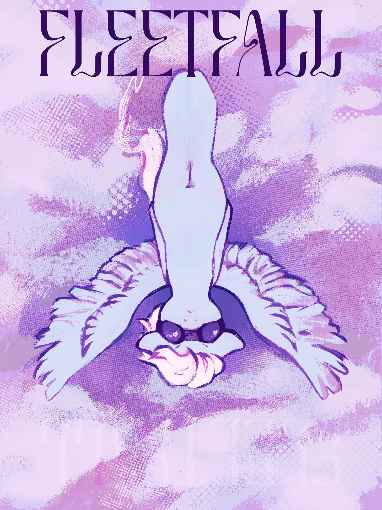

# Fleetfall

## Synopsis:
Fleetfoot goes really high and free falls while she thinks and doesn't open her eyes until she resolves the problem.

## Description:
What better motivation to think through your problems than the fear of death.

Cover done by [Lossart](https://www.tumblr.com/blog/markiza297).

Thanks to [Math Spook](https://www.fimfiction.net/user/612387/Math+Spook) for proofreading and helping with writing.

Thanks to [Hipponous](https://www.fimfiction.net/user/875988/Hipponous) for proofreading.

Thanks to [PseudoBob Delightus](https://www.fimfiction.net/user/12771/PseudoBob+Delightus) for proofreading.

Thanks to [Scriblits Talo](https://www.fimfiction.net/user/495925/Scriblits+Talo/stories) for making the concept cover.

Thanks to [Hoofprintz](https://www.fimfiction.net/user/503681/Hoofprintz) for pre-reading.

## Short Description:
What better motivation to think through your problems than the fear of death.

## Ideas:

## Story:
[Fleetfall](./fleetfall.md)

## Cover:

