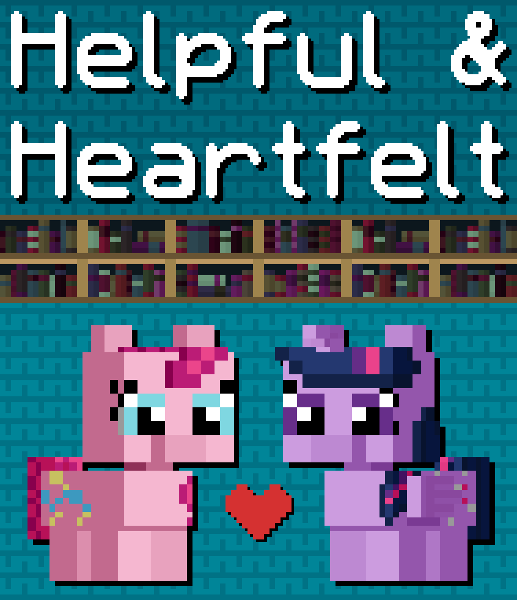

# Helpful and Heartfelt

## Synopsis:
Pinkie tries to help around the library to be closer to Twilight, who she has a crush on. Pinkie does too much and makes a mess of the place. Twilight not seeing the reason Pinkie is there, pushes her away in protest so she can think alonr. Pinkie goes home sad and dejected. After some sulking and crying, she realizes her error and goes to apologize. They make up and hug.

## Description:
Pinkie helps Twilight around her library in an attempt to be closer with her.

Thanks to [PseudoBob Delightus](https://www.fimfiction.net/user/12771/PseudoBob+Delightus) for proofreading.

Thanks to [Math Spook](https://www.fimfiction.net/user/612387/Math+Spook) for proofreading.

Thanks to [Ashy](https://www.fimfiction.net/user/499793/ashley1227) for proofreading.

Thanks to [Hoofprintz](https://www.fimfiction.net/user/503681/Hoofprintz) for pre-reading.

## Short Description:
Pinkie helps Twilight around her library in an attempt to be closer with her.

## Ideas:
- Pinkie tries to help Twilight but fails.
- Each attempt fails worse than the last.
- Pinkie tries:
   - Helping put the books away.
   - Helping organize Twilight notes.
   - Pinkie quizzes Twilight with her notes.
- Twilight panics and kicks Pinkie out after the third thing.
- They both are in the wrong, Pinkie for overdoing it, Twilight for overreacting.
- Pinkie goes home crying.
- Pinkie is sad and feels dejected.
- Twilight is sad and feels bad for how she reacted.
- Pinkie goes back to apologize.
- Twilight accepts and apologizes too.
- Twilight and Pinkie hug.
- Pinkie explains why she came there in the first place.
- Pinkie asks Twilight out.
- Twilight says yes.

## Story:
[Helpful and Heartfelt](helpful-and-heartfelt.md)

## Cover:

