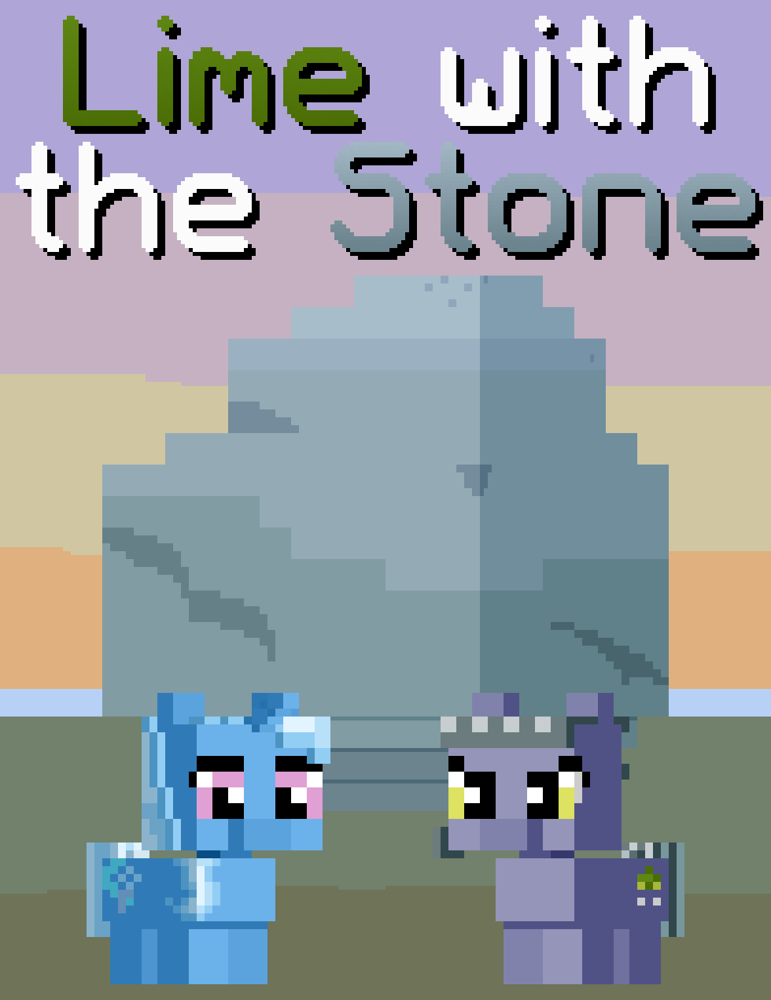

# Lime with the Stone

## Synopsis:
Trixie gets a job at the rock farm of the Pie family, to keep herself afloat. At first, it's grueling work as she buts heads with Limestone. As she gets more acquainted with the work and mellows out on Limestone, they strike up a friendship. Eventually, they become close, while still having the frequent disagreements. They develop feelings despite the arguments, and they eventually kiss. That night, Trixie realizes she can't stay there, she isn't a rock farmer. So, she decides to leave the only way she knows how, quickly and quietly. She tries to leave in the night, getting caught in a cave from the thundering storm outside. Limestone realizes what's happened and goes to find her, heartbroken and pissed. She finds her, and they get into their last argument, eventually they calm down and come to an agreement, and kiss for the last time, before saying goodbye.

## Description:

## Short Description:
Trixie meets the rock to her hard place while working at a rock farm.

## Ideas:
> _It's hard being Trixie sometimes, but Trixie is as Trixie does._

## Chapters:
[Chapter 1: Hired](./01-hired.md)
- Trixie is hired and meets Limestone.

[Chapter 2: Tired](./02-tired.md)
- Trixie is worked tirelessly by Limestone and they argue.

[Chapter 3: Unmired](./03-unmired.md)
 - Their arguments come to a head and Trixie breaks, running to her wagon before crying.
 - Limestone talks to one of her sisters and is convinced to go apologize.
 - After settling down, they talk and come to an understanding.

[Chapter 4: Admired](./04-admired.md)
 - They become closer as they start to work better together on the farm.
 - They kiss one night.

[Chapter 5: Fired](./05-fired.md)
 - Trixie realizes she can't stay, and leaves in the night.
 - Trixie gets stuck in a cave because of the weather.
 - Limestone comes to find her, heartbroken and mad.
 - They come to an understanding and kiss one last time.

## Cover:
