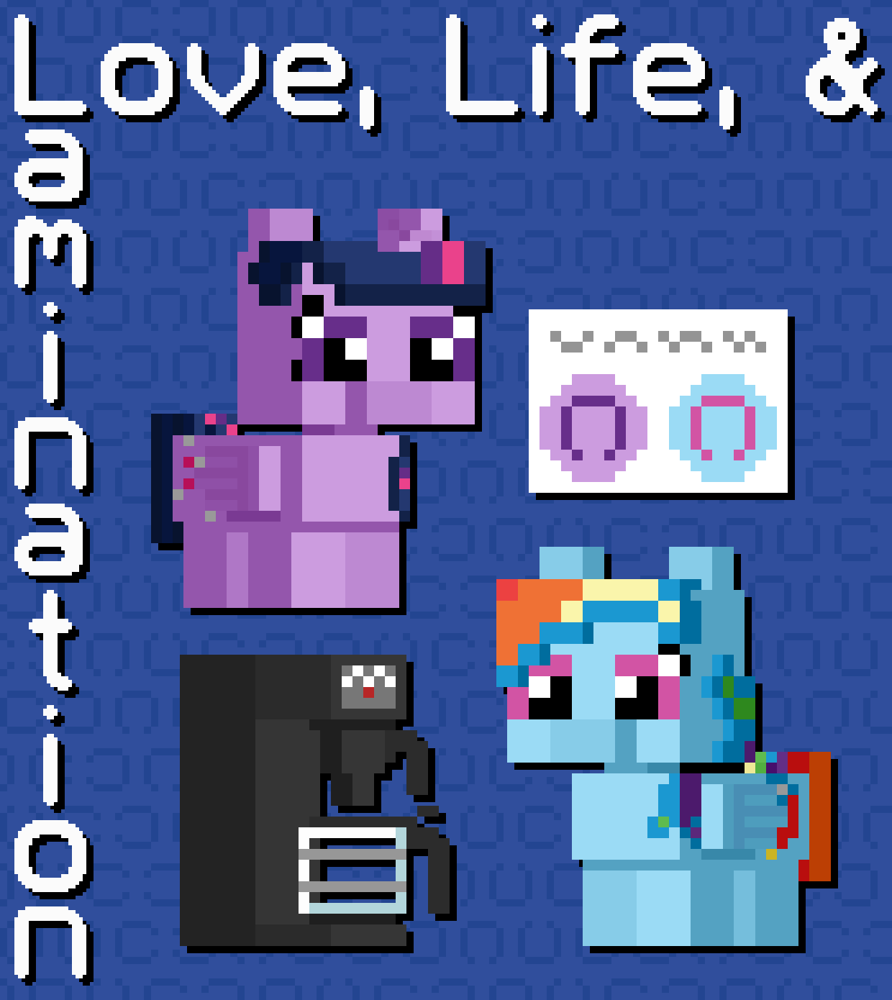

# Love, Life, and Lamination

## Synopsis:
Twilight is struggling to laminate her marriage certificate, while Rainbow struggles to make coffee.

## Description:
Twilight is struggling to laminate her marriage certificate, while Rainbow struggles to make coffee. Maybe they just need each other to help out.

Thanks to [PseudoBob Delightus](https://www.fimfiction.net/user/12771/PseudoBob+Delightus) for proofreading.

Thanks to [Scriblits Talo](https://www.fimfiction.net/user/495925/Scriblits+Talo/stories) for pre-reading, and for writing 1/5th of the story.

Thanks to [6-D Pegasus](https://www.fimfiction.net/user/293755/6-D+Pegasus) for providing feedback and ideas.

## Short Description:
Twilight is struggling to laminate her marriage certificate, while Rainbow struggles to make coffee. Maybe they just need each other to help out.

## Ideas:
- Twilight can't press start on the lamination because of mental hurdles.
- Rainbow can't make coffee because of physical hurdles.
- The hurdles are such so that you would expect them to be reversed.
- Twilight is smart and usually can think through a problem.
- Rainbow is strong and can usually do any physical task given.
- They are married, and know each other well, so they turn to each other for help.
- 

## Story:
[Love, Life, and Lamination](love-life-and-lamination.md)

## Cover:
