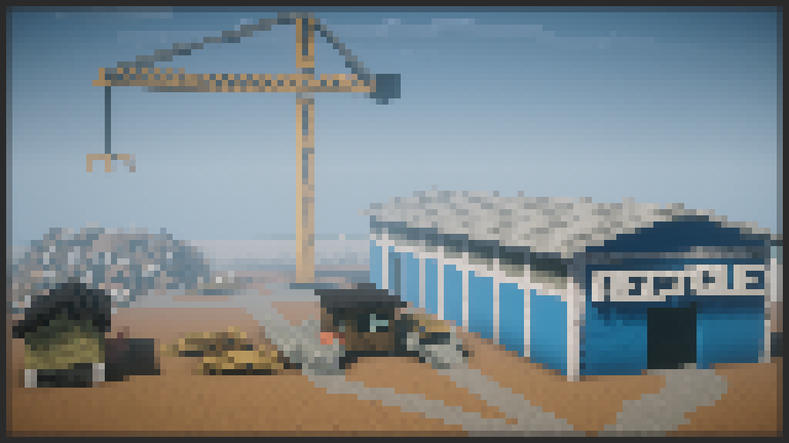

# Metal Magic

## Synopsis:
Iron Oxide gives a tour of the scrapyard she works at to the school ponies like on a field trip.

## Description:
Iron Oxide gives the Ponyville school ponies a tour of a metal scrapyard.

Story commission for [Admiral Biscuit](https://www.fimfiction.net/user/72053/Admiral+Biscuit).

Cover made in collaboration with [Ashy](https://www.fimfiction.net/user/499793/ashley1227).

Thanks to [Math Spook](https://www.fimfiction.net/user/612387/Math+Spook) for proofreading.

Thanks to [PseudoBob Delightus](https://www.fimfiction.net/user/12771/PseudoBob+Delightus) for proofreading.

Thanks to [Hipponous](https://www.fimfiction.net/user/875988/Hipponous) for proofreading.

Thanks to [Shay492](https://www.fimfiction.net/user/840747/Shay492) for pre-reading.

## Short Description:
Iron Oxide gives the Ponyville school ponies a tour of a metal scrapyard.

## Ideas:
- All the ponies in the school go on a field trip to the scrapyard.
- They are chaperoned by Rarity, Applejack, and Rainbow Dash.
- Pinkie comes as well, with Twilight to chaperon her.
- Fluttershy joins in and nopony notices?
- Iron Oxide gives the tour.
- Lots of whimsy.
- Showcase the specialty metal area, then the scrap area.
- Explains what metals are used for, and what states/types they buy.
- Explain the importance of recycling.
- Everypony wears a high-visibility vest and a hard hat?
- The ponies ask a lot of questions.
- Showcase uniquely Equestrian styles of working with all three tribes and cool magic.
- Some sort of side plot about some of the foals getting away from the group?
- Metal info:
  - Copper #1 - $4.55
  - Copper #2 - $4.29
  - Copper #3 - $4.16
  - Lead - $0.81
  - EC Wire (aluminum) - $1.58
  - Insulated Copper Wire - $3.90
  - Bare Bright Copper Wire #1 - $4.88
  - Aluminum - $1.47
  - Cast aluminum - $0.97
  - Aluminum extrusion - $1.03
  - Red brass - $2.83
  - Yellow brass - $2.66
  - Dirty brass - $1.27
  - Bronze - $2.91
  - Stainless steel - $0.40
  - Zinc - $1.41
  - Batteries - $0.17
  - Steel scrap - $0.17
- The mane scrapyard is for general iron and steel.
- The metal is processed.
- Shredded into little bits.
- Bits are sorted in various ways:
  - Magnet to sort ferrous metal.
  - Eddy current to sort non-ferrous.
  - Ponies to sort after?
- 

## Story:
[Metal Magic](./metal-magic.md)

## Cover:

