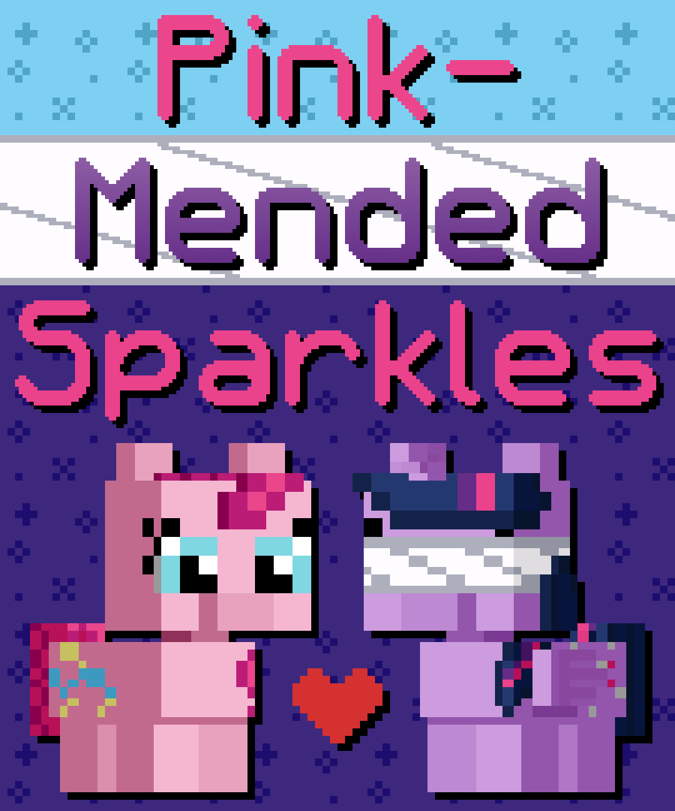

# Pink-Mended Sparkles

## Synopsis:
Pinkie takes care of Twilight after a spell blinds her for a short while. Over the time, they become close. When Twilight can see again, she asks Pinkie out. It is from Twilight's perspective.

## Description:
When a spell leaves Twilight blinded, Pinkie is left to take care of her while her feelings for her blossom.

Thanks to [6-D Pegasus](https://www.fimfiction.net/user/293755/6-D+Pegasus) for proofreading.

Thanks to [Forcalor](https://www.fimfiction.net/user/564657/Forcalor) for pre-reading.

## Short Description:
When a spell leaves Twilight blinded, Pinkie is left to take care of her while her feelings for her blossom.

## Ideas:
- Takes place over 3 days.
- Day 1 Pinkie tells a story, day 2 Twilight, day 3 Pinkie.
- The stories they tell use Twister and Parchment, stand-ins for Pinkie and Twilight.
- Day 1: Twilight realizes she might have feelings for Pinkie.
- Day 2: Twilight tries to help Pinkie deal with the guilt from the accident.
- Day 3: Pinkie confesses her feelings, but Twilight makes the first move.
- Twilight wakes up at night to Pinkie having a nightmare over the guilt she feels.
- Twilight fumbles over to her bed and tries to help.
- The only thing that helps is holding her, so Twilight holds Pinkie and falls back asleep.
- On the second night, Twilight asks Pinkie to sleep in her bed, to keep her from being alone.
- On day 3, they go to Fluttershy's, where they have a tea party.
- They all relax and have a good time.
- The walk to and from wears out Twilight, and by the end of the walk home, Pinkie has to carry her.
- Twilight says to Pinkie, "There is one thing I want from you before I can see again, a kiss." Pinkie kisses Twilight and as they kiss, Twilight removes the bandages over her eyes with magic.
- Pinkie has her eyes closed and opens them, staring into Twilight's eyes as they kiss.
- Pinkie is relieved after the kiss, glad she doesn't have to pretend to not have feelings, casually mentions that she has blushed almost as much as Twilight had, or something like that.

## Story:
[Pink Mended Sparkles](./pink-mended-sparkles.md)

## Cover:
