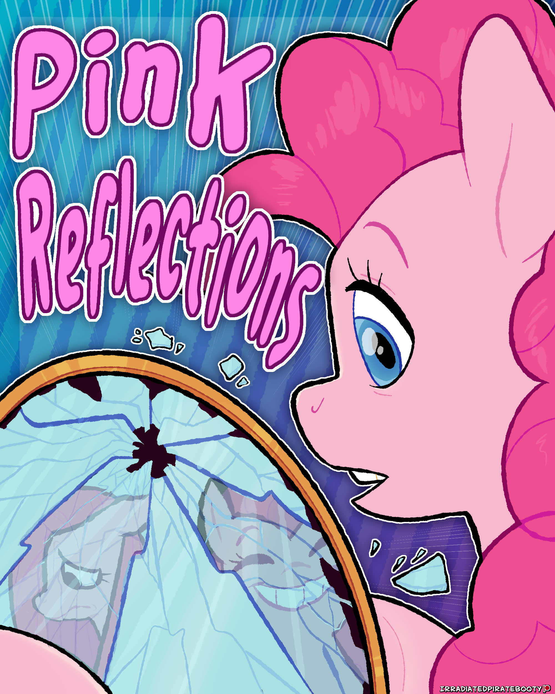

# Pink Reflections

## Synopsis:

## Description:
Pinkie Pie can't look her reflection in the eyes. Maybe her friends can.

Cover done by [IrradiatedPirateBooty](https://irradiatedpiratebooty.tumblr.com).

 Thanks to [6-D Pegasus](https://www.fimfiction.net/user/293755/6-D+Pegasus) for writing 700 words and for paying for the cover.

Thanks to [PseudoBob Delightus](https://www.fimfiction.net/user/12771/PseudoBob+Delightus) for proofreading.

Thanks to [Hipponous](https://www.fimfiction.net/user/875988/Hipponous) for proofreading.

Thanks to [Ashy](https://www.fimfiction.net/user/499793/ashley1227) for proofreading.

Thanks to [ARandomLonelyGirl](https://www.fimfiction.net/user/419652/ARandomLonelyGirl) for pre-reading.

Thanks to [MATP](https://www.fimfiction.net/user/544735/MATP) for pre-reading.

[Reviewed](https://www.fimfiction.net/blog/1135572/a-review-of-silk-roses-pink-reflections-written-at-his-behest) by [Hipponous](https://www.fimfiction.net/user/875988/Hipponous).

## Short Description:
Pinkie Pie can't look her reflection in the eyes. Maybe her friends can.

## Ideas:
- Twilight: fear of failure.
  - Twilight offers to help her manage expectations?
  - It's okay to fail, that's how you learn
  - Mirror tells Twilight to get her other friends together so it can talk to them all, because Pinkie needs as much support as possible
    - Reflection can find them for Twi?
- Rarity: fear of burnout.
  - Looks in a mirror and sees Pinkie's reflection.
  - Pinkie needs to take breaks to unwind and not push herself so hard all the time. Rarity offers to take her to the spa every week
- Rainbow: Fear of rejection. (romance)
  - Rainbow Dash is flying over a lake and sees her reflection as Pinkie, thinking she is drowning, she dives in to save her. When there is nopony there, she gets out and looks back at the edge of the lake, where the reflection greets her.
  - Rainbow says that Pinkie needs to improve her self-confidence and shows her how to do that, then asks her out/hints at it at the end
- Fluttershy: Anxiety.
- Applejack: Pressure.

## Summary:
Ch 1 (Pink Reflection): Pinkie, looking poofy and normal, tries to practice her smile and ends up talking to her reflection who is sad and straight-maned, who challenges why she hides her true self. Pinkie keeps putting up defenses until the reflection gives up and Pinkie sees her normal reflection and wipes a tear before heading to bed.

Ch 2 (Pink Refraction): Pinkie helps someone in the Everfree and brushes against Poison Joke. That night, she speaks again with her reflection and loses it, causing her to shatter the mirror and head to bed, unaware that her reflection is no longer visible after that. The next day, Pinkie sees her reflection is missing when cleaning the broken glass, but brushes it off before leaving. One by one, each of the mane 6 are visited by pinkie's inner sad reflection (in a reflective surface), who tells them about one of pinkie's fears or worries or pressures.

Ch 3 (Pink Restoration): Pinkie returns home and is surprised by her friends, who each tell or do or give something to calm each individual anxiety. Pinkie is relieved and breaks down crying and hugs them, before finally smiling a genuine smile. After the hug, she glances at a nearby reflective surface and sees her reflection back and smiling sincerely as well.

## Story:
[Pink Reflections](./pink-reflections.md)

## Chapters:

Decided to do a single chapter instead of three, keeping all these notes as an archive.

### Chapter 1: Pink Reflection
- Starts with Pinkie, bouncing as usual, in her room above Sugarcube Corner.
- Maybe she is planning her next party and going through the checklist, or maybe she is going over a list of her pinkie promises for the next day. (she will go through each item individually.)
- After that, her final item on that list is to check on her smile.
- She goes to the mirror and puts her biggest smile.
- Her reflection stares back sadly, mane flat and colors dull.

> Pinkie: Come onnn now! I gotta get this smile big and bright for tomorrow! You know the drill! Reflection: …you can't keep doing this Pinkie. You can't keep lying to yourself like this.

- They go back and forth, reflection brings up her fears and anxieties that always plague her, worries that never go away, etc.
- Pinkie consistently denies or defends it.

> Pinkie: That… doesn't matter, I- I have to keep smiling, otherwise how can I make other ponies smile? Reflection: But what about you? About me? Don't we matter too? Pinkie: I do matter! But it's worth it to make other ponies smile. Reflection: But look what it's done to you! You can't even recognize your own reflection! (or something to tie in the description)

- They continue back and forth some more, and eventually the reflection gives up, tired.
- Pinkie acts satisfied and goes something like, "alright, one more time!" She tries on a big grin in the mirror.
- Her own poofy-maned, bright-colored self smiles back, and Pinkie nods in satisfaction, wiping away a single tear in the corner of her eye before leaving.

### Chapter 2: Pink Refraction
- Starts with Pinkie helping Fluttershy in the Everfree forest, and accidentally brushes against poison joke.
- Pinkie bonds with Fluttershy and almost opens up to her, but doesn't because of her fears.
- From there, that night, she does the same thing as the first part, but this time loses her temper and smashes the mirror. She goes to sleep and doesn't notice her reflection is missing from the fallen pieces of mirror.
- The next day, each of the mane 6 are visited by pinkie's depressed reflection, who talks with each of them about one instance when pinkie pretended to be happy to make them happy, and also reveals something's about her worries and fears and anxieties. (still to figure out)
- Pinkie cleans up the mirror the next day after helping said friend. She cleans up her broken mirror, realizing she has no reflection.
- Pinkie reasons she just hasn't slept enough, leaving the room happy.

### Chapter 3: Pink Restoration
- Perspective switches to pinkie who is returning home after hosting a party or something, and is surprised by her friends with a something that assuages all her fears and anxieties

## Cover:
