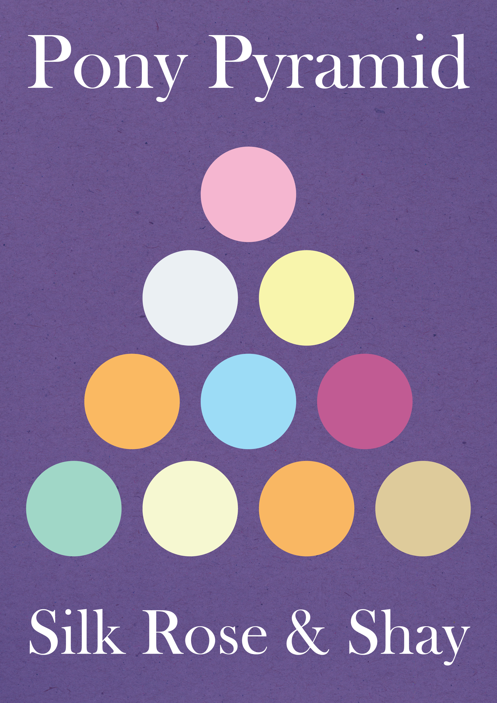

# Pony Pyramid

## Synopsis:
Pinkie Pie inadvertantly starts a pyramid scheme of friendship

## Description:
Pinkie Pie unveils her newest idea: a Pony Pyramid! With it, her and her friends will be able to make tons and tons of new friends, and even have the bits to make bigger and bigger fun events together! Everypony is super excited for this plan except for Twilight Sparkle. Something about the shape concerns her.

Written in collaboration with [Shay492](https://www.fimfiction.net/user/840747/Shay492).

Cover done by Tiki Bat: [FIMFiction](https://www.fimfiction.net/user/218083/Tiki+Bat), [Twitter](https://twitter.com/TikiBat).

Thanks to [Ashy](https://www.fimfiction.net/user/499793/ashley1227) for pre-reading and helping with ideas.

## Short Description:
Pinkie Pie starts a not pyramid scheme. Twilight insists otherwise.

## Ideas:
- Pinkie Pie wants to be friends with as many ponies as possible, so she recruits others to make friends for her.
	- To join, they must contribute "Friendship Funds" for Pinkie to spend on friendship-related activities for the group
	- She names it "Pony Pyramid"
- She gives a presentation to the mane 6 about her business
	- Everypony is on board except for Twilight. When Twilight gets word, she says that it's a pyramid scheme, but everypony else thinks she's crazy.
- The Cutie Mark Crusaders overhear her and want to get in on it (They are her first "customers") (Maybe they overhear her)
- The mane 6 recruit a bunch of ponies
- The CMCs go and recruit ponies from PonyVille elementary school and make LOADS OF MONEY!!!!
- Twilight writes to the princess, but Celestia responds that she wants to know how to get in on it
- ???
- Twilight gets so frustrated and makes her own pyramid scheme, and Pinkie Pie calls it out as a pyramid scheme

## Flow:
1. She gives a presentation to the mane 6 about her business
   - Pinkie Pie wants to be friends with as many ponies as possible, so she recruits others to make friends for her.
   - To join, they must contribute "Friendship Funds" for Pinkie to spend on friendship-related activities for the group
   - She names it "Pony Pyramid"
   - Everypony is on board except for Twilight. When Twilight gets word, she says that it's a pyramid scheme, but everypony else thinks she's crazy.
2. The mane 6 recruit a bunch of ponies
   - The Cutie Mark Crusaders overhear her and want to get in on it (They are her first "customers") (Maybe they overhear her)
   - The CMCs go and recruit ponies from PonyVille elementary school and make LOADS OF MONEY!!!! Twilight writes to the princess, but Celestia responds that she wants to know how to get in on it.
3. Twilight gets so frustrated and makes her own pyramid scheme, and Pinkie Pie calls it out as a pyramid scheme

## Story:
[Pony Pyramid](./pony-pyramid.md)

## Cover:
