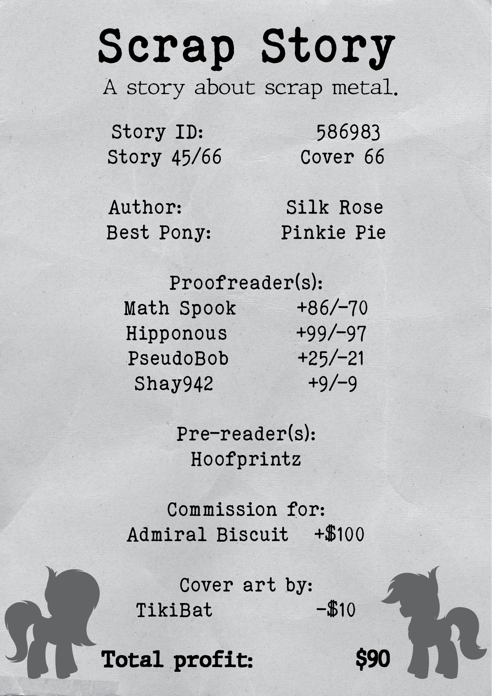

# Scrap Story

## Synopsis:
A story about scrap metal in Equestria.

## Description:
Iron Oxide makes a trip around her home of Ponyville on her usual scrap route. Along the way, she finds all sorts of stuff and meets plenty of friends.

Story commission for [Admiral Biscuit](https://www.fimfiction.net/user/72053/Admiral+Biscuit).

Cover done by Tiki Bat: [FIMFiction](https://www.fimfiction.net/user/218083/Tiki+Bat), [Twitter](https://twitter.com/TikiBat).

Thanks to [Math Spook](https://www.fimfiction.net/user/612387/Math+Spook) for proofreading, helping with ideas, and formatting the receipts.

Thanks to [Hipponous](https://www.fimfiction.net/user/875988/Hipponous) for proofreading.

Thanks to [PseudoBob Delightus](https://www.fimfiction.net/user/12771/PseudoBob+Delightus) for proofreading.

Thanks to [Shay492](https://www.fimfiction.net/user/840747/Shay492) for proofreading and writing the long description.

Thanks to [Hoofprintz](https://www.fimfiction.net/user/503681/Hoofprintz) for pre-reading.

## Short Description:
A story about scrap metal, from where it comes to where it goes.

## Ideas:
- Joke about Rarity's favorite sewing machine breaking and her dad trying to take it away to use as a boat anchor. Rarity suggests to use him as the boat anchor.
- Joke about Discord turning all her aluminum into aluminium.
- First third is about collecting scrap metal.
- Second third is about taking metal to the junkyard.
- Third third is about how metal is processed at the junkyard.
- Not a full on comedy, but a slice of life with comedic elements.
- The mane char is a unicorn named Oxide.
- Scrap metal items:
  - Wood burning stove (Applejack)
  - Metal buckets
  - Folding chairs
  - Sewing machine (Rarity)
  - Cast iron sink (Pinkie)
  - Bed rails
  - Lamps
  - Hot water tank
  - Cast iron bench
  - Desk fan
  - Bird cages (Fluttershy?)
  - Second/third place trophies (Rainbow?)
  - Cast iron tub (cut in half)
  - Weight bench
  - Weights
  - Umbrellas
  - Table and chairs
  - Chains
  - Horseshoes
  - Metal stakes
  - Lawn mower (push reel style)
  - Dog cages (folded up)
  - Furnace
  - 
- Good finds:
  - Twilight's test equipment (Twilight)
  - Random two-by-fours
  - Old toolbox with tools
  - Copper pipes
  - Aluminum pots and pans
  - Wire
  - A smaller wagon
  - Antique coins
  - 
- About 150 to 250 houses in Ponyville.
- Ponyville as a circular town with 12 sections of house rows each 20 long?
- Every 3 sections have a mane 6 member?
- 

## Story:
[Scrap Story](./scrap-story.md)

## Cover:

