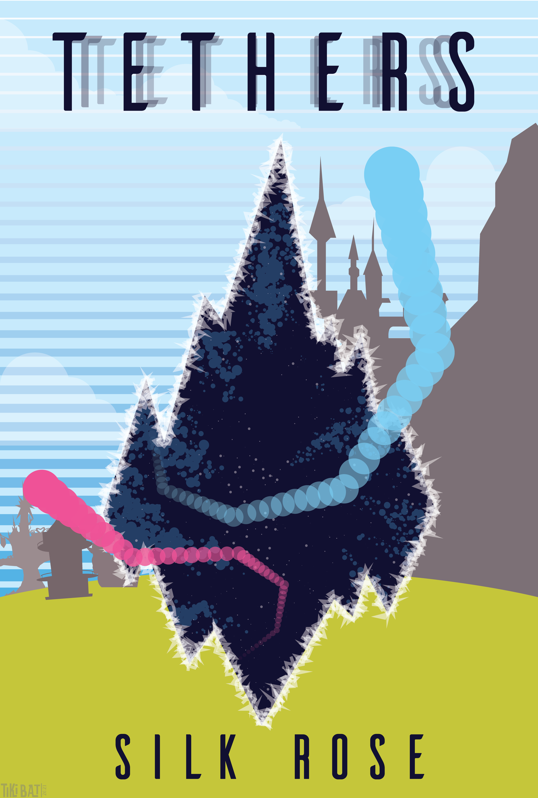

# Tethers

## Synopsis:
Equestrian magic comes from another dimension, in this dimension there is only magic, it stays the same color in each world. When a unicorn casts a spell or magic is needed a tether is formed between the worlds/dimensions. In this world magic flies around, like it is linked to Equestria in a 1 to 1 scale, but there is nothing but colorful void. The magic flies to the exact spot where it is needed, as if it knows the future and who and where and when it is needed. The magic is created from Equestria, it comes into existence when something friendly happens. The magic of Equestria comes from friendships. Bigger friendship moments make bigger and brighter balls of magic, they move at a constant speed to reach their destination at the right time. There is one massive and bright ball that is rainbow hued, it is moving really slow, like it will take 9 years to reach its destination. This one comes from the moment Twilight realizes she was glad to see her friends in the pilot and is going to the big battle in the ending of the end to defeat the villains. Maybe explain how earth pony and Pegasus magic works?

## Description:
Equestria really is a magical place, but where does that magic come from? What really happens when a unicorn casts a spell? How do pegasi fly like they do? Where do earth ponies get the ability to perform their talents?

Is there anything special about making a friend? Giving your mother a hug? Helping an old mare cross the street?

Are these things connected? If so, how?

Cover done by Tiki Bat: [FIMFiction](https://www.fimfiction.net/user/218083/Tiki+Bat), [Twitter](https://twitter.com/TikiBat).

## Short Description:
Friendship truly is magic.

## Ideas:
- A lot of magic balls are slowly moving to the final battle against Tirek, Cozy Glow, and Chrysalis.
- One really bright one is heading to that battle as well, created from the moment Twilight Sparkle realized she was glad to see her friends.(you)
- You feel the energy inside you?
- Maybe it should be told in the past?
- The worlds collide, and you phase in between them, causing chaos and conflict.
- Your slow movement means you live longer.
- When you collide with ponies, you can emanate thoughts to them, and they can think things to you. (same with other magic orbs?)

## Flow:
1. Chapter one: The spark.
2. The story begins with a spark.
3. The spark is the magic of friendship.
4. It came from Twilight and her friends becoming friends at the start.
5. You are born from the spark.
6. You move in another dimension linked to Equestria.
7. This dimension is where all magic is 'stored'.
8. All magic comes from friendship.
9. You pass by the magic going to defeat Nightmare Moon.
10. That magic is from when the Mane 6 got there cutie marks.
11. You move forward, unable to control anything but your thoughts.
12. A green orb of magic passes you.
13. You ponder on its existence vs your own.
14. 

## Chapters:
[Chapter 1: Spark](01-spark.md):

## Cover:
