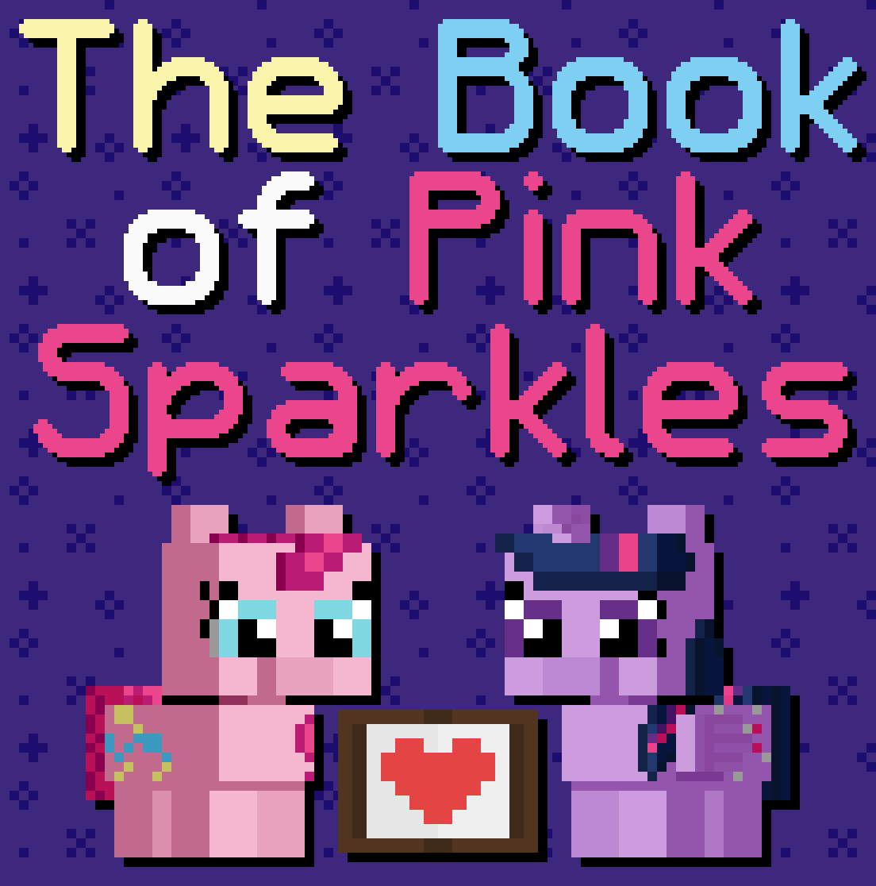

# The Book of Pink Sparkles

## Synopsis:
Pinkie asks Twilight to help her write a book about being Pinkie Pie. Twilight becomes fascinated by helping with the book. They grow considerably closer because of this and find feelings for each other. Twilight, wanting to try to strengthen her understanding and connection to Pinkie, suggests a telepathy spell. The spell causes them to switch bodies.

Story inspired by [Book of Pink](https://www.fimfiction.net/story/93899/book-of-pink), and [Book of Sparkle](https://www.fimfiction.net/story/189700/book-of-sparkle).

## Description:

## Short Description:

## Ideas:
- Animated cover in the long description on FIMFiction.
- Each chapter will have at least one image, probably animated.
- Mess with formatting, including using images for text.
- The story has two acts, one of Twilight helping Pinkie with the book, and one of them switching bodies.
- As Twilight helps with the Book of Pink, she grows closer to Pinkie.
- "As I stated in my next chapter…"
- The poetry chapter will have limericks that change inside an image.
- Twilight will be fascinated with the changing text, wanting to know how she does it.
- Pinkie teaches this in a later chapter.
- When they switch bodies, do they switch cutie marks?
- 

### Chapter name ideas:
- A Gift of Pink and Paper, aka The Book of Pink
- The Pros and Cons of being Pinkie Pie
- When Pinkie Pie is unsure of Pinkie Pie
- The Pink Dictionary, Part 2, Side B
- Pink Poetry, a Lyrical Love Letter
- How to be Pinkie Pie, a Self Written Dictionary
- Pink with a Side of Purple, aka me and my Best Friend
- Spelling out Not-Fun Nightmares :(
- Twilight Sparkle and the Crush I Totally Don't Have on My Best Friend
- How to write a book about being Pinkie Pie, an Interactive Guide
- Tempting Telepathy, or how I Became Beside Myself
- Pinkie Pie the Purple Alicorn and Twilight Sparkle the Pink Earth Pony
- Teaching an Alicorn to Cast Spells When That Alicorn is You
- Pinkie's Prancing Practices, or How to Pronk
- The one Where Pinkie Pie Kisses Herself
- Telepathic Teamwork, aka doing my Marefriend's job while thinking with them
- When You Call Yourself Cute to Make Your Marefriend Blush
- Pink is Just a Shade of Purple and Purple is just a Shade of Pink
- Untempting Telepathy, or how I Became Myself Again
- A Gift of Purple and Pages, aka The Book of Sparkle

## Chapters:

## Cover:
