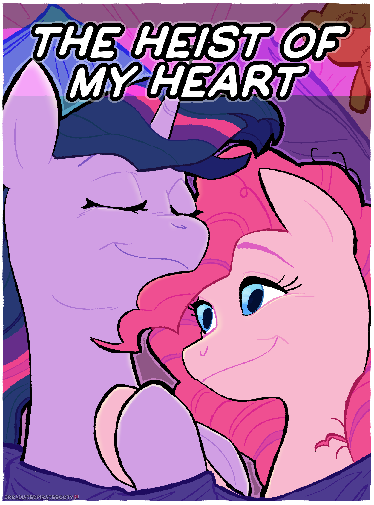

# The Heist of My Heart

## Synopsis:
Pinkie tries to steal Twilight's heart with the help of Rainbow. Twilight pretends to stay asleep and enacts her own plan. As Twilight messes with Pinkie, she realizes she may like Pinkie as more than a friend. By the end Twilight asks Pinkie out. They cuddle and fall asleep.

## Description:
Pinkie tries to steal Twilight's heart with a kiss and a love note.

Twilight has other plans.

Thanks to [Steady Gaze](https://www.fimfiction.net/user/481974/Steady+Gaze) for proofreading.

Cover done by irradiatedtittymilk on Discord.

Featured: [07-02-2023](https://github.com/SilkRose/Pony/blob/mane/src/stories/the-heist-of-my-heart/featured-2023-07-02-11-51-53.png).

Translated into Ukrainian by [volkov](https://www.fimfiction.net/user/595939/volkov), available [here](https://github.com/Vovkiv/The_Heist_of_My_Heart-ukr).

## Short Description:
Pinkie tries to steal Twilight's heart, Twilight has other plans.

## Story:
[The Heist of My Heart](the-heist-of-my-heart.md)
 - Pinkie and Rainbow sneak into Twilight's bedroom.
 - Pinkie wants to steal Twilight's heart, metaphorically.
 - Twilight is woken up, but pretends to be asleep.
 - Twilight traps Pinkie and nuzzles, cuddles, holds, and kisses her.
 - Pinkie thinks she is asleep the whole time.
 - Twilight falls asleep on Pinkie.
 - After Twilight wakes up, Pinkie catches her pretending to be asleep.
 - Twilight kisses Pinkie, and apologizes.
 - Twilight asks Pinkie out.
 - Pinkie says yes.
 - They cuddle and fall asleep together.

## Cover:
