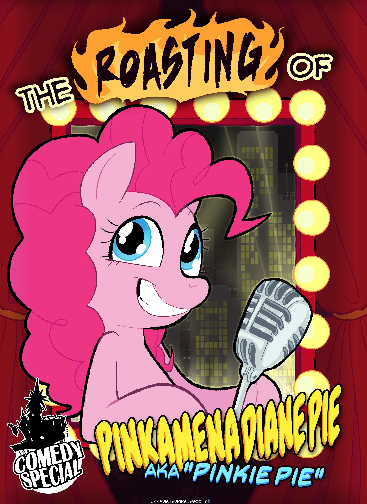

# The Roasting of Pinkamena Diane Pie

## Synopsis:
Pinkie Pie is roasted by her friends and family.

## Description:

## Short Description:

## Ideas:
- Each pony tells three to four jokes about Pinkie, one to two jokes about another attendant, and one to two stories about fun times with Pinkie.
- They tell them in different orders, to make it feel more alive.
- Vary laughs, reactions, and flow to make the story feel natural.
- Twilight goes first, and the next pony is chosen by the speaker.
- Try to make every joke good.
- Instead of showing the roast itself, what if we show them getting ready for it and testing out jokes?
- The current story shows the roast, and it's very repetitive.
- What if Fluttershy was the mane character and everypony tried their jokes on her.
- This would give a better story, but maybe not by much?
- Fluttershy keeps trying to tell her jokes but gets interrupted?
- Could show jokes which get cut.
- Would be funny if her dad could make dad jokes, but it doesn't fit his character…
- 

## Joke Ideas:

### Need to think of:
- Pi 3.14…
- How different she is from her family, like her color.
- Who EqG Pinkie is with versus Equestria Pinkie.
- Her last name.
- Rock farming.
- Her full name: Pinkamena Diane Pie
- More jokes about her singing?
- Jokes about her ability to do stuff not possible.
- More jokes about her Pinkie sense?
- Jokes about her straight mane sad state?
- Joke about how random she is.
- Joke about how she likes to prank ponies.
- Joke about her costumes.
- Joke about her out of character moments.
- Her middle name?
- How she likes to make ponies smile.
- Joke about her Cutie Mark
- Joke about her party canon
- Joke about party hats
- joke about streamers
- joke about balloons
- joke about candy
- joke about cake
- 

### Undecided:
- That's enough about the pony I want to kiss, let's talk about the pony that wants to kiss me.
- I once tried to tell a joke to Pinkie. I asked her, 'what's the difference between a cake and a filly?' I was going to have a snark reply about how sweet one is, but she responded "52,000 calories."
- Pinkie Pie is unreasonably good at everything she does. I'd love to see her enter a productive member of society contest.
- Helium is a scarce resource in Equestria now and I'm pretty sure the number one reason why is Pinkie Pie.
- Have any of you seen the photo of Pinkie dancing in the punch bowl while wearing a lamp shade on her head? Pinkie has a problem, and it's the fact the punch tasted better after she danced in it.
- Pinkie's favorite book is a coloring book.
- Pinkie Pie has too much confetti, I literally saw her sneeze confetti one time. I'd hate to see what comes out of the other end.
- I can count the number of times she's helped save Equestria, but she can't.
- She's got no personal vendettas, but she will use up all of your personal space.
- She's got friends for days, but patience for seconds.
- We're here to celebrate Pinkie Pie, so let me tell you in rapid fire about this vapid pyre. (Potential starting monologue?)
- She don't mind coming in second as long as everypony is smiling. She loves to make you smile, but all the while she'll make a file on everything you love, hate, and everything in between. She won't stop at nothing to make you grin, she'll let you win, take a pin, or even wait a min. (Continued monologue?)
- I asked Pinkie Pie how many digits of Pi she knew and she said, "Well, I have four hooves."
- Pinkie Pie loves to make ponies smile, but what if making ponies frown makes me smile?
- One time I saw Pinkie break into a bunch of little pieces. I did what anypony else would do, I went and got me a piece of the Pie. I grabbed her tail, I needed a new pillow.
- Pinkie Pie is in a special interest group, as in she is the special interest of our friend group.
- I don't think Pinkie is very good with social cues, last time I brought them up she started standing in line.
- Pinkie Pie is one of the few ponies that kept their childlike wonder into adulthood, and I figured out where the line stops for her excitement. It's taxes, not even Pinkie likes to do taxes.
- Everypony just assumes her favorite color is pink. Has anyone bothered to actually ask her? What do we do if it's green, or blue?
- 

### Twilight:
- If Pinkie stopped eating cake, I think the price of sugar would drop fifty percent overnight.
- Pinkie Pie has either never drank coffee in her life, or drinks twelve cups a day, and I'm not sure which is more concerning.
- I don't think I've ever seen Pinkie sit still for more than five seconds. The first time I saw her asleep, I had to check for a pulse.
- 

### Rarity:
- Pinkie, darling, if your mane were any more unkempt, a bird would start building a nest in it. Oh wait, I think I see one now. Fluttershy, what is it saying? (Have a bird planted for the joke?)
- I heard that her mane and tail taste like cotton candy, while I have never been brazen enough to try, it at least explains where Gummy gets his nutrition. I don't think I've ever seen her feed him.
- After making the dresses for the Gala, I'm surprised I haven't had to do any repairs. I would've thought Pinkie would try to eat the fake candy stitched into her dress at least twice by now.
- You ever slept in the same bed as Pinkie, I did once. She started moving around a bunch, here I thought she was trying to cuddle. Turns out it was a Pinkie Sense and a book fell on my head.
- 

### Rainbow:
- Pinkie, I know you have random stashes across Ponyville and Equestria. What I want to know is do you have an insulin stash ready for when the diabetes hits?
- Pinkie, does your Pinkie Sense ever go off at the wrong time? Ever just hanging with your special somepony and get a doozy right as they set in to hold your hoof.
- Some ponies might say Pinkie is a better fit for the Princess of Friendship, but I have to disagree, she's enough trouble already without wings and a horn.
- Pinkie has a secret party planning cave with folders of information of everypony in town, so she can plan the perfect party for each pony. I want to know, though, does she have a folder for herself? And can I see it?
- 

### Fluttershy:
Each of her jokes is written by a different pet.
- Angel Bunny: Oh, the pink one? She's annoying and loud.
- Owlicious: Who? But keeps laughing when Fluttershy explains.
- Tank: 
- Opalescence: 
- Winona: 
- Gummy: 

### Applejack:
- They need to classify you as some kind of weapon, that girl could agitate the apples off a pear tree.
- Pinkie will throw a party for any celebration, and I mean any. If you so much as sneeze wrong, she's liable to throw you a party for it.
- Pinkie will make friends with anypony, I swear. Once I saw her befriending a bush. (Pinkie replies, "That bush has a name!")
- Pinkie has no concept of personal space. If she hasn't hugged you within five seconds of meeting her, she suspects something of you.
- 

### Limestone:
- As a filly, Pinkie's mane used to be completely straight. Then, one day, it was all poofy, and she said she had seen a magical rainbow in the sky. We all just assumed she had finally gone crazy. I'm just glad we were wrong… We were wrong, right?
- Pinkie takes her Pinkie Promises very serious, I was the first one she made Pinkie Promise to her. I think I'm also the only pony to survive breaking one.
- 

### Marble (said aloud by Maud):
- Being Pinkie's twin sister can be hard. Especially when she does all the talking for you. Particularly when she doesn't stop talking ever. Specifically, when she has to ask your crush out for you.
- Everyone assumes the reason Pinkie is the older twin is because she wanted to make new friends, only having Marble for the past nine months. But, the real reason why Pinkie is the older twin is, Marble pushed her out first so she could enjoy a few minutes of peace and quiet.
- 

### Maud:
- My sister sparkles as brightly as a freshly excavated chunk of golden pyrite. She bears the same mindset as well, namely, not to be taken seriously.
- I tried to study a rare formation of naturally occurring pink calcium sulfate I found when we were younger, but I didn't get very far before Pinkie had used it to draw a series of numbers and boxes on the road to our farm. One could say it left me hopping mad.
- 

### Spike:
- I know ponies tend to burst into song a lot, but Pinkie takes it to a whole new level. I don't think she's gone a day since I met her without her randomly singing a song about something barely related to what was going on. It's almost like it's a legal requirement. Quick, burst into song if you need help.
- Pinkie is the type of pony to remember everypony's birthday in town, but forget her own.
- Twilight schedules everything in her life. She has "Panic Attack" on her calendar for tomorrow.
- 

### Starlight:
- "You want to know a secret? Pinkie you have to Pinkie Promise to not get mad if I tell you." Pinkie does the Pinkie Promise. "I broke a Pinkie Promise once." (She winks at Pinkie, and Pinkie starts laughing.)
- I'm glad Pinkie was already in the group of friends when I joined, saved me from being the *pink one*.
- I might have done some horrible things in my past, but at least I didn't look at my sister and think, needs more cowbell.
- 

### Igneous Rock Pie
- A lot of ponies ask why we named our daughter Pinkamena instead of something more normal, well you see: pink ah mean a lot to my daughter.
- I still remember teaching her how to farm, it was a rocky experience.
- Ponies don't understand why our last name is a baked good and not something rock related. Well, it changed over the generations, it used to be pyrite. as in look at that Pie right there.
- We still have a family feud with a schism of the pyrite family. It all stems back to a huge argument before the pyleft.
- 

### Cloudy Quartz
- Each of our daughter's had a unique first word. Limestone said, "Holder's Boulder," which makes sense seeing how much she loves that thing. Maud's first word was, "rock," unsurprisingly. Marble hasn't actually spoken yet, her first word was, "Mmmhmm." And Pinkie first word was, "antidisestablishmentarianism."
- We tried to bring Pinkie and Big Mac to the Pairing Stone that suited my husband and I, but it refused to wed the two and we didn't understood why. I guess now we know.
- Speaking of disappointments, I've always bugged Pinkie about giving us grandfoals. Now that we know that will never happen, I'll have to turn my attention somewhere else. Clone grandfoals would fit into my life just as well.
- 

### Mr. & Mrs. Cake:
- Pinkie, we love you, we just wish you would stop giving all our ice cream to Rarity.
- Pinkie is a good employee, when she isn't eating our entire inventory in one sitting.
- We've had Pinkie living with us since she moved to Ponyville, anyone else want to take a turn?
- 

### Cutie Mark Crusaders:
They each tell a joke about their sister and a joke about Pinkie.
- Pinkie is so bad at Pin the tail on the Pony, I saw her pin it to herself.
- Rainbow Dash naps so much, she'd miss her own funeral.
- You're so pink, I couldn't find you in a pig pen.
- Applejack's so stubborn, she'd win an argument against a brick wall.
- You'd make a great alarm clock if you had an off button.
- Rarity takes so long to get ready, I'm surprised she isn't still at home, doing her makeup.

### Cheese Sandwich
- I thought I was coming here to roast my wife, but it turns out I married her clone. And here I thought I was the one who performed, '[I Think I'm a Clone Now](https://www.youtube.com/watch?v=7vFGKHzY_38)'.
- 

### Pinkie's Mirror Pool Clone
- I heard the Cakes went to everyone else in Equestria before you for child care, even a group of children. I would know because they asked me before you.
- Will the real Pinkie Pie please stand up? Oh wait, I'm already standing!
- Last time I had this many eyes on me, I thought that they had found me. I had to be here, though, I couldn't turn down the opportunity to make fun of myself without looking in a mirror.
- 

### EqG Pinkie:
- I'd make a joke about how many Pinkie Pie's it take to screw in a light bulb, but you'd have to invent the light bulb first.
- I'd ask whats the difference between this Pinkie and me are, but so far nopony has noticed when we've swapped, not even the Elements of Harmony.
- 

## Story:
[The Roast of Pinkie Pie](./the-roast-of-pinkie-pie.md)

## Cover:

