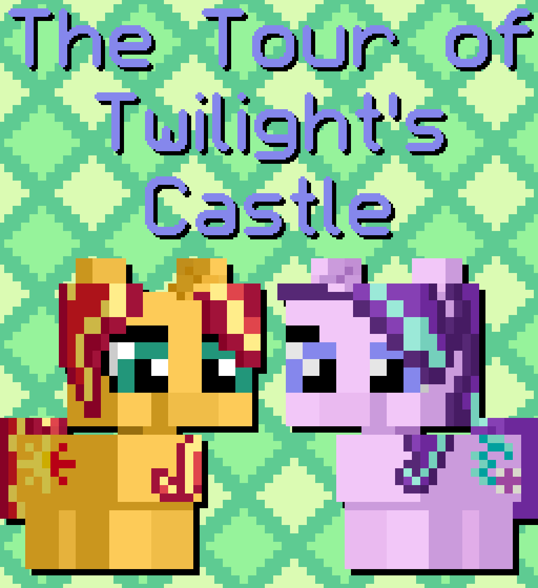

# The Tour of Twilight's Castle

## Synopsis:
Starlight gives Sunset a tour of Twilight's castle.

## Description:
Starlight gives Sunset a tour of Twilight's castle. Surely nothing could go wrong with this.

Turns out, most of the rooms aren't even accounted for. Still, why are there so many broom closets?

Written for [Lunaria](https://www.fimfiction.net/user/68640/Lunaria) for [Jinglemas](https://www.fimfiction.net/group/213263/jinglemas) 2025.

Thanks to [Math Spook](https://www.fimfiction.net/user/612387/Math+Spook) for proofreading.

Thanks to [PseudoBob Delightus](https://www.fimfiction.net/user/12771/PseudoBob+Delightus) for proofreading.

Thanks to  [Shay492](https://www.fimfiction.net/user/840747/Shay492) for pre-reading and helping with ideas.

Thanks to [Ashy](https://www.fimfiction.net/user/499793/ashley1227) for pre-reading.

Thanks to  [6-D Pegasus](https://www.fimfiction.net/user/293755/6-D+Pegasus) for helping with ideas.

## Short Description:
Starlight gives Sunset a tour of Twilight's castle. Surely nothing could go wrong with this.

## Ideas:
* Part of a room's floor is cracked and filled with dirt as part of Applejack's unfinished attempt to plant crops in the castle to grow from the "elements magic."
* One room partially eaten away at by Spike. (Guilty pleasure room.)
* Spike's mirror room. (For standing on a stool and flexing to himself.)
* A rage room for Rainbow.
* A locked door that Starlight disables, peeks in, re-locks and says, "Nope, we are not looking at that one."
* Room that is just a blackened crater. (Twilight's former experiment)
* The last room is just a empty room with "The End" written on the wall?
* Bowling alley room?
* Little fillies room, and a big fillies room? Medium?
* Starlight's room, where they take a photo together for her mirror.
* A broom closet with a tinier broom closet within it.
* A door that goes nowhere, just a blank wall.
* Twilight's bedroom, where they put a copy of their photo on her mirror.
* A bunch of broom closets.
* Broom closet with a party canon in it.
* Guest bedroom for Sunset.
* The Cutie Map room.
* The kitchen.
* Black hole room?
* Dinning room.
* Scooby Doo hallway where doors lead to impossible doors in the same hallway.
* Dinosaurs?
* A jet plane?
* The ocean?
* A wall of chocolate?
* A supermarket?
* A phone booth?
* A room where Celestia and Luna can keep the sun and moon when they're not in the sky?
* The room where missing socks go?
* A nuclear reactor?
* 

## Story:
[The Tour of Twilight's Castle](the-tour-of-twilights-castle.md)

## Cover:

