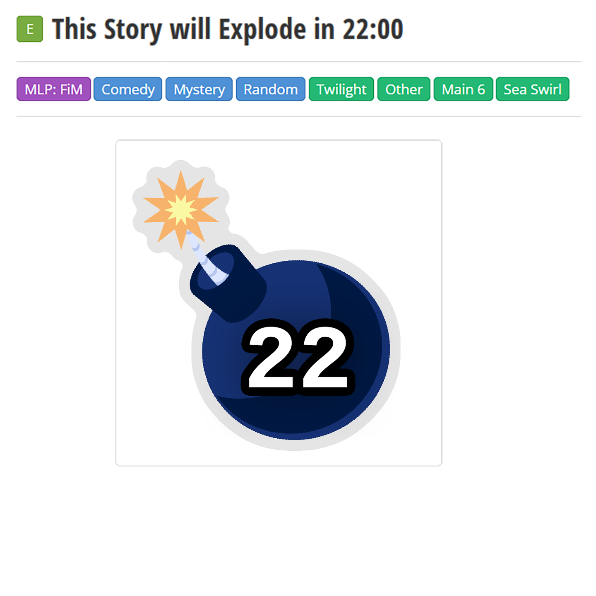
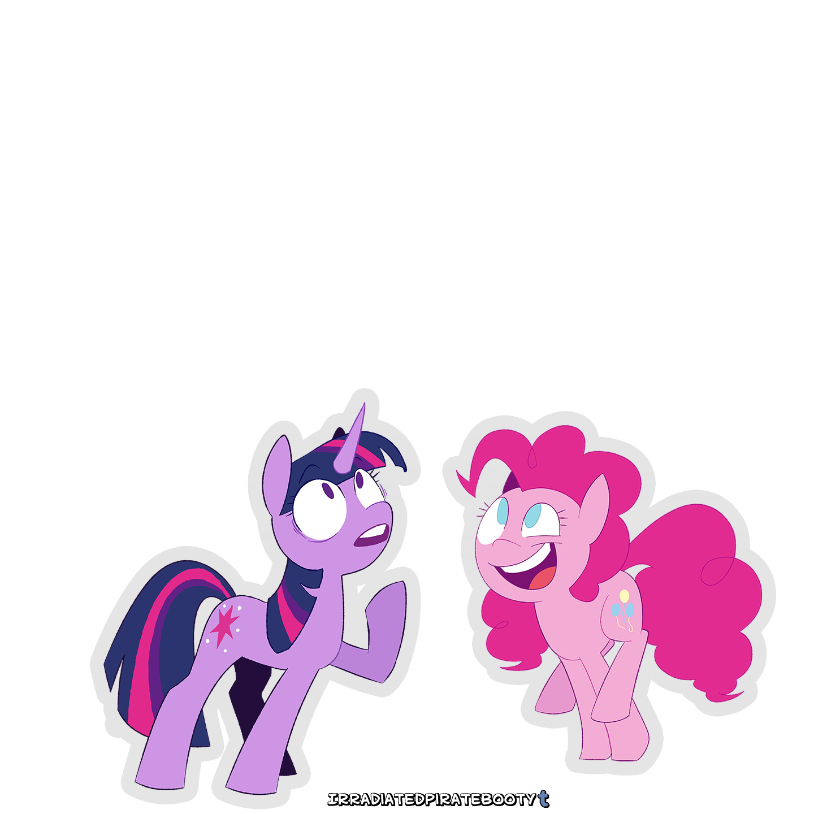

# Pinkie Pie

Twilight knocked on Pinkie's bedroom door as she entered. "Pinkie, are you here?"

A rustle came from the closet, moments before Pinkie sprung out of it doing cartwheels. She came to a stop at the last moment, ending up nose-to-nose with Twilight.

"Hi, Twilight, what's up?"

Twilight blinked before pointing up at the title. "I was wondering if you knew anything about that?"

"Oh!" Pinkie gasped "Is the story really gonna explode?"

"Okay. You just noticed it." Twilight sighed. "Great."

"I bet I could touch it if I jump high enough!"

"Pinkie, this is serious. We need to figure out what's going on."

Pinkie wasn't listening. She was already jumping to try and touch the title.

"Pinkie!"

After another moment of jumping from various angles, Pinkie gave up. She noticed Twilight was still there and said, "Twilight? What are you still doing here?"

"Getting you." She turned towards the door and motioned for Pinkie to follow her. "Come on, we need to go and figure this out."

"Okay," Pinkie said before diving back into her closet. "Just let me grab my exploding story confetti and I'll be ready!"

That stopped Twilight in her tracks. "Why do you have *exploding story confetti*?"

Pinkie tossed a heavy box onto the floor, marked on the side in military stencil: Exploding Story Confetti. "Never ask why, young Twilight," she said sagely. "Ask: why not?"

"Okay, so, you're ready?"

"Yeah! An exploding story sounds fun! I can't wait to see what happens."

"It's not- Ugh, okay, whatever, let's go."

Twilight marched out the door, and Pinkie followed behind, bouncing bubbly with a smile.
