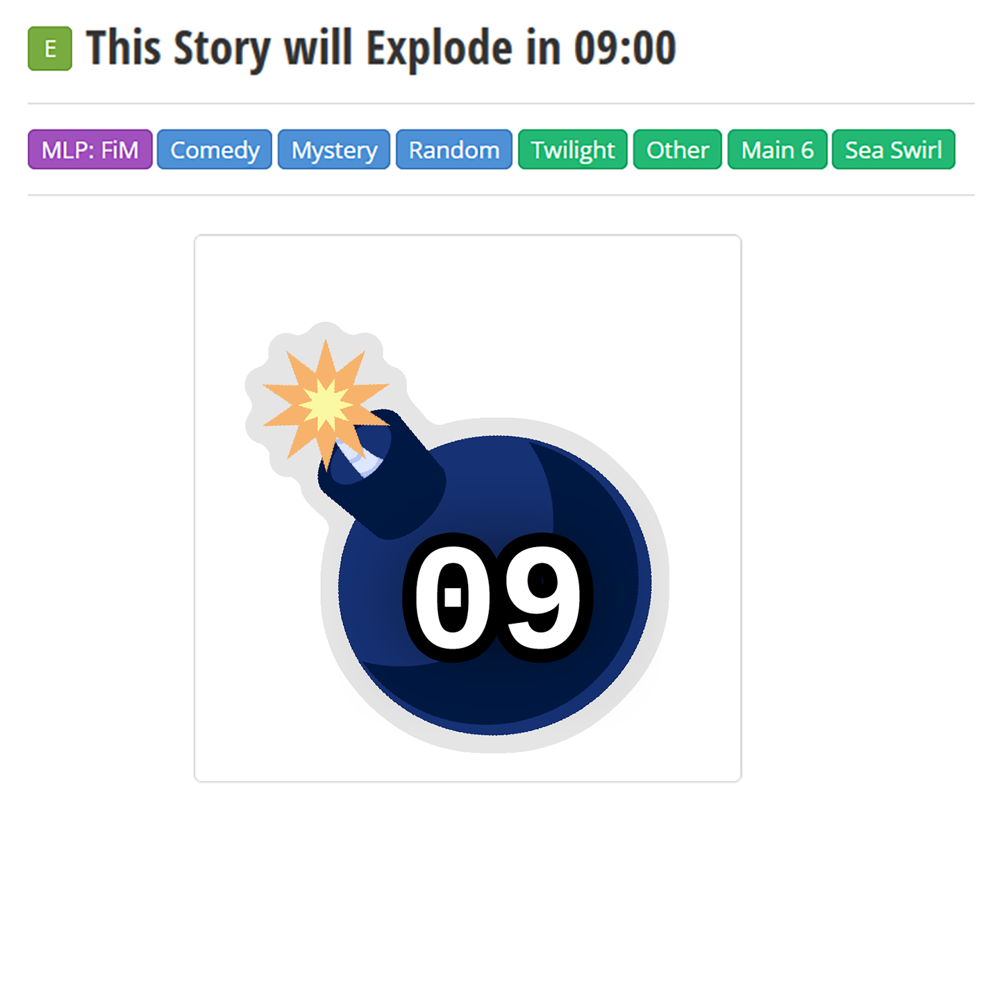
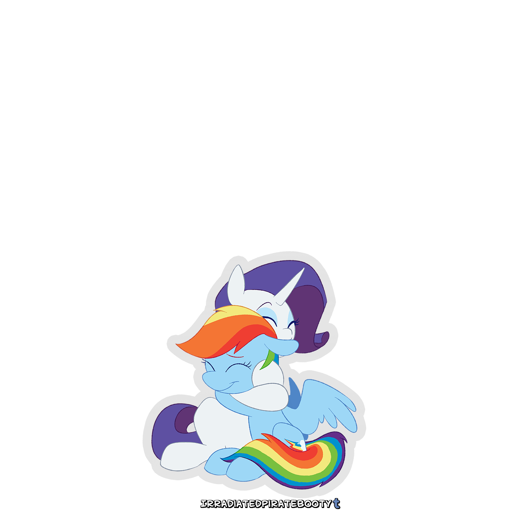

# Rainbow & Rarity

I am about to knock on Rarity's door when it opens.

"Oh, Rainbow Dash, just the pony I wanted to see. Would you like to come in?"

"Sure, I had something I needed to talk about."

"I as well."

Rarity leads me over to a couch, where we sit down.

"Were you looking for me because of that?" I point to the title in the sky, which is visible indoors, somehow.

"Yes…" There's a slight smile on her face. "I wanted to let this happen naturally, but it appears the universe has other plans."

"That's kind of why I'm here, too."

"I wanted to spend more time with you…"

"Me too."

My stomach turns, and I can feel the distance between us. My voice wavers as I ask, "Should I say it?"

She smiles at me like she knew all along. "Go ahead."

I feel a blush coming over me as I squeeze my eyes shut and say, "Rarity, I think I love you."

Rarity replies, serenely, "Rainbow Dash, I think I love you, too."

A sound comes out of me, and my eyes are wet. I can't tell if I'm laughing or crying. All I know is Rarity's hooves are around me, and I lean into her, and our lips meet. We kiss passionately.

It ends too soon. But I'm comfortable just hugging her.

I hear a sniffle, and a tear drops onto my withers. She's crying, too.

As I hold her, I whisper, "I've wanted to tell you for so long…"

"Me too," Rarity whispers back.

Feeling giggly now, I admit, "You know, normally I consider myself number one at everything, but I can admit defeat on one thing."

"What's that?"

I pull way from her, briefly, to get a good look. "You are the most beautiful mare ever."

"Well, you are the prettiest mare ever!"

"Aren't those the same thing?"

"Why don't we call it a tie?"

"Deal." I pull her back into an embrace, nuzzling her neck.

Rarity rests her chin on my head. "If this is our last day together, I'm glad I can at least spend it with you."

We sit there in silence for a while, just enjoying each other's presence.

Even so, I can't shake the idea of this all ending in a big explosion. I ask in a whisper, "Do you think Twilight will be able to figure out how to stop it?"

"I sure hope so," Rarity says.

I hug her a little tighter. "Me too, Rarity. Me too."

