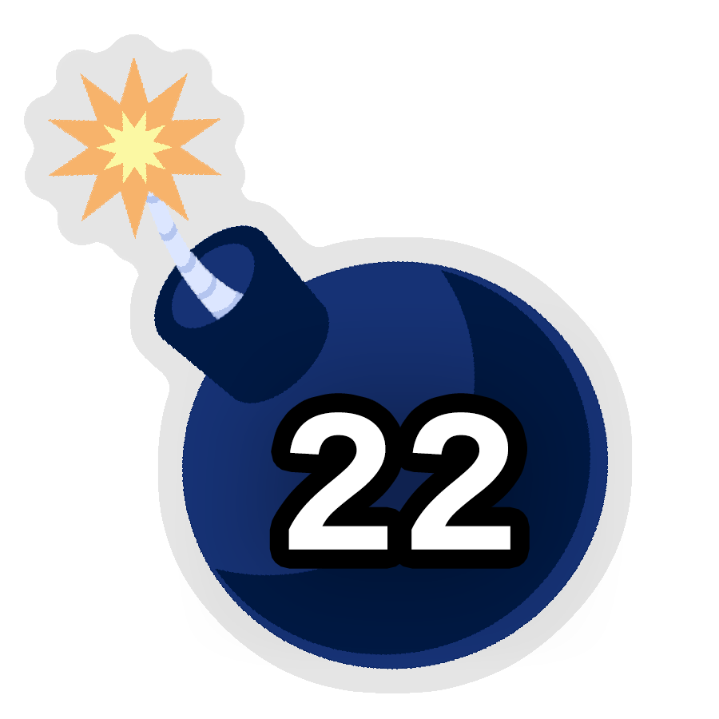
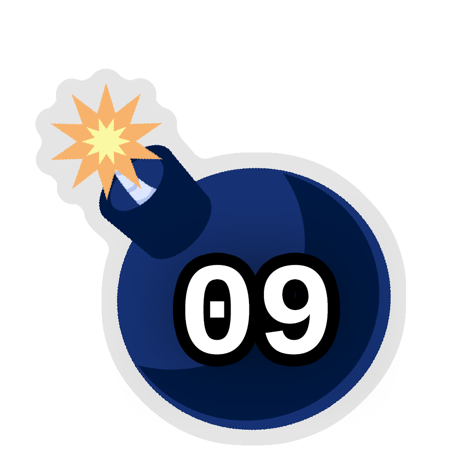

# This Story Did Not Explode

## Synopsis:
Story with a countdown timer as the title. A new chapter is released every hour. The cover, short description and description all update regularly.

## Explanation:
This story was a collaboration with [PseudoBob Delightus](https://www.fimfiction.net/user/12771/PseudoBob+Delightus).

I wrote all the code and 2 of the chapters, he wrote most of the story.

This version only contains the parts I wrote, to read the whole story, please go [here](https://www.fimfiction.net/story/553695/this-story-did-not-explode).

The history for these chapters can be found in PseudoBob's [fanfic](https://github.com/PseudoBob-Delightus/fanfic) repo.

Below is his comment replying to all comments after the fact:
> [Silk Rose](https://www.fimfiction.net/user/237915/) wrote a blog, which you can read [HERE](https://www.fimfiction.net/blog/1036674/the-exploding-story-code-overview), about how all the crazy features of the story were implemented.
>
> I wrote a blog, which you can read [HERE](https://www.fimfiction.net/blog/1036675/the-real-explosion-was-the-friends-we-made-along-the-way), about how all the written and visual elements of the story came together.
>
> And we're both hosting a Q&A thread on the Writer's Group [HERE](https://www.fimfiction.net/group/50/the-writers-group/thread/536849/qa-thread-the-exploding-story) in case you have any questions, comments, concerns, complaints, conspiracies, conflagrations, or otherwise just wanna bask in the presence of two amateur pranksters.
>
> Thanks for reading!
>
> ~ *[PseudoBob Delightus](https://www.fimfiction.net/user/12771/PseudoBob+Delightus)*

## Description:
This story did not explode! What a relief and/or letdown.

---

Part of [OPERATION CRACKFIC STORM 2024](https://www.fimfiction.net/group/214288/the-cult-of-raccoon/thread/535312/operation-crackfic-storm-2024-the-final-crackfic-storm-annual-random-writeoff) ( [group](https://www.fimfiction.net/group/214288/the-cult-of-raccoon) | [stories](https://www.fimfiction.net/group/214288/folder/82400/crackfic-storm-2024-submissions-folder-for-end-of-march) ).

Thanks to [Silk Rose](https://www.fimfiction.net/user/237915/) for coming up with the idea, writing chapters 22 and 9, and developing the code; thanks also to [Meadowsys](https://www.fimfiction.net/user/487213/) for general code help.

Thanks to [IrradiatedPirateBooty](https://irradiatedpiratebooty.tumblr.com/) for the awesome character art.

And thanks to everyone in the comments who stuck around for the final countdown!

## Short Description:
Phew! That was a close one.

## Chapters:
3. [Pinkie Pie](./03-pinkie-pie.md)
16. [Rainbow & Rarity](./16-rainbow-and-rarity.md)

## Covers:

